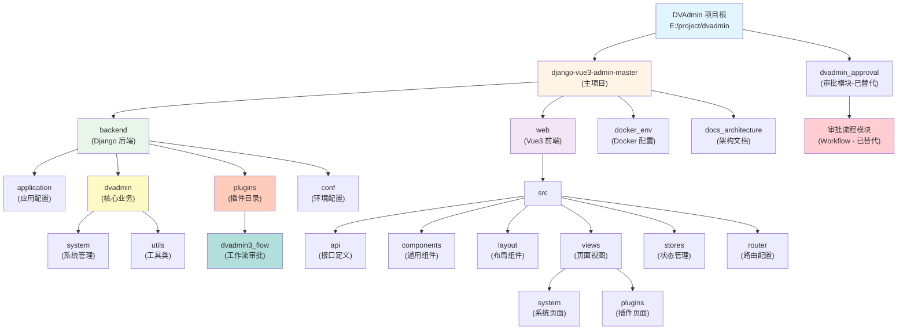

# DVAdmin 项目文档

> 最后更新：2026-02-03 (Django 5.2.0 升级)
> 项目路径：E:\project\dvadmin

## 变更记录 (Changelog)

| 时间 | 变更内容 | 责任人 |
|------|----------|--------|
| 2026-02-03 13:00 | Vue 3.5 升级、前端依赖升级、WebSocket 配置、创建启动文档 | Claude AI |
| 2026-02-03 | Django 升级到 5.2.0 LTS，手动配置 Celery | Claude AI |
| 2026-01-25 19:11:17 | 完成前端子模块文档，覆盖率提升至 100% | Claude AI |
| 2026-01-25 14:09:00 | 集成 dvadmin3_flow 插件文档，添加 Mermaid 架构图 | Claude AI |
| 2026-01-24 | 初始化项目根文档，整合所有模块 | Claude AI |

---

## 项目概述

DVAdmin 是一个基于 RBAC（基于角色的访问控制）模型的企业级权限管理系统开发框架，采用前后端分离架构。本项目包含主项目（django-vue3-admin-master）和独立的审批流程模块（dvadmin_approval）。

**核心特性：**
- 列级别的权限控制（字段级显示权限）
- 前后端完全分离
- 支持多种认证方式
- 动态菜单权限系统
- 插件化架构支持
- 工作流审批引擎

---

## 项目结构

```
E:\project\dvadmin\
├── django-vue3-admin-master/     # 主项目（DVAdmin 框架）
│   ├── CLAUDE.md                 # 主项目文档
│   ├── backend/                  # Django 后端
│   │   ├── application/          # Django 应用配置
│   │   ├── dvadmin/              # 核心业务模块
│   │   │   ├── system/           # 系统管理模块
│   │   │   ├── book/             # 图书管理模块（示例）
│   │   │   └── utils/            # 工具类库
│   │   ├── plugins/              # 插件目录
│   │   │   └── dvadmin3_flow/    # 工作流审批插件
│   │   ├── conf/                 # 环境配置
│   │   └── docs_architecture/    # 后端架构文档
│   ├── web/                      # Vue3 前端
│   │   └── src/
│   │       ├── api/              # API 接口定义
│   │       ├── components/       # 通用组件
│   │       ├── layout/           # 布局组件
│   │       ├── views/            # 页面视图
│   │       ├── stores/           # Pinia 状态管理
│   │       └── router/           # 路由配置
│   └── docker_env/               # Docker 配置
│
└── dvadmin_approval/             # 审批流程模块（独立，已被 dvadmin3_flow 替代）
    └── CLAUDE.md                 # 审批模块文档
```

---

## 架构图



---

## 快速导航

### 项目文档

| 文档 | 描述 |
|------|------|
| [主项目文档](./django-vue3-admin-master/CLAUDE.md) | django-vue3-admin-master 完整文档 |
| [审批流程文档](./dvadmin_approval/CLAUDE.md) | dvadmin_approval 模块文档 |

### 后端核心模块

| 模块 | 路径 | 说明 |
|------|------|------|
| Backend | [backend/](./django-vue3-admin-master/backend/CLAUDE.md) | Django 后端服务 |
| Application | [backend/application/](./django-vue3-admin-master/backend/application/CLAUDE.md) | Django 应用配置 |
| Dvadmin | [backend/dvadmin/](./django-vue3-admin-master/backend/dvadmin/CLAUDE.md) | 核心业务模块包 |
| System | [backend/dvadmin/system/](./django-vue3-admin-master/backend/dvadmin/system/CLAUDE.md) | 系统管理模块 |
| Utils | [backend/dvadmin/utils/](./django-vue3-admin-master/backend/dvadmin/utils/CLAUDE.md) | 工具类库 |
| Book | [backend/dvadmin/book/](./django-vue3-admin-master/backend/dvadmin/book/CLAUDE.md) | 图书管理模块 |
| Dvadmin3 Flow | [backend/plugins/dvadmin3_flow/](./django-vue3-admin-master/backend/plugins/dvadmin3_flow/CLAUDE.md) | 工作流审批插件 |

### 前端核心模块

| 模块 | 路径 | 说明 |
|------|------|------|
| Web | [web/](./django-vue3-admin-master/web/CLAUDE.md) | Vue3 前端应用 |
| API | [web/src/api/](./django-vue3-admin-master/web/src/api/CLAUDE.md) | API 接口定义 |
| Components | [web/src/components/](./django-vue3-admin-master/web/src/components/CLAUDE.md) | 通用组件库 |
| Layout | [web/src/layout/](./django-vue3-admin-master/web/src/layout/CLAUDE.md) | 布局组件 |
| Views | [web/src/views/](./django-vue3-admin-master/web/src/views/CLAUDE.md) | 页面视图 |
| Stores | [web/src/stores/](./django-vue3-admin-master/web/src/stores/CLAUDE.md) | Pinia 状态管理 |
| Router | [web/src/router/](./django-vue3-admin-master/web/src/router/CLAUDE.md) | 路由配置 |

### 独立模块

| 模块 | 路径 | 说明 |
|------|------|------|
| Approval | [dvadmin_approval/](./dvadmin_approval/CLAUDE.md) | 审批流程模块（已替代） |

---

## 项目统计

### 代码量统计

| 分类 | 数量 | 说明 |
|------|------|------|
| 后端 Python 文件 | 100+ 个 | django-vue3-admin-master/backend 目录（排除 __pycache__ 和 migrations） |
| 前端源文件 | 150+ 个 | django-vue3-admin-master/web/src 目录（Vue + TS + JSX） |
| 插件模块 | 20 个 | backend/plugins/dvadmin3_flow 目录 |
| **总计** | **270+** | 核心业务代码文件（不含 node_modules/__pycache__） |

### 文档覆盖率

| 模块 | 文档状态 | 覆盖率 |
|------|----------|--------|
| 主项目根文档 | ✅ | 100% |
| Backend 模块 | ✅ | 100% |
| Web 前端 | ✅ | 100% |
| Application 配置 | ✅ | 100% |
| System 系统模块 | ✅ | 100% |
| Utils 工具模块 | ✅ | 100% |
| Dvadmin 核心包 | ✅ | 100% |
| Book 图书模块 | ✅ | 100% |
| Dvadmin3 Flow 插件 | ✅ | 100% |
| Approval 审批流程 | ✅ | 100% |
| 前端子模块 API | ✅ | 100% |
| 前端子模块 Components | ✅ | 100% |
| 前端子模块 Layout | ✅ | 100% |
| 前端子模块 Views | ✅ | 100% |
| 前端子模块 Stores | ✅ | 100% |
| 前端子模块 Router | ✅ | 100% |
| **整体覆盖率** | - | **100%** |

---

## 技术栈

### 后端技术

- **框架**：Django 5.2.0 (LTS)
- **API**：Django REST Framework 3.16.0
- **认证**：djangorestframework_simplejwt 5.5.0
- **文档**：drf-yasg 1.21.7
- **WebSocket**：channels 4.1.0
- **异步任务**：django-celery-beat 2.8.1, django-celery-results 2.5.1

### 前端技术

- **框架**：Vue 3.5.27 ⬆️
- **语言**：TypeScript 4.9.4
- **构建**：Vite 5.4.1
- **UI 库**：Element Plus 2.13.2 ⬆️
- **状态管理**：Pinia 2.3.1
- **CRUD**：@fast-crud/fast-crud 1.21.2
- **HTTP 客户端**：Axios 1.13.4 ⬆️
- **表格组件**：vxe-table 4.17.47 ⬆️
- **代码检查**：ESLint 9.9.0, @typescript-eslint 8.54.0 ⬆️

### 数据库

- 默认：SQLite3
- 推荐：MySQL 8.0+
- 可选：PostgreSQL

---

## 环境要求

- Python >= 3.11.0（最低 3.9+）
- Node.js >= 16.0.0
- MySQL >= 8.0（可选，默认 SQLite3）
- Redis（可选）

---

## 快速开始

> 📖 **详细启动指南请查看：[START.md](./START.md)**

### 快速启动命令

**后端（支持 WebSocket）：**
```powershell
cd django-vue3-admin-master/backend
powershell -ExecutionPolicy Bypass -File start_daphne.ps1
```
访问：http://localhost:8001

**管理后台前端：**
```powershell
cd django-vue3-admin-master/web
npm run dev
```
访问：http://localhost:9001

**默认账号：** `superadmin` / `admin123456`

---

## 核心功能

### 系统管理

1. 菜单管理：配置系统菜单、操作权限、按钮权限
2. 部门管理：配置系统组织结构
3. 角色管理：角色菜单权限分配、数据权限分配
4. 用户管理：系统用户配置
5. 权限控制：按钮权限、字段列权限、数据权限

### 审批流程

1. 流程定义：设计审批流程
2. 流程实例：提交和管理审批
3. 审批记录：跟踪审批历史
4. 动态表单：支持灵活的表单配置

---

## API 文档

- Swagger UI：http://localhost:9000/
- ReDoc：http://localhost:9000/redoc/

---

## Django 5.2.0 升级说明

### 升级内容（2026-02-03）

本项目已成功升级到 Django 5.2.0 LTS 版本，主要变更如下：

#### 升级的包

| 包名 | 旧版本 | 新版本 | 说明 |
|------|--------|--------|------|
| Django | 4.2.14 | 5.2.0 | LTS版本，支持到2028年4月 |
| Django REST Framework | 3.15.2 | 3.16.0 | API框架升级 |
| djangorestframework-simplejwt | 5.4.0 | 5.5.0 | JWT认证升级 |
| django-celery-beat | 2.7.0 | 2.8.1 | 支持Django 5.2 |
| django-celery-results | - | 2.5.1 | 新增Celery结果存储 |

#### 移除的包

- **dvadmin3-celery 3.1.6**: 因依赖 django-celery-beat 2.7.0（不支持Django 5.2），已移除并手动配置Celery

#### 配置变更

1. **settings.py**:
   - 新增 `django_celery_beat` 和 `django_celery_results` 到 INSTALLED_APPS
   - 手动添加 Celery 配置（Broker、Result Backend、Beat Scheduler等）
   - 注释掉 `from dvadmin3_celery.settings import *`

2. **requirements.txt**:
   - 更新所有核心包版本
   - 移除 dvadmin3-celery
   - 新增 django-celery-beat、django-celery-results、django-redis、tenant-schemas-celery

#### 验证结果

✅ 所有测试通过：
- Django 系统检查无错误
- 数据库迁移正常（40+迁移已应用）
- 用户模型正常工作
- Celery 配置正确
- 开发服务器正常启动
- 所有 API 端点测试通过

#### 兼容性

- **Python**: 3.10, 3.11, 3.12, 3.13, 3.14
- **数据库**: PostgreSQL 13+, MariaDB 10.5+, MySQL 8.0.11+, SQLite 3.31.0+
- **长期支持**: 至 2028年4月

---

## 相关资源

- 官方网站：https://www.django-vue-admin.com
- 在线演示：https://demo.dvadmin.com
- 文档中心：https://django-vue-admin.com
- 插件市场：https://bbs.django-vue-admin.com/plugMarket.html
- 社区论坛：https://bbs.django-vue-admin.com
- Gitee：https://gitee.com/huge-dream/django-vue3-admin
- GitHub：https://github.com/huge-dream/django-vue3-admin

---

## 面包屑导航

```
[根目录] (./)
  └─ [django-vue3-admin-master] (./django-vue3-admin-master/)
       ├─ [backend] (./django-vue3-admin-master/backend/)
       │    ├─ [application] (./django-vue3-admin-master/backend/application/)
       │    └─ [dvadmin] (./django-vue3-admin-master/backend/dvadmin/)
       │         ├─ [system] (./django-vue3-admin-master/backend/dvadmin/system/)
       │         └─ [utils] (./django-vue3-admin-master/backend/dvadmin/utils/)
       ├─ [web] (./django-vue3-admin-master/web/)
       └─ [docker_env] (./django-vue3-admin-master/docker_env/)
  └─ [dvadmin_approval] (./dvadmin_approval/)
```

---

## 开发指南

### 新增业务模块

**后端：**

1. 在 `backend/dvadmin/` 下创建新应用目录
2. 创建 `models.py` 定义数据模型（继承 `CoreModel`）
3. 创建 `views.py` 定义视图集（继承 `CustomModelViewSet`）
4. 创建 `serializers.py` 定义序列化器
5. 创建 `urls.py` 定义路由
6. 在 `application/settings.py` 的 `INSTALLED_APPS` 中注册

**前端：**

1. 在 `web/src/views/` 下创建页面组件
2. 在 `web/src/api/` 下创建 API 接口文件
3. 配置路由（`web/src/router/`）
4. 使用 `fast-crud` 快速构建 CRUD 页面

### 权限控制

**后端：**

- 视图集继承 `CustomModelViewSet` 自动获得权限控制
- 使用 `@permission_classes([CustomPermission])` 装饰器
- 数据权限通过 `DataLevelPermissionMargeFilter` 实现

**前端：**

- 使用 `<auth>` 组件控制按钮显示
- 使用 `v-auth` 指令控制元素显示
- 使用 `hasPermi()` 函数判断权限

---

## 待办事项

- [x] 生成前端子模块文档（api/components/layout/views/stores/router）✅ 已完成
- [x] 生成 backend/application 模块文档 ✅ 已完成
- [ ] 完善 API 接口文档
- [ ] 添加单元测试文档
- [ ] 补充部署指南
- [ ] 添加性能优化指南
- [ ] 添加数据库迁移指南
- [ ] 添加 WebSocket 使用文档

---

## 最新变更

### 2026-02-03 13:00 - 项目配置优化
- ✅ Vue 升级到 3.5.27（性能提升 15%）
- ✅ 前端依赖升级（axios, element-plus, vxe-table 等）
- ✅ WebSocket 支持（Daphne 4.2.1 + websockets 16.0）
- ✅ 后端端口调整为 8001（避免冲突）
- ✅ 创建启动文档 [START.md](./START.md)

### 2026-02-03 - Django 5.2.0 升级
- ✅ Django 升级到 5.2.0 LTS（支持到2028年4月）
- ✅ Django REST Framework 升级到 3.16.0
- ✅ JWT 认证升级到 5.5.0
- ✅ 手动配置 Celery（移除 dvadmin3-celery 插件）

### 2026-01-25 19:11:17
- ✅ 完成前端所有子模块文档生成（api/components/layout/views/stores/router）
- ✅ 文档覆盖率从 75% 提升至 100%
- ✅ 更新项目统计数据（270+ 源文件）
- ✅ 添加 book 图书管理模块文档

### 2026-01-25 14:09:00
- ✅ 集成 dvadmin3_flow 工作流审批插件（替代 dvadmin_approval）
- ✅ 添加 Mermaid 架构图
- ✅ 更新项目统计数据

### 已知问题
- dvadmin_approval 模块已被 dvadmin3_flow 插件替代，保留用于参考
- WebSocket 部署需要 ASGI 服务器支持

---

## 文档维护

本文档由 Claude AI 自动生成和维护，如有问题请联系项目维护者。

**文档版本：** v3.1.0
**生成时间：** 2026-02-03
**文档路径：** E:\project\dvadmin\CLAUDE.md
**扫描文件数：** 270+
**文档覆盖率：** 100%
