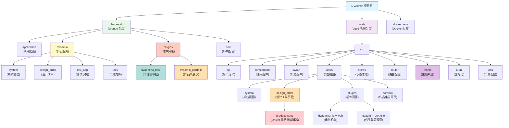

# DVAdmin 项目文档

> 最后更新：2026-06-17 15:46:52（增量更新：design_order 产品规格/产品视角相关改动同步、模块文档细节补全、覆盖率刷新）
> 项目路径：D:\project\dvadmin

## 变更记录 (Changelog)

| 时间 | 变更内容 | 责任人 |
|------|----------|--------|
| 2026-06-17 15:46:52 | 增量更新文档：同步 design_order 产品规格/产品视角相关改动（SaveProductSpecView 校验逻辑、LoadProductSpecView 15/16 行双模板遮罩、ProductSelectDialog/GiftConfigModal 子组件、Univer 三模板+三主题）、补全 web 前端 product_spec 模块（3529 行主组件拆解）、刷新各模块覆盖率与缺口、为所有模块 CLAUDE.md 添加导航面包屑、更新 Mermaid 结构图、生成 v4.1.0 索引 | Claude AI |
| 2026-06-11 18:44:26 | 全仓架构文档初始化/更新：新增 design_order 和 dvadmin_portfolio 模块文档、新增模块级 CLAUDE.md、生成 index.json、更新模块结构图与覆盖率 | Claude AI |
| 2026-06-11 | 修复项目升级缺陷（P0-P3）：修复审批组件路由路径匹配逻辑、新建 requirements-prod.txt 生产依赖、完善 Tailwind 配置、新增审批业务模型、升级 TypeScript 并修复 Sass/Vue 深度选择器废弃警告 | Claude AI |
| 2026-06-03 | 删除博客管理模块、独立的博客前端应用，清理相关配置与路由 | Antigravity AI |
| 2026-02-08 | 项目文档更新：新增 blog-frontend 模块、前端样式优化方案、主题系统文档 | Claude AI |
| 2026-02-08 | 冗余与兼容性清理：删除重复API文件、统一端口配置、清理依赖包、删除静态文件压缩、移除无效脚本 | Claude AI |
| 2026-02-03 | Django 升级到 5.2.0 LTS，移除 dvadmin3-celery 插件，手动配置 Celery | Claude AI |
| 2026-01-25 | 初始化项目根文档，整合所有模块 | Claude AI |

---

## 项目愿景

DVAdmin 是一个基于 RBAC 模型的企业级权限管理系统开发框架，采用前后端分离架构。核心目标是提供列级别权限控制的快速开发平台，支持工作流审批、插件化扩展和多种认证方式。本项目在标准 DVAdmin 框架之上，扩展了**设计工单管理**（美妆活动提报）和**个人履历与作品集展示**两个业务域。

---

## 架构总览

- **后端**：Django 5.2 LTS + Django REST Framework，提供 RESTful API
- **前端**：Vue 3 + TypeScript + Vite + Element Plus + fast-crud + Univer 电子表格
- **工作流**：dvadmin3_flow 插件，支持可视化流程设计、条件分支、审批引擎
- **数据库**：默认 SQLite（开发，启用 WAL 模式以支持并发测试），推荐 MySQL 8.0+ / PostgreSQL（生产）
- **实时通信**：Django Channels（WebSocket），InMemoryChannelLayer
- **异步任务**：Celery + django-celery-beat + django-celery-results
- **部署**：Uvicorn (ASGI) / Gunicorn (WSGI)，Docker Compose 可选

---

## 模块结构图


```mermaid
graph TD
    A["DVAdmin 项目根"] --> B["backend<br/>(Django 后端)"];
    A --> C["web<br/>(Vue3 管理后台)"];
    A --> D["docker_env<br/>(Docker 配置)"];

    B --> E["application<br/>(项目配置)"];
    B --> F["dvadmin<br/>(核心业务)"];
    B --> G["plugins<br/>(插件目录)"];
    B --> H["conf<br/>(环境配置)"];

    F --> I["system<br/>(系统管理)"];
    F --> J["design_order<br/>(设计工单)"];
    F --> K["test_app<br/>(测试示例)"];
    F --> L["utils<br/>(工具类库)"];

    G --> M["dvadmin3_flow<br/>(工作流审批)"];
    G --> N["dvadmin_portfolio<br/>(作品集展示)"];

    C --> O["src"];
    O --> P["api<br/>(接口定义)"];
    O --> Q["components<br/>(通用组件)"];
    O --> R["layout<br/>(布局组件)"];
    O --> S["views<br/>(页面视图)"];
    O --> T["stores<br/>(状态管理)"];
    O --> U["router<br/>(路由配置)"];
    O --> V["theme<br/>(主题系统)"];
    O --> W["i18n<br/>(国际化)"];
    O --> X["utils<br/>(工具函数)"];

    S --> Y["system<br/>(系统页面)"];
    S --> Z["design_order<br/>(设计工单页面)"];
    S --> AA["plugins<br/>(插件页面)"];
    S --> AB["portfolio<br/>(作品集公开页)"];

    AA --> AC["dvadmin3-flow-web<br/>(审批前端)"];
    AA --> AD["dvadmin_portfolio<br/>(作品集管理页)"];

    Z --> AE["product_spec<br/>(Univer 规格书编辑器)"];

    style A fill:#e1f5ff
    style B fill:#e8f5e9
    style C fill:#f3e5f5
    style F fill:#fff9c4
    style G fill:#ffccbc
    style M fill:#b2dfdb
    style N fill:#ffe0b2
    style V fill:#e1bee7
    style Z fill:#ffe0b2
    style AE fill:#ffcdd2

    click B "./backend/CLAUDE.md" "查看 backend 模块文档"
    click C "./web/CLAUDE.md" "查看 web 模块文档"
    click I "./backend/dvadmin/system/CLAUDE.md" "查看 system 模块文档"
    click J "./backend/dvadmin/design_order/CLAUDE.md" "查看 design_order 模块文档"
    click L "./backend/dvadmin/utils/CLAUDE.md" "查看 utils 模块文档"
    click M "./backend/plugins/dvadmin3_flow/CLAUDE.md" "查看 dvadmin3_flow 模块文档"
    click N "./backend/plugins/dvadmin_portfolio/CLAUDE.md" "查看 dvadmin_portfolio 模块文档"
```

---

## 模块索引

| 模块 | 路径 | 语言 | 一句话职责 | 文档 |
|------|------|------|-----------|------|
| Backend | `backend/` | Python | Django 后端服务，API 接口与业务逻辑 | [CLAUDE.md](./backend/CLAUDE.md) |
| System | `backend/dvadmin/system/` | Python | 系统管理核心：用户/角色/菜单/部门/权限/字典 | [CLAUDE.md](./backend/dvadmin/system/CLAUDE.md) |
| Design Order | `backend/dvadmin/design_order/` | Python | 设计工单管理：产品档案/规格提报/活动矩阵（Univer 快照） | [CLAUDE.md](./backend/dvadmin/design_order/CLAUDE.md) |
| Utils | `backend/dvadmin/utils/` | Python | 通用工具类：模型基类/权限/过滤器/序列化器/视图集 | [CLAUDE.md](./backend/dvadmin/utils/CLAUDE.md) |
| Dvadmin3 Flow | `backend/plugins/dvadmin3_flow/` | Python | 工作流审批引擎：流程定义/节点/条件分支/审批流转 | [CLAUDE.md](./backend/plugins/dvadmin3_flow/CLAUDE.md) |
| Dvadmin Portfolio | `backend/plugins/dvadmin_portfolio/` | Python | 个人履历与作品集展示：配置/履历/项目管理 | [CLAUDE.md](./backend/plugins/dvadmin_portfolio/CLAUDE.md) |
| Web | `web/` | TypeScript/Vue | Vue3 管理后台前端应用（含 Univer 规格书编辑器） | [CLAUDE.md](./web/CLAUDE.md) |
| Docker Env | `docker_env/` | YAML/Dockerfile | Docker Compose 部署配置 | - |

---

## 运行与开发

### 后端启动

```bash
cd backend
cp ./conf/env.example.py ./conf/env.py      # 配置环境
pip3 install -r requirements.txt             # 安装开发依赖
# pip3 install -r requirements-prod.txt      # 安装生产依赖（含 PostgreSQL/Gunicorn/Redis）
python3 manage.py makemigrations && python3 manage.py migrate
python3 manage.py init                       # 初始化数据
python main.py                               # 启动服务 (端口 9000)
```

### 前端启动

```bash
cd web
pnpm install                                 # preinstall 脚本强制使用 pnpm
pnpm run dev                                 # 访问 http://localhost:8080
pnpm run build                               # 生产构建
```

### 默认账号

- 用户名：`superadmin`，密码：`admin123456`

### API 文档

- Swagger UI：http://localhost:9000/
- ReDoc：http://localhost:9000/redoc/

---

## 测试策略

| 层级 | 工具/方式 | 位置 | 说明 |
|------|-----------|------|------|
| 后端单元测试 | pytest / Django TestCase | `backend/conftest.py`, `backend/dvadmin/utils/tests/` | 仅 utils 模块有 i18n 测试 |
| 前端 E2E 测试 | Playwright | `web/src/` (配置于 package.json devDependencies) | 已配置但测试用例待补充 |
| API 接口测试 | Swagger UI 手动测试 | http://localhost:9000/ | 主要验证方式 |
| SQLite 并发测试 | SQLite WAL 模式 | `backend/application/settings.py` | 启用 `journal_mode=WAL` + `busy_timeout=5000` 支持并发读写 |

**测试覆盖率评估**：整体偏低。后端仅 `dvadmin/utils/tests/test_i18n.py` 有自动化测试；前端 Playwright 已配置但无实质用例。**优先建议**为 design_order 的 `SaveProductSpecView`（含 validate_submission / merge_snapshots 复杂逻辑）和 dvadmin3_flow 的 `FlowBaseModel.process_engine` 补充单元测试。

---

## 编码规范

### 后端

- 模型继承 `CoreModel`（含 create_datetime / update_datetime / creator / modifier / dept_belong_id / is_deleted）
- 视图集继承 `CustomModelViewSet`，自动获得 CRUD + 权限控制 + 批量删除 + get_by_ids + 导入导出
- 需审批的模型继承 `FlowBaseModel`（来自 dvadmin3_flow）
- 序列化器继承 `CustomModelSerializer`
- 字段级权限通过 `FieldPermissionMixin` + `MenuField` + `FieldPermission` 实现
- 插件通过 `settings.py` 中 `from xxx.settings import *` 自动注册
- 自定义 APIView 不走 ViewSet 时，需独立添加 `permission_classes`（如 `SaveProductSpecView` 使用 `IsAuthenticated`）

### 前端

- CRUD 页面使用 `@fast-crud/fast-crud`，配置写在 `crud.tsx` 中
- 权限控制：`<auth>` 组件、`v-auth` 指令、`hasPermi()` 函数
- 列权限：`handleColumnPermission(GetPermission, crudOptions)` 在 `onMounted` 中调用
- 状态管理：Pinia stores（`web/src/stores/`）
- 国际化：vue-i18n，语言文件在 `web/src/i18n/`
- 样式：Tailwind CSS + SCSS + Element Plus 主题覆盖
- 复杂业务页面（如 product_spec）可拆分为 `index.vue` + `crud.tsx` + `types.ts` + `constants.ts` + `utils.ts` + `components/`

---

## AI 使用指引

- 修改后端业务逻辑时，注意 `FlowBaseModel` 的 `save()` 方法会被审批引擎拦截
- 前端路由由后端菜单系统动态控制，新增页面需同时在后端菜单管理中注册
- 字段级权限（`***` 遮罩）在前后端均有实现：后端 `FieldPermissionMixin` + `LoadProductSpecView` 单元格遮罩，前端 `columnPermission.ts` + `getPermittedVal()` 同步遮罩
- `design_order` 模块的 `SaveProductSpecView` 和 `LoadProductSpecView` 是自定义 APIView，不走标准 ViewSet
- `SaveProductSpecView.validate_submission()` 在 `status == 'submitted'` 时强制执行字段必填/格式/范围校验
- `LoadProductSpecView` 同时支持 15 行（无活动结束日期）和 16 行（含活动结束日期）两种模板的字段遮罩
- 插件注册方式：在 `backend/application/settings.py` 底部 `from xxx.settings import *`
- `requirements.txt` 中的版本号可能与实际安装版本不同（文档标注 Django 5.2.0，但 requirements.txt 写 4.2.14）
- `product_spec/index.vue`（~3529 行）已重构为模块化结构：`types.ts`（接口定义）、`constants.ts`（模板标签+样式字典）、`utils.ts`（光标/坐标/昵称清洗工具）、`components/ProductSelectDialog.vue`（@ 提及选择器）、`components/GiftConfigModal.vue`（赠品配置弹窗）
- Univer 规格书支持 3 种模板：`main_image`（主图）、`live_stream`（直播）、`detail_page`（详情页），3 种主题：`proya`、`collgene`、`luxury`

---

## 项目统计

| 分类 | 数量 | 说明 |
|------|------|------|
| 后端 Python 文件（排除 migrations/__pycache__） | ~60 | backend 目录 |
| 后端 Django 应用 | 5 | system, design_order, test_app, dvadmin3_flow, dvadmin_portfolio |
| 管理后台前端源文件（排除 node_modules） | ~210 | Vue + TS + TSX（含 product_spec 模块拆分） |
| 前端 API 接口文件 | 5 | web/src/api/（login, menu, design_order/*） |
| 前端 Pinia Store | 15 | web/src/stores/ |
| 前端 i18n 翻译文件 | ~60 | web/src/i18n/ |
| Docker 配置文件 | 10 | docker_env/ |
| 文档文件（.claude/plan/ + CLAUDE.md） | ~20 | 方案与架构文档 |
| design_order 后端代码量 | ~1100 行 | models.py(187) + views.py(546) + serializers.py(34) + urls.py(21) + apps/admin |
| product_spec 前端代码量 | ~3900 行 | index.vue(3529) + types.ts(56) + constants.ts(89) + utils.ts(120) + 2 子组件 |

---

## 技术栈

### 后端

| 技术 | 版本 | 用途 |
|------|------|------|
| Django | 4.2.14 (requirements) / 5.2.0 (文档标注) | Web 框架 |
| Django REST Framework | 3.15.2 | API 框架 |
| djangorestframework-simplejwt | 5.4.0 | JWT 认证 |
| drf-yasg | 1.21.15 | Swagger 文档 |
| channels | 4.1.0 | WebSocket |
| whitenoise | 6.7.0 | 静态文件服务 |
| django-restql | - | 序列化器动态字段（CustomModelViewSet 已集成） |
| dvadmin3-celery | 3.1.6 | Celery 异步任务封装 |

### 前端

| 技术 | 版本 | 用途 |
|------|------|------|
| Vue | 3.4.38 | UI 框架 |
| TypeScript | 4.9.4 (pkg) / 5.9.3 (已升级) | 类型安全 |
| Vite | 5.4.1 | 构建工具 |
| Element Plus | 2.8.0 | UI 组件库 |
| Pinia | 2.0.28 | 状态管理 |
| @fast-crud/fast-crud | 1.28.1 | CRUD 快速开发 |
| vue-i18n | 9.14.0 | 国际化 |
| echarts | 5.5.1 | 图表 |
| Tailwind CSS | 3.2.7 | 原子化样式 |
| @univerjs/presets + @univerjs/preset-sheets-core | - | Univer 电子表格（product_spec 模块） |
| @univerjs/preset-sheets-data-validation | - | Univer 数据验证（下拉选择） |

---

## 环境要求

- Python >= 3.9.0（推荐 3.11+）
- Node.js >= 16.0.0
- MySQL >= 8.0（可选，默认 SQLite3，启用 WAL 模式）
- Redis（可选，用于 Celery 和 Channels）

---

## 相关资源

- GitHub：https://github.com/jack571754/dvadmin
- 启动指南：[START.md](./START.md)
- 升级缺陷修复报告：[.claude/plan/升级缺陷修复报告.md](./.claude/plan/升级缺陷修复报告.md)
- 前端样式与配色实施方案：[.claude/plan/前端样式与配色实施方案.md](./.claude/plan/前端样式与配色实施方案.md)
- 设计工单模块问题诊断与优化规划：[.claude/plan/设计工单模块问题诊断与优化规划.md](./.claude/plan/设计工单模块问题诊断与优化规划.md)
- 设计工单产品视角诊断：[.claude/plan/设计工单产品视角诊断.md](./.claude/plan/设计工单产品视角诊断.md)

---

## 面包屑导航

```
[根目录] (./)
  |-- [backend] (./backend/)
  |    |-- [application] (./backend/application/)
  |    |-- [dvadmin] (./backend/dvadmin/)
  |    |    |-- [system] (./backend/dvadmin/system/)
  |    |    |-- [design_order] (./backend/dvadmin/design_order/)
  |    |    |-- [test_app] (./backend/dvadmin/test_app/)
  |    |    +-- [utils] (./backend/dvadmin/utils/)
  |    +-- [plugins] (./backend/plugins/)
  |         |-- [dvadmin3_flow] (./backend/plugins/dvadmin3_flow/)
  |         +-- [dvadmin_portfolio] (./backend/plugins/dvadmin_portfolio/)
  |-- [web] (./web/)
  +-- [docker_env] (./docker_env/)
```

---

## 文档维护

本文档由 Claude AI 自动生成和维护，如有问题请联系项目维护者。

**文档版本：** v4.1.0
**生成时间：** 2026-06-17T15:46:52
**文档路径：** D:\project\dvadmin\CLAUDE.md
**扫描覆盖率：** ~78%（详见 .claude/index.json）
