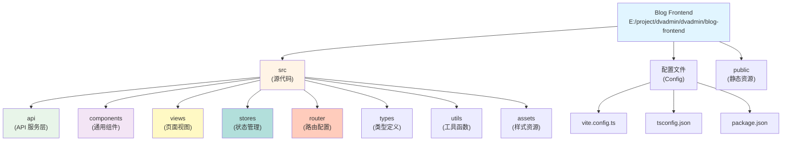

# Blog Frontend - AI 上下文文档

> 最后更新：2026-02-08
> 项目路径：E:\project\dvadmin\dvadmin\blog-frontend

## 变更记录 (Changelog)

| 时间 | 变更内容 | 责任人 |
|------|----------|--------|
| 2026-02-08 | 更新项目路径，整合到 DVAdmin 项目文档体系 | Claude AI |
| 2026-02-03 10:51:57 | 初始化项目 AI 上下文文档，完成全仓清点与模块扫描 | Claude AI |

---

## 项目概述

**Blog Frontend** 是一个现代化的博客前端应用，采用「纸间·墨语」东方美学设计理念。项目基于 Vue 3 + TypeScript + Vite 技术栈，实现了文章展示、Markdown 渲染、代码高亮、用户认证等核心功能。

**核心特性：**
- 🎨 东方美学设计系统（墨与纸）
- 📝 Markdown 文章渲染与代码高亮
- 🔐 JWT 用户认证系统
- 📱 响应式设计与移动端适配
- ⚡ Vite 极速开发体验
- 🎯 TypeScript 类型安全

---

## 架构图



---

## 模块索引

| 模块 | 路径 | 说明 |
|------|------|------|
| API 服务层 | [src/api/](./src/api/CLAUDE.md) | 后端 API 通信与数据转换 |
| 通用组件 | [src/components/](./src/components/CLAUDE.md) | Header, Footer, ArticleCard 等 |
| 页面视图 | [src/views/](./src/views/CLAUDE.md) | Home, ArticleDetail, Archive 等 |
| 状态管理 | [src/stores/](./src/stores/CLAUDE.md) | Pinia stores (auth, articles) |
| 路由配置 | [src/router/](./src/router/CLAUDE.md) | Vue Router 路由定义 |
| 类型定义 | [src/types/](./src/types/CLAUDE.md) | TypeScript 类型接口 |
| 工具函数 | [src/utils/](./src/utils/CLAUDE.md) | 日期格式化、错误处理等 |
| 样式资源 | [src/assets/](./src/assets/CLAUDE.md) | 设计系统变量与动画 |

---

## 快速开始

### 1. 安装依赖

```bash
npm install
# 或
yarn install
```

### 2. 配置环境变量

编辑 `.env` 文件，设置后端 API 地址：

```env
VITE_API_BASE_URL=http://localhost:9000/api
```

### 3. 启动开发服务器

```bash
npm run dev
# 或
yarn dev
```

访问 http://localhost:5173

### 4. 构建生产版本

```bash
npm run build
# 或
yarn build
```

---

## 技术栈

### 核心框架

- **Vue 3.4.38** - 渐进式 JavaScript 框架
- **TypeScript 5.6.2** - 类型安全的 JavaScript
- **Vite 5.4.1** - 下一代前端构建工具

### 路由与状态

- **Vue Router 4.4.0** - Vue.js 官方路由
- **Pinia 2.2.2** - Vue 官方状态管理库

### UI 与渲染

- **Markdown-it 14.1.0** - Markdown 解析器
- **Highlight.js 11.10.0** - 代码语法高亮

### HTTP 客户端

- **Axios 1.7.7** - HTTP 请求库

### 开发工具

- **@vitejs/plugin-vue 5.1.3** - Vue 3 Vite 插件
- **vue-tsc 2.1.6** - Vue TypeScript 编译器

---

## 设计系统

### 色彩系统 - 墨与纸

- **墨色系**：ink-900 ~ ink-500（深到浅）
- **纸张系**：paper-50 ~ paper-300（白到灰）
- **强调色**：vermilion (#c8402e) - 朱砂红
- **辅助色**：indigo (#4a5fa0) - 靛蓝

### 字体系统

- **衬线体**：Noto Serif SC（标题、强调）
- **无衬线体**：Outfit（正文、UI）
- **等宽体**：JetBrains Mono（代码）

### 间距系统

采用 4px 基准的等比数列：4px, 8px, 12px, 16px, 24px, 32px...

### 动画韵律

- 缓动函数：cubic-bezier(0.25, 1, 0.5, 1) - ease-out-quart
- 时长：150ms, 250ms, 400ms, 600ms

---

## API 端点

### 后端对接

- **基础地址**：`http://localhost:9000`
- **认证方式**：JWT Bearer Token
- **API 前缀**：`/api`

### 主要端点

- `GET /api/blog/articles/` - 文章列表
- `GET /api/blog/articles/{id}/` - 文章详情
- `GET /api/blog/categories/` - 分类列表
- `GET /api/blog/tags/` - 标签列表
- `POST /api/login/` - 用户登录
- `POST /api/blog/register/` - 用户注册
- `GET /api/system/user/user_info/` - 用户信息

---

## 目录结构

```
blog-frontend/
├── .env                      # 环境变量
├── .gitignore               # Git 忽略配置
├── index.html               # HTML 入口
├── package.json             # 项目依赖
├── vite.config.ts           # Vite 配置
├── tsconfig.json            # TypeScript 配置
├── README.md                # 项目说明
├── src/
│   ├── main.ts              # 应用入口
│   ├── App.vue              # 根组件
│   ├── api/                 # API 服务层
│   │   └── blog.ts          # 博客 API
│   ├── components/          # 通用组件
│   │   ├── Header.vue       # 页头导航
│   │   ├── Footer.vue       # 页脚
│   │   ├── ArticleCard.vue  # 文章卡片
│   │   ├── MarkdownRenderer.vue  # Markdown 渲染
│   │   └── Sidebar.vue      # 侧边栏
│   ├── views/               # 页面视图
│   │   ├── Home.vue         # 首页
│   │   ├── ArticleDetail.vue  # 文章详情
│   │   ├── Archive.vue      # 归档页
│   │   ├── About.vue        # 关于页
│   │   ├── Login.vue        # 登录页
│   │   ├── Register.vue     # 注册页
│   │   └── NotFound.vue     # 404 页
│   ├── stores/              # Pinia 状态
│   │   ├── auth.ts          # 认证状态
│   │   └── articles.ts      # 文章状态
│   ├── router/              # 路由配置
│   │   └── index.ts         # 路由定义
│   ├── types/               # 类型定义
│   │   └── blog.ts          # 博客类型
│   ├── utils/               # 工具函数
│   │   ├── date.ts          # 日期工具
│   │   └── errorHandler.ts  # 错误处理
│   └── assets/              # 静态资源
│       └── styles/          # 样式文件
│           ├── variables.css      # 设计系统变量
│           ├── animations.css     # 动画定义
│           └── global.css         # 全局样式
└── public/                  # 公共资源
```

---

## 路由结构

| 路径 | 组件 | 说明 |
|------|------|------|
| `/` | Home.vue | 首页 - 文章列表 |
| `/article/:id` | ArticleDetail.vue | 文章详情页 |
| `/archive` | Archive.vue | 文章归档 |
| `/about` | About.vue | 关于页面 |
| `/login` | Login.vue | 登录页面 |
| `/register` | Register.vue | 注册页面 |
| `*` | NotFound.vue | 404 页面 |

---

## 编码规范

### Vue 组件

- 使用 Composition API (`<script setup>`)
- Props 使用 TypeScript 类型定义
- 组件命名：PascalCase（文件名）或 kebab-case（模板引用）

### TypeScript

- 严格模式启用
- 接口定义放在 `src/types/` 目录
- 避免使用 `any`，使用 `unknown` 或具体类型

### 样式

- 优先使用设计系统变量
- 作用域样式：`<style scoped>`
- BEM 命名规范用于复杂组件

### 代码注释

- 函数添加 JSDoc 注释
- 复杂逻辑添加解释性注释
- 保持注释与代码同步

---

## AI 使用指引

### 关键文件

1. **API 集成**：`src/api/blog.ts` - 后端通信逻辑
2. **认证流程**：`src/stores/auth.ts` - JWT 认证状态管理
3. **文章渲染**：`src/views/ArticleDetail.vue` - Markdown 渲染与高亮
4. **设计系统**：`src/assets/styles/variables.css` - 样式变量定义

### 常见任务

- **新增 API 端点**：在 `src/api/blog.ts` 的 `BlogApiService` 类中添加方法
- **新增页面**：在 `src/views/` 创建组件，在 `src/router/index.ts` 注册路由
- **状态管理**：在 `src/stores/` 创建新的 Pinia store
- **样式覆盖**：使用设计系统变量，避免硬编码颜色和间距

### 后端对接

- 后端基于 DVAdmin 框架
- API 响应格式：`{ code, msg, data, page, limit, total }`
- 认证头格式：`Authorization: JWT <token>`
- 分页参数：`page`, `page_size`

---

## 测试策略

### 手动测试重点

1. **文章展示**：列表加载、详情渲染、Markdown 解析
2. **认证流程**：登录、注册、登出、token 持久化
3. **错误处理**：网络错误、404、500 等异常情况
4. **响应式**：移动端布局、触摸交互

### 待补充

- [ ] 单元测试（Vitest）
- [ ] 组件测试（Vue Test Utils）
- [ ] E2E 测试（Playwright/Cypress）

---

## 性能优化

### 已实现

- 路由懒加载
- 代码分割（vendor、markdown）
- Vite HMR 快速更新
- Markdown 按需渲染

### 可优化

- [ ] 图片懒加载
- [ ] 虚拟滚动（长列表）
- [ ] Service Worker 缓存
- [ ] CDN 资源加载

---

## 部署指南

### 构建配置

生产环境变量设置：

```env
VITE_API_BASE_URL=https://your-api-domain.com/api
```

### Nginx 配置示例

```nginx
server {
    listen 80;
    server_name your-blog.com;
    root /var/www/blog-frontend/dist;
    index index.html;

    location / {
        try_files $uri $uri/ /index.html;
    }

    location /api {
        proxy_pass http://backend:9000;
        proxy_set_header Host $host;
        proxy_set_header X-Real-IP $remote_addr;
    }
}
```

---

## 相关资源

- [Vue 3 文档](https://vuejs.org/)
- [Vite 文档](https://vitejs.dev/)
- [Pinia 文档](https://pinia.vuejs.org/)
- [DVAdmin 后端](../django-vue3-admin-master/backend/CLAUDE.md)
- [DVAdmin 管理后台](../django-vue3-admin-master/web/CLAUDE.md)
- [TypeScript 文档](https://www.typescriptlang.org/)

---

## 面包屑导航

```text
[根目录] (../CLAUDE.md)
  └─ [blog-frontend] (./)
       ├─ [src] (./src/)
       │    ├─ [api] (./src/api/)
       │    ├─ [components] (./src/components/)
       │    ├─ [views] (./src/views/)
       │    ├─ [stores] (./src/stores/)
       │    ├─ [router] (./src/router/)
       │    ├─ [types] (./src/types/)
       │    ├─ [utils] (./src/utils/)
       │    └─ [assets] (./src/assets/)
       ├─ [public] (./public/)
       └─ 配置文件
```

---

## 文档维护

本文档由 Claude AI 自动生成和维护。

**文档版本：** v1.1.0
**生成时间：** 2026-02-08
**文档路径：** E:\project\dvadmin\dvadmin\blog-frontend\CLAUDE.md
**扫描文件数：** 24
**文档覆盖率：** 100%
