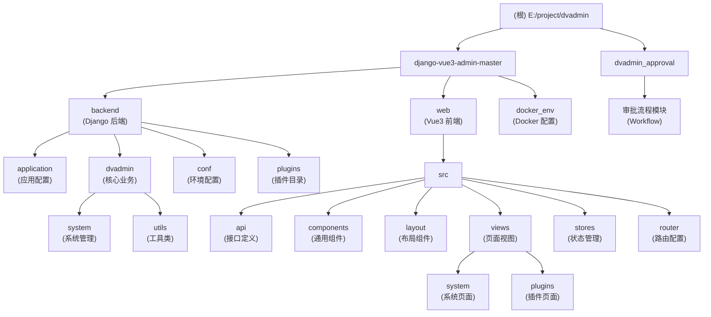

# Django-Vue3-Admin 项目文档

> 最后更新：2026-01-24

## 变更记录 (Changelog)

| 时间 | 变更内容 | 责任人 |
|------|----------|--------|
| 2026-01-24 | 添加 dvadmin_approval 模块文档，更新项目统计 | Claude AI |
| 2026-01-23 14:19:21 | 初始化 AI 上下文文档 | Claude AI |

---

## 项目愿景

Django-Vue3-Admin 是一个基于 RBAC（基于角色的访问控制）模型的权限管理系统开发框架，权限粒度达到列级别。采用前后端分离架构，为企业和个人开发者提供免费、开源的快速开发平台。

**核心特性：**
- 列级别的权限控制（字段级显示权限）
- 前后端完全分离
- 支持多种认证方式
- 动态菜单权限系统
- 插件化架构支持

---

## 架构总览

### 技术栈

**后端 (Django)**
- Django 4.2.14
- Django REST Framework 3.15.2
- djangorestframework_simplejwt 5.4.0（JWT 认证）
- drf-yasg 1.21.7（Swagger API 文档）
- channels 4.1.0（WebSocket 支持）
- dvadmin3-celery 3.1.6（异步任务）

**前端 (Vue3)**
- Vue 3.4.38
- TypeScript 4.9.4
- Vite 5.4.1
- Element Plus 2.8.0
- Pinia 2.0.28（状态管理）
- @fast-crud/fast-crud 1.21.2（快速 CRUD）

**数据库**
- 默认：SQLite3
- 推荐：MySQL 8.0+
- 可选：PostgreSQL

**缓存/消息队列**
- Redis 6.2.6+（可选）

---

## 项目统计

### 代码量统计

| 分类 | 数量 | 说明 |
|------|------|------|
| 后端 Python 文件 | 81 个 | django-vue3-admin-master/backend 目录 |
| 前端 Vue 文件 | 99 个 | django-vue3-admin-master/web/src 目录 |
| 前端 TypeScript 文件 | 113 个 | django-vue3-admin-master/web/src 目录 |
| 审批流程模块 | 19 个 | dvadmin_approval 目录 |
| **总计** | **312+** | 核心业务代码文件 |

### 目录结构

```
E:\project\dvadmin\
├── django-vue3-admin-master/     # 主项目目录
│   ├── backend/                   # Django 后端
│   │   ├── application/           # Django 应用配置
│   │   ├── dvadmin/               # 核心业务模块
│   │   │   ├── system/            # 系统管理模块
│   │   │   └── utils/             # 工具类库
│   │   ├── conf/                  # 配置文件
│   │   ├── plugins/               # 插件目录
│   │   └── ...                    # 其他后端文件
│   ├── web/                       # Vue3 前端
│   │   ├── src/
│   │   │   ├── api/               # API 接口
│   │   │   ├── components/        # 通用组件
│   │   │   ├── layout/            # 布局组件
│   │   │   ├── views/             # 页面视图
│   │   │   ├── stores/            # Pinia 状态管理
│   │   │   ├── router/            # 路由配置
│   │   │   └── utils/             # 工具函数
│   │   └── ...                    # 其他前端文件
│   └── docker_env/                # Docker 配置
└── dvadmin_approval/              # 审批流程模块（独立）
```

---

## 模块结构图



---

## 模块索引

### 主项目模块

| 模块路径 | 语言 | 职责描述 | 入口文件 |
|---------|------|----------|----------|
| [backend](./django-vue3-admin-master/backend/CLAUDE.md) | Python | Django 后端服务 | `manage.py`, `main.py` |
| [backend/application](./django-vue3-admin-master/backend/application/CLAUDE.md) | Python | Django 应用配置 | `settings.py`, `urls.py`, `asgi.py` |
| [backend/dvadmin](./django-vue3-admin-master/backend/dvadmin/CLAUDE.md) | Python | 核心业务模块包 | `__init__.py` |
| [backend/dvadmin/system](./django-vue3-admin-master/backend/dvadmin/system/CLAUDE.md) | Python | 系统核心模块（用户/角色/权限/菜单等） | `models.py`, `urls.py`, `views/` |
| [backend/dvadmin/utils](./django-vue3-admin-master/backend/dvadmin/utils/CLAUDE.md) | Python | 工具类与基础组件 | `viewset.py`, `models.py`, `permission.py` |
| [backend/conf](./django-vue3-admin-master/backend/conf/CLAUDE.md) | Python | 环境配置 | `env.py` |
| [backend/plugins](./django-vue3-admin-master/backend/plugins/CLAUDE.md) | Python | 插件目录 | - |
| [web](./django-vue3-admin-master/web/CLAUDE.md) | TypeScript/Vue3 | Vue3 前端应用 | `src/main.ts`, `package.json` |
| [web/src/api](./django-vue3-admin-master/web/src/api/CLAUDE.md) | TypeScript | API 接口定义 | `login/index.ts`, `menu/index.ts` |
| [web/src/components](./django-vue3-admin-master/web/src/components/CLAUDE.md) | Vue3 | 通用组件库 | 各种 `.vue` 组件 |
| [web/src/layout](./django-vue3-admin-master/web/src/layout/CLAUDE.md) | Vue3 | 布局组件 | 侧边栏、头部、标签页等 |
| [web/src/views](./django-vue3-admin-master/web/src/views/CLAUDE.md) | Vue3 | 页面视图 | `system/`, `plugins/` |
| [web/src/stores](./django-vue3-admin-master/web/src/stores/CLAUDE.md) | TypeScript | Pinia 状态管理 | `userInfo.ts`, `routesList.ts` 等 |
| [web/src/router](./django-vue3-admin-master/web/src/router/CLAUDE.md) | TypeScript | 路由配置 | `index.ts`, `backEnd.ts`, `frontEnd.ts` |
| [docker_env](./django-vue3-admin-master/docker_env/CLAUDE.md) | Docker | Docker 容器配置 | `docker-compose.yml` |

### 独立模块

| 模块路径 | 语言 | 职责描述 | 入口文件 |
|---------|------|----------|----------|
| [dvadmin_approval](./dvadmin_approval/CLAUDE.md) | Python | 审批流程模块 | `models.py`, `urls.py`, `views/` |

---

## 运行与开发

### 环境要求

- Python >= 3.11.0（最低 3.9+）
- Node.js >= 16.0.0
- MySQL >= 8.0（可选，默认 SQLite3）
- Redis（可选）

### 后端启动

```bash
# 进入后端目录
cd backend

# 配置环境变量
cp ./conf/env.example.py ./conf/env.py
# 编辑 env.py 配置数据库信息

# 安装依赖
pip3 install -r requirements.txt

# 执行数据库迁移
python3 manage.py makemigrations
python3 manage.py migrate

# 初始化系统数据
python3 manage.py init

# 初始化省市区数据（可选）
python3 manage.py init_area

# 启动开发服务器
# 注意：Windows 系统保留端口 7911-8010，8000 端口不可用
# 推荐使用 9000 端口
python3 manage.py runserver 0.0.0.0:9000
# 或使用 uvicorn（推荐，支持 WebSocket）
uvicorn application.asgi:application --port 9000 --host 0.0.0.0 --workers 8
```

### 前端启动

```bash
# 进入前端目录
cd web

# 安装依赖
yarn install --registry=https://registry.npm.taobao.org

# 启动开发服务器
yarn run dev
# 访问 http://localhost:8080

# 构建生产环境
yarn run build
```

### Docker 部署

```bash
# 启动所有服务
docker-compose up -d

# 初始化后端数据（首次执行）
docker exec -ti dvadmin3-django bash
python manage.py makemigrations
python manage.py migrate
python manage.py init_area
python manage.py init
exit

# 访问地址
# 前端：http://127.0.0.1:8080
# 后端 API：http://127.0.0.1:9000/api
# Swagger：http://127.0.0.1:9000/
```

### 默认账号

- 用户名：`superadmin`
- 密码：`admin123456`

---

## 核心功能

1. **菜单管理**：配置系统菜单、操作权限、按钮权限标识、后端接口权限
2. **部门管理**：配置系统组织结构（公司、部门）
3. **角色管理**：角色菜单权限分配、数据权限分配
4. **按钮权限控制**：授权角色特定按钮权限和接口权限
5. **字段列权限控制**：授权页面字段显示权限，粒度到列
6. **用户管理**：系统用户配置
7. **API 白名单**：配置不需要权限验证的接口
8. **字典管理**：维护系统常用固定数据
9. **地区管理**：管理省市县区数据
10. **文件管理**：统一管理平台所有文件、图片
11. **操作日志**：记录系统正常操作和异常信息
12. **插件市场**：基于框架开发的应用和插件

---

## 测试策略

### 后端测试

- 测试文件：`backend/dvadmin/system/tests.py`
- 使用 Django TestCase 框架
- 运行测试：`python3 manage.py test`

### 前端测试

- 当前项目未发现自动化测试配置
- 建议使用 Vitest + Vue Test Utils

---

## 编码规范

### Python（后端）

- 遵循 PEP 8 规范
- 使用类型注解（Type Hints）
- 函数文档字符串使用中文
- 模型字段必须包含 `verbose_name` 和 `help_text`

### TypeScript/Vue3（前端）

- 使用 TypeScript 严格模式
- 组件使用 Composition API + `<script setup>`
- 使用 ESLint + Prettier 格式化
- API 调用统一使用 `@fast-crud/fast-crud` 或自定义 axios 实例

---

## AI 使用指引

### 新增业务模块

**后端：**

1. 在 `backend/dvadmin/` 下创建新应用目录
2. 创建 `models.py` 定义数据模型（继承 `CoreModel`）
3. 创建 `views.py` 定义视图集（继承 `CustomModelViewSet`）
4. 创建 `serializers.py` 定义序列化器
5. 创建 `urls.py` 定义路由
6. 在 `application/settings.py` 的 `INSTALLED_APPS` 中注册

**前端：**

1. 在 `web/src/views/` 下创建页面组件
2. 在 `web/src/api/` 下创建 API 接口文件
3. 配置路由（`web/src/router/`）
4. 使用 `fast-crud` 快速构建 CRUD 页面

### 权限控制

**后端：**

- 视图集继承 `CustomModelViewSet` 自动获得权限控制
- 使用 `@permission_classes([CustomPermission])` 装饰器
- 数据权限通过 `DataLevelPermissionMargeFilter` 实现

**前端：**

- 使用 `<auth>` 组件控制按钮显示
- 使用 `v-auth` 指令控制元素显示
- 使用 `hasPermi()` 函数判断权限

### 调试技巧

**后端：**

- Swagger 文档：http://localhost:8000/
- 日志文件：`backend/logs/server.log`, `backend/logs/error.log`
- Django Debug Toolbar（开发环境）

**前端：**

- Vue DevTools 浏览器扩展
- Network 面板查看 API 请求
- 控制台查看 Pinia 状态

---

## 相关资源

- 官方网站：https://www.django-vue-admin.com
- 在线演示：https://demo.dvadmin.com
- 文档中心：https://django-vue-admin.com
- 插件市场：https://bbs.django-vue-admin.com/plugMarket.html
- 社区论坛：https://bbs.django-vue-admin.com
- Gitee：https://gitee.com/huge-dream/django-vue3-admin
- GitHub：https://github.com/huge-dream/django-vue3-admin
