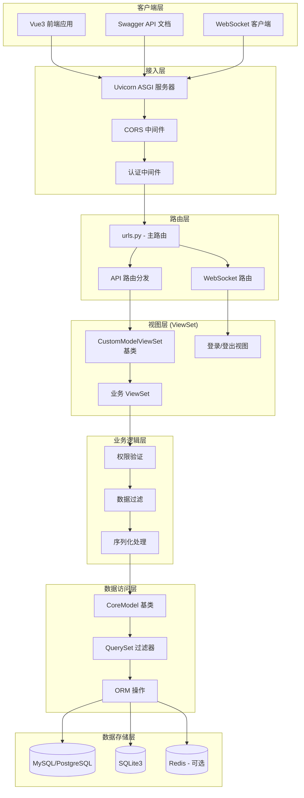
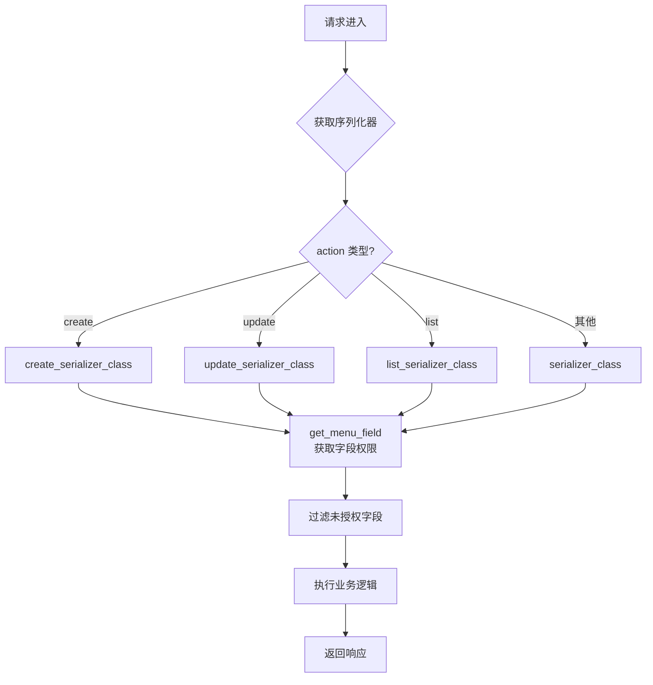
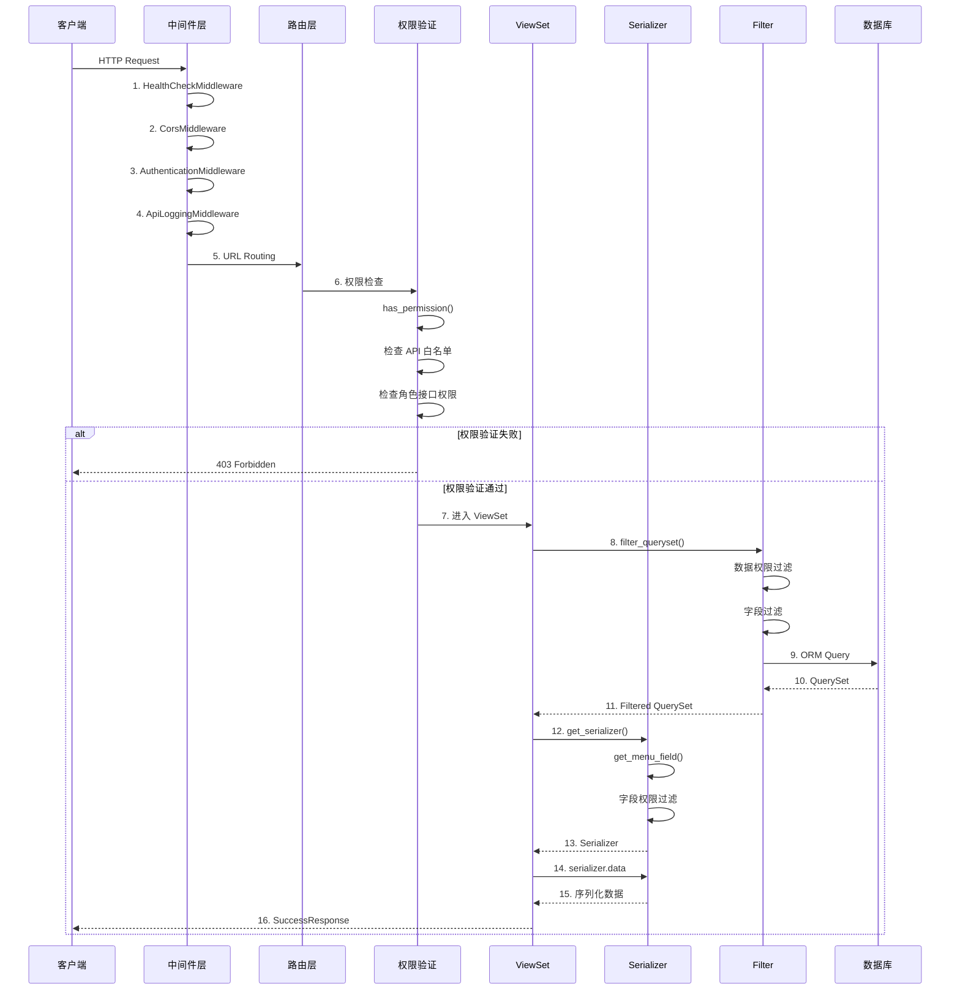
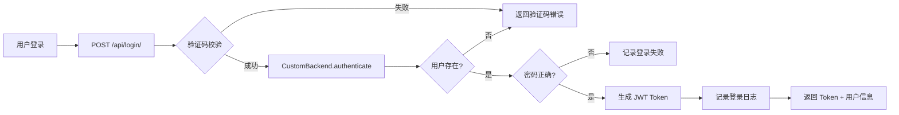
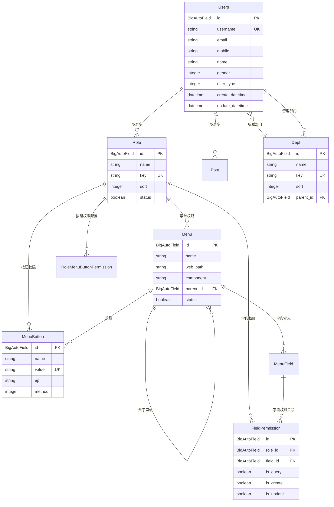
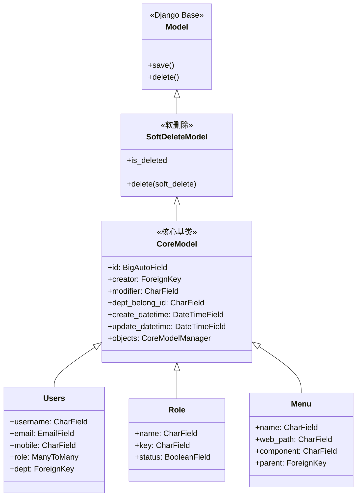
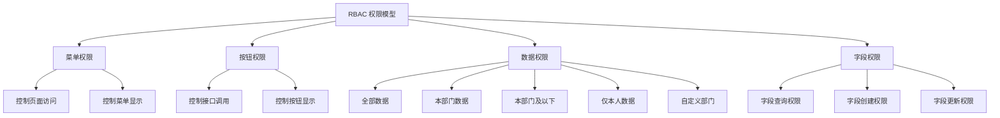
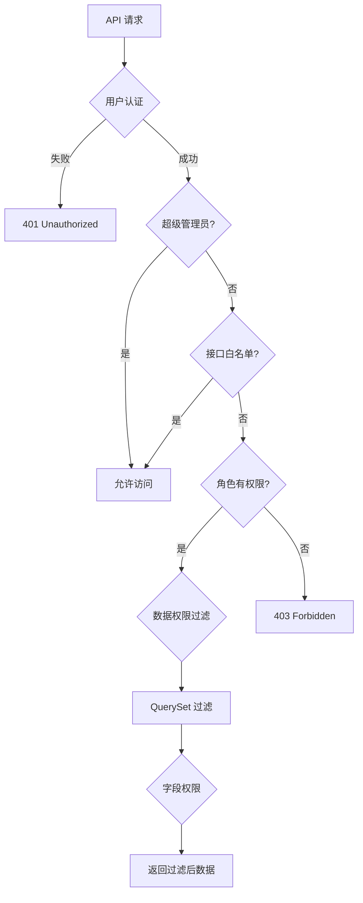
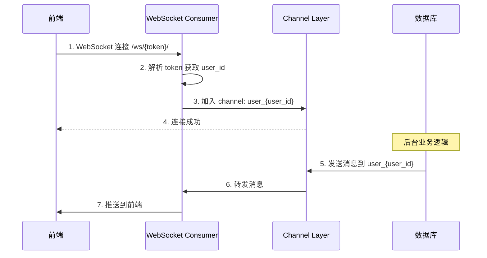

# DVAdmin 后端架构设计篇

> **文档定位**：面向开发者，深入解析架构原理与设计模式
> **更新时间**：2026-01-24
> **适用版本**：Django 4.2.14 + DRF 3.15.2

---

## 目录

- [1. 架构概览](#1-架构概览)
- [2. 分层架构设计](#2-分层架构设计)
- [3. 核心组件](#3-核心组件)
- [4. 请求处理流程](#4-请求处理流程)
- [5. 数据模型设计](#5-数据模型设计)
- [6. 权限系统架构](#6-权限系统架构)
- [7. WebSocket 架构](#7-websocket-架构)
- [8. 设计模式总结](#8-设计模式总结)

---

## 1. 架构概览

### 1.1 架构定位

DVAdmin 采用 **前后端分离 + RBAC 权限模型** 的企业级开发框架，核心特点是**列级别的权限控制**。

### 1.2 技术栈

| 层次 | 技术 |
|------|------|
| **Web 框架** | Django 4.2.14 |
| **API 框架** | Django REST Framework 3.15.2 |
| **认证** | JWT (djangorestframework_simplejwt 5.4.0) |
| **文档** | drf-yasg 1.21.7 (Swagger) |
| **WebSocket** | channels 4.1.0 |
| **数据库** | SQLite3 (默认) / MySQL 8.0+ / PostgreSQL |
| **异步任务** | dvadmin3-celery 3.1.6 |

### 1.3 整体架构图



---

## 2. 分层架构设计

### 2.1 架构层次

```
┌─────────────────────────────────────────────────────────────┐
│                         表现层 (Presentation)                │
│  ┌──────────────┐  ┌──────────────┐  ┌──────────────┐       │
│  │  API 接口    │  │  Swagger     │  │  WebSocket   │       │
│  │  (ViewSet)   │  │  文档        │  │  (Consumer)  │       │
│  └──────────────┘  └──────────────┘  └──────────────┘       │
├─────────────────────────────────────────────────────────────┤
│                         业务逻辑层 (Business)                 │
│  ┌──────────────┐  ┌──────────────┐  ┌──────────────┐       │
│  │  权限验证    │  │  数据过滤    │  │  序列化处理   │       │
│  │  Permission  │  │  Filter      │  │  Serializer  │       │
│  └──────────────┘  └──────────────┘  └──────────────┘       │
├─────────────────────────────────────────────────────────────┤
│                         数据访问层 (Data Access)             │
│  ┌──────────────┐  ┌──────────────┐  ┌──────────────┐       │
│  │  CoreModel   │  │  Manager     │  │  QuerySet    │       │
│  │  基类        │  │  管理器      │  │  查询集      │       │
│  └──────────────┘  └──────────────┘  └──────────────┘       │
├─────────────────────────────────────────────────────────────┤
│                         持久化层 (Persistence)               │
│  ┌──────────────┐  ┌──────────────┐  ┌──────────────┐       │
│  │   MySQL      │  │  PostgreSQL  │  │   SQLite     │       │
│  └──────────────┘  └──────────────┘  └──────────────┘       │
└─────────────────────────────────────────────────────────────┘
```

### 2.2 目录映射

| 分层 | 目录 | 说明 |
|------|------|------|
| 表现层 | `dvadmin/*/views/` | ViewSet 视图层 |
| 业务逻辑层 | `dvadmin/utils/` | 权限、过滤器、序列化器 |
| 数据访问层 | `dvadmin/*/models.py` | 数据模型 |
| 持久化层 | `DATABASES` 配置 | 数据库 |

---

## 3. 核心组件

### 3.1 CoreModel - 核心基类

**位置**：`dvadmin/utils/models.py`

**设计原理**：抽象基类模式，为所有业务模型提供统一的审计字段和功能。

```python
class CoreModel(models.Model):
    # 主键
    id = models.BigAutoField(primary_key=True)

    # 审计字段
    creator = models.ForeignKey(...)      # 创建人
    modifier = models.CharField(...)      # 修改人
    dept_belong_id = models.CharField(...) # 数据归属部门
    create_datetime = models.DateTimeField(auto_now_add=True)
    update_datetime = models.DateTimeField(auto_now=True)

    # 自定义 Manager
    objects = CoreModelManager()

    class Meta:
        abstract = True  # 抽象基类，不生成表
```

**核心功能**：
1. 自动审计字段（创建人、修改人、时间戳）
2. 数据归属部门支持（用于数据权限）
3. 软删除支持（通过 `SoftDeleteModel`）
4. 自定义 Manager 拦截查询操作

### 3.2 CustomModelViewSet - 视图集基类

**位置**：`dvadmin/utils/viewset.py`

**设计原理**：模板方法模式 + DRF 的 ModelViewSet，封装 CRUD 标准操作。

```python
class CustomModelViewSet(ModelViewSet):
    # 序列化器配置
    serializer_class = None
    create_serializer_class = None      # 创建时使用
    update_serializer_class = None      # 更新时使用
    list_serializer_class = None        # 列表时使用

    # 过滤配置
    filter_fields = '__all__'           # 支持全部字段过滤
    search_fields = ()

    # 权限配置
    permission_classes = [CustomPermission]

    # 导入导出
    import_field_dict = {}
    export_field_label = {}
```

**核心方法流程**：



### 3.3 CustomPermission - 权限类

**位置**：`dvadmin/utils/permission.py`

**设计原理**：基于 RBAC 的接口权限验证。

```python
class CustomPermission(BasePermission):
    def has_permission(self, request, view):
        # 1. 超级管理员直接通过
        if request.user.is_superuser:
            return True

        # 2. 检查接口白名单
        api = request.path
        method = request.method
        if api in white_list:
            return True

        # 3. 检查角色权限
        role_id_list = request.user.role.values_list('id', flat=True)
        user_api_list = RoleMenuButtonPermission.objects.filter(
            role__in=role_id_list
        ).values('permission__api', 'permission__method')

        # 4. 正则匹配接口权限
        return validate_api(api, method, user_api_list)
```

### 3.4 CoreModelFilterBackend - 过滤器

**设计原理**：动态字段过滤，支持所有模型字段。

```python
class CoreModelFilterBackend(FilterSet):
    """
    根据 model 字段动态生成过滤器
    filter_fields = '__all__' 支持全部字段
    """
```

### 3.5 DataLevelPermissionMargeFilter - 数据权限过滤器

**设计原理**：根据角色数据权限范围过滤查询集。

```python
class DataLevelPermissionMargeFilter:
    def filter_queryset(self, request, queryset, view):
        """
        数据权限范围：
        0 - 仅本人数据
        1 - 本部门及以下
        2 - 本部门数据
        3 - 全部数据
        4 - 自定义部门
        """
        # 获取用户当前角色的数据权限范围
        data_range = get_user_data_range(request.user)

        if data_range == 0:  # 仅本人
            return queryset.filter(creator=request.user)
        elif data_range == 1:  # 本部门及以下
            dept_ids = Dept.recursion_all_dept(request.user.dept_id)
            return queryset.filter(dept_belong_id__in=dept_ids)
        # ...
```

---

## 4. 请求处理流程

### 4.1 完整请求流程



### 4.2 中间件执行顺序

**位置**：`application/settings.py`

```python
MIDDLEWARE = [
    "dvadmin.utils.middleware.HealthCheckMiddleware",    # 1. 健康检查
    "django.middleware.security.SecurityMiddleware",     # 2. 安全
    "whitenoise.middleware.WhiteNoiseMiddleware",        # 3. 静态文件
    "django.contrib.sessions.middleware.SessionMiddleware",  # 4. Session
    "corsheaders.middleware.CorsMiddleware",             # 5. CORS 跨域
    "django.middleware.common.CommonMiddleware",         # 6. 通用
    "django.middleware.csrf.CsrfViewMiddleware",         # 7. CSRF
    "django.contrib.auth.middleware.AuthenticationMiddleware", # 8. 认证
    "django.contrib.messages.middleware.MessageMiddleware", # 9. 消息
    "django.middleware.clickjacking.XFrameOptionsMiddleware", # 10. 点击劫持
    "dvadmin.utils.middleware.ApiLoggingMiddleware",     # 11. API 日志
]
```

### 4.3 认证流程



---

## 5. 数据模型设计

### 5.1 核心模型关系



### 5.2 模型继承体系



### 5.3 关键设计特点

1. **统一审计字段**
   - 所有业务模型继承 `CoreModel`
   - 自动记录创建人、修改人、时间戳
   - 支持 `request` 参数自动注入用户信息

2. **软删除支持**
   - 通过 `SoftDeleteModel` 实现
   - 删除时设置 `is_deleted=True`
   - 查询时自动过滤已删除数据

3. **数据归属**
   - `dept_belong_id` 字段记录数据归属部门
   - 用于数据权限过滤

4. **表前缀**
   - 统一使用 `TABLE_PREFIX` 配置
   - 默认：`dvadmin_`

---

## 6. 权限系统架构

### 6.1 RBAC 权限模型

DVAdmin 实现**增强型 RBAC**，支持三级权限控制：



### 6.2 权限验证流程



### 6.3 权限配置数据结构

**角色菜单按钮权限表** (`RoleMenuButtonPermission`)：

| 字段 | 类型 | 说明 |
|------|------|------|
| role | ForeignKey | 关联角色 |
| menu_button | ForeignKey | 关联按钮 |
| data_range | Integer | 数据权限范围 (0-4) |
| dept | ManyToMany | 自定义部门列表 (data_range=4) |

---

## 7. WebSocket 架构

### 7.1 ASGI 配置

**位置**：`application/asgi.py`

```python
application = ProtocolTypeRouter({
    "http": http_application,           # HTTP 请求
    "websocket": AuthMiddlewareStack(   # WebSocket 请求
        URLRouter(websocket_urlpatterns)
    ),
})
```

### 7.2 WebSocket 路由

**位置**：`application/ws_routing.py`

```python
websocket_urlpatterns = [
    re_path(r'^ws/(?P<token>.+)/', MegCenter.as_asgi()),
]
```

### 7.3 消息推送流程



---

## 8. 设计模式总结

### 8.1 使用的设计模式

| 模式 | 应用位置 | 说明 |
|------|----------|------|
| **抽象工厂** | CoreModel | 抽象基类，提供统一接口 |
| **模板方法** | CustomModelViewSet | 定义 CRUD 流程骨架 |
| **策略模式** | Filter Backend | 可插拔的过滤策略 |
| **装饰器模式** | permission_classes | 动态添加权限验证 |
| **中间件模式** | Middleware | 请求/响应处理链 |
| **单例模式** | settings.DICTIONARY_CONFIG | 全局配置缓存 |
| **观察者模式** | Django Signals | 模型变更通知 |
| **责任链模式** | Middleware Pipeline | 请求处理链 |

### 8.2 架构优势

1. **高度封装**
   - `CustomModelViewSet` 封装 80% CRUD 代码
   - 继承即可获得完整功能

2. **权限粒度细**
   - 菜单、按钮、数据、字段四级权限
   - 列级别权限控制（行业首创）

3. **扩展性强**
   - 插件化架构
   - 自定义 ViewSet 无缝集成

4. **开发效率高**
   - 标准化目录结构
   - 代码生成友好

### 8.3 架构权衡

| 优势 | 代价 |
|------|------|
| 封装程度高 | 灵活性降低，深度定制需修改基类 |
| 约定优于配置 | 学习曲线，需理解框架约定 |
| 权限粒度细 | 性能开销，多次数据库查询 |

---

**下一篇**：[02_开发指南篇.md](./02_开发指南篇.md) - 从 0 到 1 开发业务模块

**相关文档**：
- [03_权限系统篇.md](./03_权限系统篇.md)
- [04_实战案例_商品管理模块.md](./04_实战案例_商品管理模块.md)
