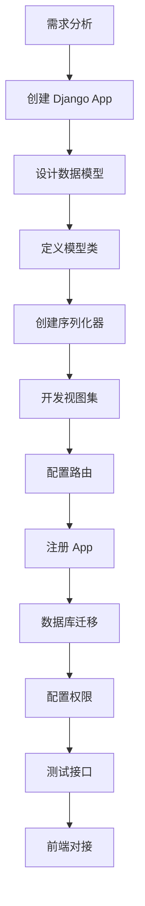

# DVAdmin 开发指南篇

> **文档定位**：从 0 到 1 开发业务模块的完整流程
> **更新时间**：2026-01-24
> **适用场景**：新增业务模块、功能开发

---

## 目录

- [1. 开发环境搭建](#1-开发环境搭建)
- [2. 项目结构说明](#2-项目结构说明)
- [3. 新增业务模块步骤](#3-新增业务模块步骤)
- [4. 模型开发规范](#4-模型开发规范)
- [5. 序列化器开发](#5-序列化器开发)
- [6. 视图集开发](#6-视图集开发)
- [7. 路由配置](#7-路由配置)
- [8. 权限配置](#8-权限配置)
- [9. 常见问题与解决方案](#9-常见问题与解决方案)

---

## 1. 开发环境搭建

### 1.1 环境要求

| 组件 | 版本要求 |
|------|----------|
| Python | >= 3.9 (推荐 3.11+) |
| Node.js | >= 16.0.0 |
| MySQL | >= 8.0 (可选，默认 SQLite3) |
| Redis | >= 6.0 (可选) |

### 1.2 后端环境初始化

```bash
# 1. 进入后端目录
cd django-vue3-admin-master/backend

# 2. 配置环境变量
cp ./conf/env.example.py ./conf/env.py
# 编辑 env.py，配置数据库等信息

# 3. 安装依赖
pip install -r requirements.txt

# 4. 数据库迁移
python manage.py makemigrations
python manage.py migrate

# 5. 初始化系统数据
python manage.py init

# 6. 初始化省市区数据（可选）
python manage.py init_area

# 7. 启动服务（Windows 使用 9000 端口）
uvicorn application.asgi:application --host 0.0.0.0 --port 9000 --reload
```

### 1.3 验证安装

访问以下地址验证：

- **Swagger 文档**：http://localhost:9000/
- **API 根路径**：http://localhost:9000/api/system/
- **默认账号**：`superadmin` / `admin123456`

---

## 2. 项目结构说明

### 2.1 标准目录结构

```
backend/
├── application/              # Django 应用配置
│   ├── settings.py          # 主配置文件
│   ├── urls.py              # 主路由
│   ├── asgi.py              # ASGI 配置（WebSocket）
│   ├── wsgi.py              # WSGI 配置
│   └── ...
│
├── dvadmin/                 # 核心业务模块
│   ├── system/              # 系统核心模块
│   │   ├── models.py        # 数据模型
│   │   ├── urls.py          # 路由配置
│   │   ├── views/           # 视图层
│   │   │   ├── user.py
│   │   │   ├── role.py
│   │   │   └── ...
│   │   ├── serializers.py   # 序列化器（可选）
│   │   └── ...
│   │
│   ├── utils/               # 工具类库
│   │   ├── models.py        # CoreModel 基类
│   │   ├── viewset.py       # CustomModelViewSet 基类
│   │   ├── permission.py    # 权限控制
│   │   ├── filters.py       # 过滤器
│   │   └── ...
│   │
│   └── [your_app]/          # 你的新业务模块
│       ├── __init__.py
│       ├── models.py
│       ├── urls.py
│       ├── views/
│       └── ...
│
├── conf/                    # 配置文件
│   ├── env.example.py       # 环境变量示例
│   └── env.py               # 实际环境配置（不提交）
│
├── static/                  # 静态文件
├── media/                   # 用户上传文件
├── logs/                    # 日志文件
├── templates/               # 模板文件
├── plugins/                 # 插件目录
├── manage.py                # Django 管理命令
└── requirements.txt         # 依赖包列表
```

### 2.2 新模块推荐结构

```
dvadmin/[your_app]/
├── __init__.py
├── models.py                # 数据模型
├── urls.py                  # 路由配置
├── views/                   # 视图层目录
│   ├── __init__.py
│   ├── [module].py          # 各业务模块视图
│   └── ...
├── serializers.py           # 序列化器（可选）
├── admin.py                 # Django Admin 配置
├── apps.py                  # App 配置
└── tests.py                 # 测试用例
```

---

## 3. 新增业务模块步骤

### 3.1 完整开发流程



### 3.2 快速创建命令

```bash
# 方式 1：使用 Django 命令创建
python manage.py startapp product_management dvadmin

# 方式 2：手动创建（推荐，更灵活）
# 在 dvadmin/ 下创建目录结构
```

---

## 4. 模型开发规范

### 4.1 基础模型定义

**继承 CoreModel**，自动获得审计字段和基础功能：

```python
# dvadmin/product_management/models.py

from django.db import models
from dvadmin.utils.models import CoreModel, table_prefix


class ProductCategory(CoreModel):
    """
    商品分类模型
    """
    name = models.CharField(
        max_length=64,
        verbose_name="分类名称",
        help_text="分类名称"
    )
    code = models.CharField(
        max_length=32,
        unique=True,
        verbose_name="分类编码",
        help_text="分类编码"
    )
    sort = models.IntegerField(
        default=1,
        verbose_name="排序",
        help_text="排序"
    )
    status = models.BooleanField(
        default=True,
        verbose_name="状态",
        help_text="状态"
    )
    parent = models.ForeignKey(
        to="self",
        on_delete=models.CASCADE,
        null=True,
        blank=True,
        db_constraint=False,
        verbose_name="父级分类",
        help_text="父级分类"
    )

    class Meta:
        db_table = table_prefix + "product_category"
        verbose_name = "商品分类"
        verbose_name_plural = verbose_name
        ordering = ("sort",)

    def __str__(self):
        return self.name


class Product(CoreModel):
    """
    商品模型
    """
    name = models.CharField(
        max_length=128,
        verbose_name="商品名称",
        help_text="商品名称"
    )
    code = models.CharField(
        max_length=64,
        unique=True,
        verbose_name="商品编码",
        help_text="商品编码"
    )
    category = models.ForeignKey(
        to=ProductCategory,
        on_delete=models.PROTECT,
        db_constraint=False,
        verbose_name="商品分类",
        help_text="商品分类",
        null=True,
        blank=True
    )
    price = models.DecimalField(
        max_digits=10,
        decimal_places=2,
        verbose_name="商品价格",
        help_text="商品价格"
    )
    stock = models.IntegerField(
        default=0,
        verbose_name="库存数量",
        help_text="库存数量"
    )
    STATUS_CHOICES = (
        (0, "下架"),
        (1, "上架"),
    )
    status = models.IntegerField(
        choices=STATUS_CHOICES,
        default=1,
        verbose_name="商品状态",
        help_text="商品状态"
    )
    description = models.TextField(
        verbose_name="商品描述",
        help_text="商品描述",
        null=True,
        blank=True
    )
    image = models.CharField(
        max_length=255,
        verbose_name="商品图片",
        help_text="商品图片",
        null=True,
        blank=True
    )

    class Meta:
        db_table = table_prefix + "product"
        verbose_name = "商品"
        verbose_name_plural = verbose_name
        ordering = ("-create_datetime",)

    def __str__(self):
        return self.name
```

### 4.2 模型开发规范

| 规范 | 说明 | 示例 |
|------|------|------|
| **继承 CoreModel** | 获得审计字段 | `class Product(CoreModel)` |
| **添加 verbose_name** | 字段中文说明 | `verbose_name="商品名称"` |
| **添加 help_text** | 字段帮助文本 | `help_text="商品名称"` |
| **设置 db_constraint=False** | 外键约束 | 避免数据库级联删除问题 |
| **设置 db_table** | 自定义表名 | 使用 `TABLE_PREFIX` 前缀 |
| **定义 __str__** | 对象字符串表示 | `return self.name` |
| **定义 ordering** | 默认排序 | `ordering = ("-create_datetime",)` |

### 4.3 执行数据库迁移

```bash
# 1. 生成迁移文件
python manage.py makemigrations product_management

# 2. 查看迁移 SQL（可选）
python manage.py sqlmigrate product_management 0001

# 3. 执行迁移
python manage.py migrate product_management

# 4. 验证表结构
python manage.py dbshell
# 或通过 Django Admin 查看表
```

---

## 5. 序列化器开发

### 5.1 基础序列化器

```python
# dvadmin/product_management/serializers.py

from rest_framework import serializers
from dvadmin.utils.serializers import CustomModelSerializer
from .models import Product, ProductCategory


class ProductCategorySerializer(CustomModelSerializer):
    """
    商品分类序列化器
    """

    class Meta:
        model = ProductCategory
        fields = "__all__"


class ProductSerializer(CustomModelSerializer):
    """
    商品序列化器
    """
    # 显示字段（关联字段）
    category_name = serializers.SerializerMethodField(read_only=True)

    class Meta:
        model = Product
        fields = "__all__"

    def get_category_name(self, obj):
        """获取分类名称"""
        return obj.category.name if obj.category else None


# 不同操作使用不同序列化器
class ProductCreateSerializer(CustomModelSerializer):
    """
    商品创建序列化器
    """
    class Meta:
        model = Product
        fields = ["name", "code", "category", "price", "stock", "description", "image"]


class ProductUpdateSerializer(CustomModelSerializer):
    """
    商品更新序列化器
    """
    class Meta:
        model = Product
        fields = ["name", "category", "price", "stock", "status", "description", "image"]


class ProductListSerializer(CustomModelSerializer):
    """
    商品列表序列化器
    """
    category_name = serializers.CharField(source="category.name", read_only=True)
    status_text = serializers.CharField(source="get_status_display", read_only=True)

    class Meta:
        model = Product
        fields = ["id", "name", "code", "category_name", "price", "stock", "status", "status_text", "create_datetime"]
```

### 5.2 序列化器最佳实践

| 技巧 | 说明 | 示例 |
|------|------|------|
| **分离操作序列化器** | 增删改查用不同序列化器 | `ProductCreateSerializer` |
| **添加计算字段** | 使用 `SerializerMethodField` | `category_name` |
| **字段验证** | 添加 `validate_<field>` 方法 | `validate_price` |
| **对象级验证** | 添加 `validate` 方法 | 自定义验证逻辑 |

```python
class ProductSerializer(CustomModelSerializer):
    def validate_price(self, value):
        """验证价格"""
        if value <= 0:
            raise serializers.ValidationError("价格必须大于0")
        return value

    def validate(self, attrs):
        """对象级验证"""
        if attrs.get('stock', 0) < 0:
            raise serializers.ValidationError({"stock": "库存不能为负数"})
        return attrs
```

---

## 6. 视图集开发

### 6.1 基础视图集

```python
# dvadmin/product_management/views/product.py

from rest_framework.decorators import action
from dvadmin.utils.viewset import CustomModelViewSet
from dvadmin.utils.json_response import DetailResponse, SuccessResponse
from .models import Product
from .serializers import (
    ProductSerializer,
    ProductCreateSerializer,
    ProductUpdateSerializer,
    ProductListSerializer
)


class ProductViewSet(CustomModelViewSet):
    """
    商品管理视图集
    """
    queryset = Product.objects.all()
    serializer_class = ProductSerializer

    # 不同操作使用不同序列化器
    create_serializer_class = ProductCreateSerializer
    update_serializer_class = ProductUpdateSerializer
    list_serializer_class = ProductListSerializer

    # 过滤配置
    filter_fields = ["name", "code", "category", "status"]
    search_fields = ["name", "code"]

    @action(methods=['post'], detail=False)
    def batch_update_stock(self, request):
        """
        批量更新库存
        """
        data = request.data
        stock_changes = data.get('stock_changes', [])  # [{'id': 1, 'stock': 10}, ...]

        for item in stock_changes:
            product_id = item.get('id')
            stock = item.get('stock')
            Product.objects.filter(id=product_id).update(stock=stock)

        return DetailResponse(msg="库存更新成功")

    @action(methods=['post'], detail=True)
    def change_status(self, request, pk=None):
        """
        修改商品状态
        """
        product = self.get_object()
        status = request.data.get('status')
        product.status = status
        product.save()
        return DetailResponse(msg="状态修改成功")
```

### 6.2 视图集最佳实践

| 技巧 | 说明 | 示例 |
|------|------|------|
| **使用 values_queryset** | ORM 性能优化 | 只查询需要的字段 |
| **自定义 action** | 添加自定义接口 | `@action(methods=['post'])` |
| **批量操作** | 使用 `multiple_delete` | 批量删除已内置 |

```python
class ProductViewSet(CustomModelViewSet):
    # 性能优化：只查询需要的字段
    values_queryset = Product.objects.values(
        "id", "name", "code", "price", "stock", "status"
    )
```

---

## 7. 路由配置

### 7.1 App 路由配置

```python
# dvadmin/product_management/urls.py

from django.urls import path, include
from rest_framework.routers import SimpleRouter

from .views.product import ProductViewSet
from .views.category import ProductCategoryViewSet

# 创建路由
router = SimpleRouter()

# 注册路由
router.register(r'product', ProductViewSet)
router.register(r'category', ProductCategoryViewSet)

urlpatterns = [
    path('', include(router.urls)),
]
```

### 7.2 主路由注册

```python
# application/urls.py

urlpatterns = (
    # ... 其他路由
    path("api/product/", include("dvadmin.product_management.urls")),
)
```

### 7.3 验证路由

```bash
# 查看所有路由
python manage.py show_urls

# 或访问 Swagger 文档
# http://localhost:9000/
```

---

## 8. 权限配置

### 8.1 注册 App

```python
# application/settings.py

INSTALLED_APPS = [
    # ...
    "dvadmin.product_management",
]
```

### 8.2 菜单配置

**方式 1：通过系统界面配置**
1. 登录系统
2. 进入「菜单管理」
3. 添加新菜单（商品管理）
4. 配置菜单权限、按钮权限

**方式 2：通过初始化数据配置**

```bash
# 查看系统菜单结构
python manage.py shell

>>> from dvadmin.system.models import Menu
>>> Menu.objects.all()
```

### 8.3 字段权限配置

1. 进入「列权限管理」
2. 选择菜单（商品管理）
3. 配置字段权限（查询/创建/更新）

### 8.4 接口白名单

如需开发接口无需登录，添加到白名单：

```python
# 通过系统界面：API 白名单管理
# 或初始化数据：fixtures/init_apiwhitelist.json
```

---

## 9. 常见问题与解决方案

### 9.1 数据库迁移问题

**问题**：迁移失败或表已存在

```bash
# 解决方案 1：重置迁移
python manage.py migrate product_management zero
python manage.py makemigrations product_management
python manage.py migrate product_management

# 解决方案 2：伪造迁移（表已存在）
python manage.py makemigrations product_management
python manage.py migrate --fake product_management
```

### 9.2 外键问题

**问题**：创建/更新时外键字段报错

```python
# 解决方案：使用 ID 而非对象
# ❌ 错误
data = {"category": category_object}

# ✅ 正确
data = {"category": category_id}
```

### 9.3 权限问题

**问题**：接口返回 403

```python
# 检查清单
# 1. 用户是否登录
# 2. 角色是否有菜单权限
# 3. 菜单按钮是否配置接口权限
# 4. 接口路径是否正确

# 临时解决方案：添加到白名单
```

### 9.4 序列化器问题

**问题**：序列化器验证失败

```python
# 调试方法
serializer = ProductSerializer(data=request.data)
if not serializer.is_valid():
    print(serializer.errors)  # 查看具体错误

# 常见错误
# - required 字段缺失
# - unique 字段重复
# - 外键对象不存在
```

### 9.5 性能问题

**问题**：列表查询慢

```python
# 解决方案
class ProductViewSet(CustomModelViewSet):
    # 1. 使用 values_queryset
    values_queryset = Product.objects.values("id", "name", "price")

    # 2. 使用 select_related 减少查询
    queryset = Product.objects.select_related('category').all()

    # 3. 使用 prefetch_related 多对多预加载
    queryset = Product.objects.prefetch_related('tags').all()
```

---

## 10. 完整示例总结

### 10.1 最小可用模块

| 文件 | 必需内容 |
|------|----------|
| `models.py` | 模型类（继承 CoreModel） |
| `views/[module].py` | 视图集（继承 CustomModelViewSet） |
| `urls.py` | 路由配置 |
| `__init__.py` | 空文件 |

### 10.2 完整模块文件

```
product_management/
├── __init__.py
├── models.py              # ✅ 必需
├── urls.py                # ✅ 必需
├── views/
│   ├── __init__.py
│   └── product.py         # ✅ 必需
├── serializers.py         # 推荐
├── admin.py               # 可选
└── apps.py                # 可选
```

---

**下一篇**：[03_权限系统篇.md](./03_权限系统篇.md) - 权限系统深度解析与配置

**实战案例**：[04_实战案例_商品管理模块.md](./04_实战案例_商品管理模块.md)
