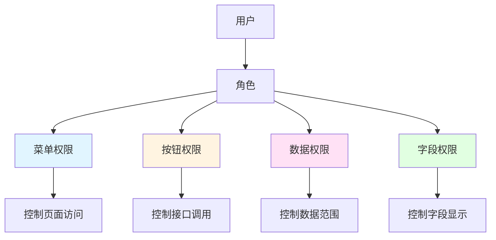
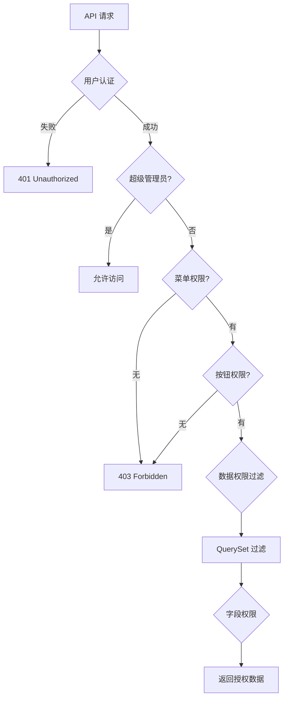
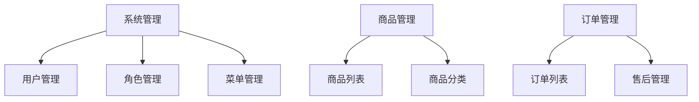
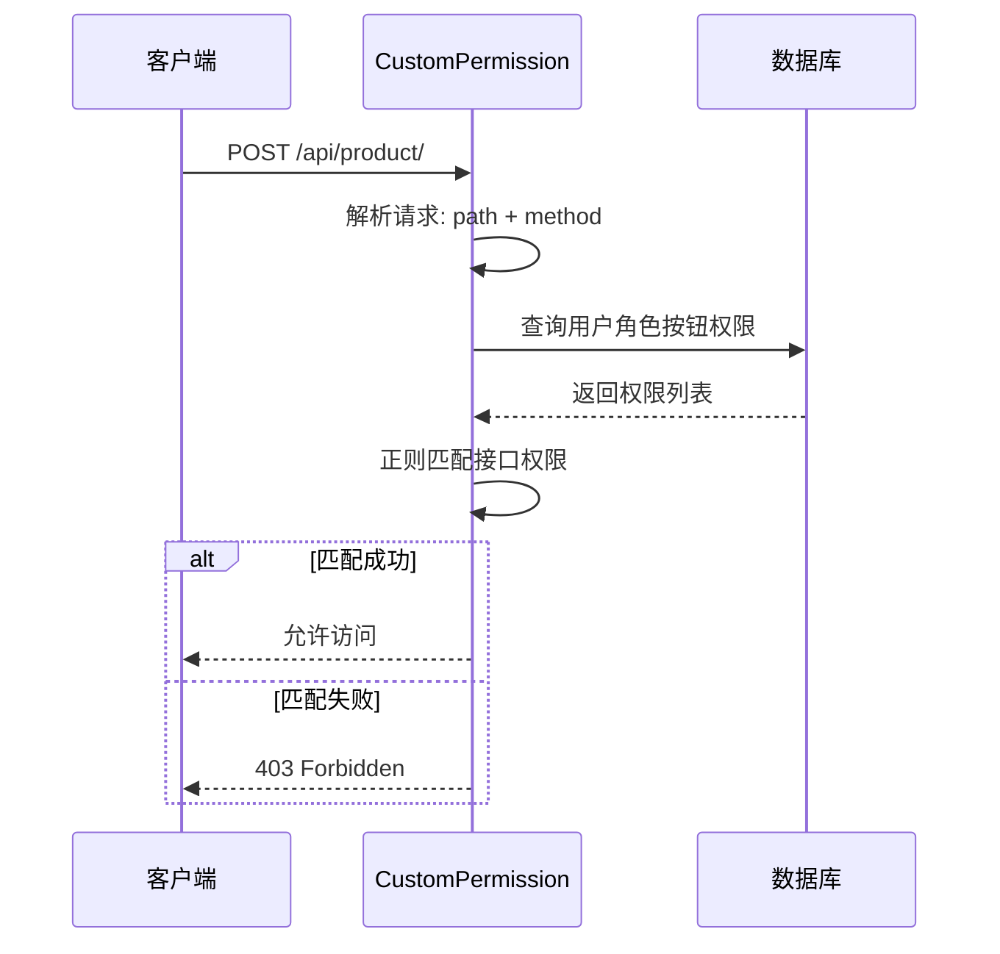
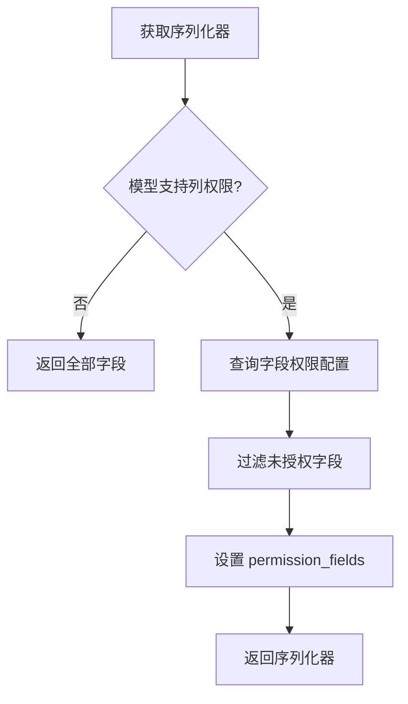

# DVAdmin 权限系统篇

> **文档定位**：RBAC 权限系统深度解析与配置指南
> **更新时间**：2026-01-24
> **核心特点**：四级权限控制（菜单、按钮、数据、字段）

---

## 目录

- [1. 权限系统概览](#1-权限系统概览)
- [2. 菜单权限](#2-菜单权限)
- [3. 按钮权限](#3-按钮权限)
- [4. 数据权限](#4-数据权限)
- [5. 字段权限](#5-字段权限)
- [6. 前后端权限联调](#6-前后端权限联调)
- [7. 权限配置实战](#7-权限配置实战)

---

## 1. 权限系统概览

### 1.1 四级权限模型



### 1.2 权限验证流程



### 1.3 核心数据模型

| 模型 | 说明 | 关键字段 |
|------|------|----------|
| `Users` | 用户表 | `role` (多对多) |
| `Role` | 角色表 | `name`, `key`, `status` |
| `Menu` | 菜单表 | `name`, `web_path`, `component` |
| `MenuButton` | 按钮表 | `name`, `value`, `api`, `method` |
| `MenuField` | 字段定义表 | `model`, `field_name`, `title` |
| `RoleMenuPermission` | 角色菜单关联 | `role`, `menu` |
| `RoleMenuButtonPermission` | 角色按钮权限 | `role`, `menu_button`, `data_range` |
| `FieldPermission` | 字段权限 | `role`, `field`, `is_query/create/update` |

---

## 2. 菜单权限

### 2.1 菜单模型

```python
# dvadmin/system/models.py

class Menu(CoreModel):
    parent = models.ForeignKey(to="Menu", on_delete=models.CASCADE, null=True)
    name = models.CharField(max_length=64, verbose_name="菜单名称")
    sort = models.IntegerField(default=1, verbose_name="显示排序")
    web_path = models.CharField(max_length=128, verbose_name="路由地址")
    component = models.CharField(max_length=128, verbose_name="组件地址")
    is_link = models.BooleanField(default=False, verbose_name="是否外链")
    is_catalog = models.BooleanField(default=False, verbose_name="是否目录")
    status = models.BooleanField(default=True, verbose_name="菜单状态")
    visible = models.BooleanField(default=True, verbose_name="侧边栏中是否显示")
```

### 2.2 菜单树形结构



### 2.3 菜单权限验证

**验证位置**：`CustomPermission.has_permission()`

```python
# 1. 获取用户角色
role_id_list = request.user.role.values_list('id', flat=True)

# 2. 获取角色拥有的菜单
menu_list = RoleMenuPermission.objects.filter(
    role__in=role_id_list
).values_list('menu_id', flat=True)

# 3. 检查当前菜单是否在列表中
current_menu_id = get_menu_from_request(request)
if current_menu_id not in menu_list:
    return False
```

### 2.4 配置菜单权限

**方式 1：系统界面配置**

1. 登录系统（超级管理员）
2. 进入「系统管理」→「菜单管理」
3. 添加新菜单
4. 进入「角色管理」
5. 编辑角色，分配菜单权限

**方式 2：初始化数据**

```json
// fixtures/init_menu.json
[
  {
    "model": "system.menu",
    "pk": "uuid-xxx",
    "fields": {
      "name": "商品管理",
      "web_path": "/product",
      "component": "product/index",
      "parent": null,
      "sort": 1,
      "status": true
    }
  }
]
```

---

## 3. 按钮权限

### 3.1 按钮模型

```python
class MenuButton(CoreModel):
    menu = models.ForeignKey(to="Menu", on_delete=models.CASCADE)
    name = models.CharField(max_length=64, verbose_name="名称")
    value = models.CharField(unique=True, max_length=64, verbose_name="权限值")
    api = models.CharField(max_length=200, verbose_name="接口地址")
    method = models.IntegerField(default=0, verbose_name="请求方法")
```

### 3.2 按钮权限验证



**权限验证代码**：

```python
# dvadmin/utils/permission.py

class CustomPermission(BasePermission):
    def has_permission(self, request, view):
        # 1. 超级管理员直接通过
        if request.user.is_superuser:
            return True

        # 2. 构造请求标识：api:method
        api = request.path
        method = request.method
        method_index = ['GET', 'POST', 'PUT', 'DELETE'].index(method)
        request_key = f"{api}:{method_index}"

        # 3. 获取用户角色的所有按钮权限
        role_id_list = request.user.role.values_list('id', flat=True)
        permissions = RoleMenuButtonPermission.objects.filter(
            role__in=role_id_list
        ).values_list('menu_button__api', 'menu_button__method')

        # 4. 正则匹配
        for perm_api, perm_method in permissions:
            pattern = perm_api.replace('{id}', '([a-zA-Z0-9-]+)')
            pattern = f"^{pattern}:{perm_method}$"
            if re.match(pattern, request_key):
                return True

        return False
```

### 3.3 配置按钮权限

**步骤 1：创建按钮**

```python
# 通过系统界面：菜单管理 → 按钮权限
# 或初始化数据
{
    "name": "新增商品",
    "value": "product:add",
    "api": "/api/product/",
    "method": 1  # POST
}
```

**步骤 2：分配按钮权限**

1. 进入「角色管理」
2. 编辑角色
3. 分配按钮权限

**步骤 3：前端使用**

```javascript
// Vue3 前端
<auth-button value="product:add">新增</auth-button>

// 或使用指令
<el-button v-auth="'product:add'">新增</el-button>
```

---

## 4. 数据权限

### 4.1 数据权限范围

| 值 | 说明 | 过滤逻辑 |
|----|------|----------|
| 0 | 仅本人数据 | `creator = request.user` |
| 1 | 本部门及以下 | `dept_belong_id IN (本部门 + 所有子部门)` |
| 2 | 本部门数据 | `dept_belong_id = 用户部门` |
| 3 | 全部数据 | 无过滤 |
| 4 | 自定义部门 | `dept_belong_id IN (自定义部门列表)` |

### 4.2 数据权限过滤

```python
# dvadmin/utils/filters.py

class DataLevelPermissionMargeFilter(FilterBackend):
    def filter_queryset(self, request, queryset, view):
        # 1. 获取用户当前角色
        current_role = request.user.current_role

        # 2. 获取数据权限范围
        permission = RoleMenuButtonPermission.objects.filter(
            role=current_role,
            menu_button=view.kwargs.get('menu_id')
        ).first()

        if not permission:
            return queryset  # 无配置则返回全部

        data_range = permission.data_range

        # 3. 根据范围过滤
        if data_range == 0:  # 仅本人
            return queryset.filter(creator=request.user)

        elif data_range == 1:  # 本部门及以下
            dept_ids = Dept.recursion_all_dept(request.user.dept_id)
            return queryset.filter(dept_belong_id__in=dept_ids)

        elif data_range == 2:  # 本部门
            return queryset.filter(dept_belong_id=request.user.dept_id)

        elif data_range == 3:  # 全部
            return queryset

        elif data_range == 4:  # 自定义
            dept_ids = permission.dept.values_list('id', flat=True)
            return queryset.filter(dept_belong_id__in=dept_ids)

        return queryset
```

### 4.3 配置数据权限

**步骤 1：进入角色管理**

1. 编辑角色
2. 找到「按钮权限」配置
3. 设置数据权限范围

**步骤 2：自定义部门**

选择「自定义部门」后，可勾选具体部门列表。

---

## 5. 字段权限

### 5.1 字段权限模型

```python
class MenuField(CoreModel):
    """字段定义"""
    model = models.CharField(max_length=64, verbose_name='表名')
    menu = models.ForeignKey(to='Menu', on_delete=models.CASCADE)
    field_name = models.CharField(max_length=64, verbose_name='字段名')
    title = models.CharField(max_length=64, verbose_name='字段显示名')


class FieldPermission(CoreModel):
    """字段权限"""
    role = models.ForeignKey(to='Role', on_delete=models.CASCADE)
    field = models.ForeignKey(to='MenuField', on_delete=models.CASCADE)
    is_query = models.BooleanField(default=True, verbose_name='可查询')
    is_create = models.BooleanField(default=True, verbose_name='可创建')
    is_update = models.BooleanField(default=True, verbose_name='可更新')
```

### 5.2 字段权限过滤



**实现代码**：

```python
# dvadmin/utils/viewset.py

class CustomModelViewSet(ModelViewSet):
    def get_menu_field(self, serializer_class):
        """获取字段权限"""
        # 1. 检查模型是否支持列权限
        model = serializer_class.Meta.model
        if model not in get_custom_app_models():
            return []

        # 2. 查询角色的字段权限
        roles = self.request.user.role.values_list('id', flat=True)
        field_permissions = FieldPermission.objects.filter(
            role__in=roles,
            field__model=model.__name__,
            is_query=True
        )

        # 3. 返回可查询字段列表
        return field_permissions.values_list('field__field_name', flat=True)

    def get_serializer(self, *args, **kwargs):
        serializer_class = self.get_serializer_class()

        # 获取字段权限
        can_see = self.get_menu_field(serializer_class)

        # 存储到 request 中，供分页器使用
        self.request.permission_fields = can_see

        return serializer_class(*args, **kwargs)
```

### 5.3 配置字段权限

**步骤 1：定义字段**

进入「列权限管理」，添加模型字段：

```
模型：Product
字段：cost_price
显示名：成本价
```

**步骤 2：分配权限**

编辑角色，在「字段权限」中配置：
- 可查询：是否可查看
- 可创建：是否可创建
- 可更新：是否可修改

**步骤 3：前端使用**

```javascript
// 前端根据 permission_fields 动态显示列
const columns = computed(() => {
    return allColumns.filter(col =>
        permissionFields.value.includes(col.prop)
    )
})
```

---

## 6. 前后端权限联调

### 6.1 前端获取权限

```javascript
// 登录成功后获取权限
async login() {
    const { data } = await loginApi(form)
    localStorage.setItem('token', data.token)

    // 获取用户权限
    const { data: permissions } = await getUserPermissions()
    store.commit('SET_PERMISSIONS', permissions)
}
```

### 6.2 前端权限指令

```javascript
// v-auth 指令
app.directive('auth', {
    mounted(el, binding) {
        const { value } = binding
        const permissions = store.getters.permissions

        if (value && !permissions.includes(value)) {
            el.parentNode?.removeChild(el)
        }
    }
})

// 使用
<el-button v-auth="'product:add'">新增</el-button>
```

### 6.3 路由权限

```javascript
// 路由守卫
router.beforeEach(async (to, from, next) => {
    const permissions = store.getters.permissions

    // 检查菜单权限
    if (to.meta.permission && !permissions.includes(to.meta.permission)) {
        next('/403')
        return
    }

    next()
})
```

---

## 7. 权限配置实战

### 7.1 场景：商品管理员权限

**需求**：
- 可查看/编辑商品信息
- 只能查看本部门的商品
- 不能查看成本价字段

**配置步骤**：

**1. 创建角色**

```
名称：商品管理员
权限字符：product_admin
```

**2. 分配菜单权限**

勾选：
- 商品管理
  - 商品列表

**3. 配置按钮权限**

| 按钮 | 接口 | 方法 | 数据权限 |
|------|------|------|----------|
| 查询列表 | /api/product/ | GET | 本部门数据 |
| 新增 | /api/product/ | POST | 本部门数据 |
| 编辑 | /api/product/{id}/ | PUT | 本部门数据 |
| 删除 | /api/product/{id}/ | DELETE | 本部门数据 |

**4. 配置字段权限**

| 字段 | 可查询 | 可创建 | 可更新 |
|------|--------|--------|--------|
| name | ✅ | ✅ | ✅ |
| code | ✅ | ✅ | ❌ |
| price | ✅ | ✅ | ✅ |
| cost_price | ❌ | ❌ | ❌ |

### 7.2 场景：销售员权限

**需求**：
- 只能查看自己负责的商品
- 可修改库存

**配置**：

```
角色：销售员
数据权限：仅本人数据
按钮权限：查询、修改库存
```

---

## 8. 权限开发最佳实践

### 8.1 权限设计原则

| 原则 | 说明 | 示例 |
|------|------|------|
| **最小权限** | 只授予必需权限 | 销售员无需删除权限 |
| **职责分离** | 不同角色不同权限 | 审批与执行分离 |
| **权限继承** | 管理员包含所有权限 | 简化配置 |

### 8.2 常见问题

**问题 1：接口返回 403**

排查顺序：
1. 用户是否登录
2. 角色是否有菜单权限
3. 按钮权限是否配置
4. 接口路径是否匹配

**问题 2：字段权限不生效**

检查：
1. 模型是否在 `get_custom_app_models()` 中
2. 字段是否在 `MenuField` 中定义
3. `FieldPermission` 是否配置

**问题 3：数据权限过滤不正确**

检查：
1. 用户的 `current_role` 是否设置
2. `dept_belong_id` 是否正确
3. 数据权限范围配置

---

**下一篇**：[04_实战案例_商品管理模块.md](./04_实战案例_商品管理模块.md) - 完整业务模块开发示例

**相关文档**：
- [01_架构设计篇.md](./01_架构设计篇.md)
- [02_开发指南篇.md](./02_开发指南篇.md)
