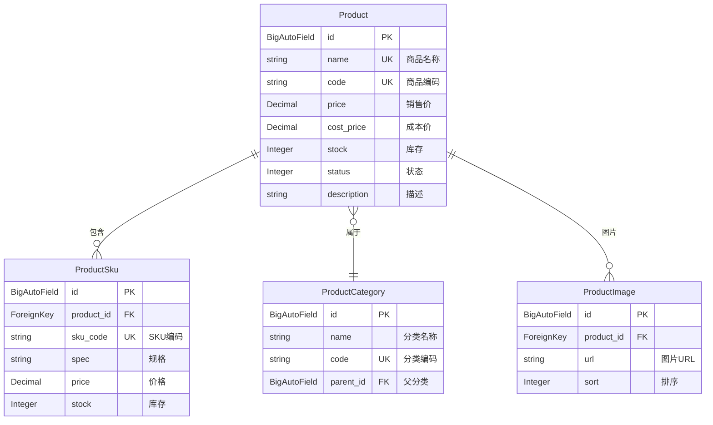

# 实战案例：商品管理模块

> **文档定位**：从 0 到 1 完整开发一个业务模块
> **业务场景**：电商系统的商品管理功能
> **涉及功能**：CRUD、权限配置、导入导出、数据验证

---

## 目录

- [1. 需求分析](#1-需求分析)
- [2. 数据库设计](#2-数据库设计)
- [3. 后端开发](#3-后端开发)
- [4. 权限配置](#4-权限配置)
- [5. 测试验证](#5-测试验证)

---

## 1. 需求分析

### 1.1 功能需求

| 功能 | 描述 | 权限要求 |
|------|------|----------|
| 商品列表 | 分页查询、搜索、筛选 | 查询权限 |
| 新增商品 | 创建新商品 | 新增权限 |
| 编辑商品 | 修改商品信息 | 编辑权限 |
| 删除商品 | 单个/批量删除 | 删除权限 |
| 导入导出 | Excel 批量导入/导出 | 导入导出权限 |
| 库存管理 | 修改库存数量 | 库存权限 |
| 审核流程 | 商品上架需要审核 | 审核权限 |

### 1.2 数据权限

| 角色 | 数据范围 | 说明 |
|------|----------|------|
| 超级管理员 | 全部数据 | 查看所有商品 |
| 商品管理员 | 本部门数据 | 只能看本部门的商品 |
| 销售员 | 仅本人数据 | 只能看自己创建的商品 |

### 1.3 字段权限

| 字段 | 销售员 | 商品管理员 | 超级管理员 |
|------|--------|------------|------------|
| 商品名称 | ✅查询 | ✅全部 | ✅全部 |
| 成本价 | ❌ | ❌ | ✅全部 |
| 库存数量 | ✅查询 | ✅全部 | ✅全部 |

---

## 2. 数据库设计

### 2.1 ER 图



### 2.2 模型定义

**详见代码文件**：
- `examples/product_management/models.py`

---

## 3. 后端开发

### 3.1 项目结构

```
examples/product_management/
├── __init__.py
├── models.py              # 数据模型
├── urls.py                # 路由配置
├── serializers.py         # 序列化器
├── views/
│   ├── __init__.py
│   ├── product.py         # 商品视图
│   └── category.py        # 分类视图
└── tests.py               # 测试用例
```

### 3.2 完整代码

**模型定义** → **序列化器** → **视图集** → **路由配置**

详见下方代码文件。

---

## 4. 权限配置

### 4.1 菜单配置

```
系统管理 > 菜单管理

商品管理 (一级菜单)
├── 商品列表 (页面)
├── 商品分类 (页面)
└── 库存管理 (页面)
```

### 4.2 按钮权限

| 按钮 | 权限值 | 接口 | 方法 |
|------|--------|------|------|
| 查询 | product:list | /api/product/ | GET |
| 新增 | product:add | /api/product/ | POST |
| 编辑 | product:edit | /api/product/{id}/ | PUT |
| 删除 | product:delete | /api/product/{id}/ | DELETE |
| 导入 | product:import | /api/product/import/ | POST |
| 导出 | product:export | /api/product/export/ | POST |

### 4.3 数据权限

在「角色管理」中配置：
- 商品管理员：本部门数据
- 销售员：仅本人数据

---

## 5. 测试验证

### 5.1 接口测试

```bash
# 1. 登录获取 Token
curl -X POST http://localhost:9000/api/login/ \
  -H "Content-Type: application/json" \
  -d '{"username":"superadmin","password":"admin123456"}'

# 2. 查询商品列表
curl -X GET http://localhost:9000/api/product/ \
  -H "Authorization: JWT <token>"

# 3. 创建商品
curl -X POST http://localhost:9000/api/product/ \
  -H "Authorization: JWT <token>" \
  -H "Content-Type: application/json" \
  -d '{
    "name": "测试商品",
    "code": "TEST001",
    "price": 99.99,
    "category": 1
  }'
```

### 5.2 权限测试

| 测试场景 | 预期结果 |
|----------|----------|
| 未登录访问 | 401 Unauthorized |
| 无权限角色访问 | 403 Forbidden |
| 超级管理员访问 | 成功 |
| 数据权限过滤 | 只看到授权数据 |
| 字段权限过滤 | 不显示未授权字段 |

---

## 6. 前端对接（简要说明）

### 6.1 API 接口

```javascript
// api/product.js
import request from '@/utils/request'

export function getProductList(params) {
    return request({
        url: '/api/product/',
        method: 'get',
        params
    })
}

export function createProduct(data) {
    return request({
        url: '/api/product/',
        method: 'post',
        data
    })
}

export function updateProduct(id, data) {
    return request({
        url: `/api/product/${id}/`,
        method: 'put',
        data
    })
}

export function deleteProduct(id) {
    return request({
        url: `/api/product/${id}/`,
        method: 'delete'
    })
}
```

### 6.2 页面使用

```vue
<template>
  <div class="product-list">
    <!-- 权限按钮 -->
    <el-button
      v-auth="'product:add'"
      type="primary"
      @click="handleAdd"
    >
      新增商品
    </el-button>

    <!-- 表格 -->
    <el-table :data="tableData">
      <el-table-column prop="name" label="商品名称" />
      <el-table-column prop="price" label="价格" />
      <!-- 成本价：根据权限显示 -->
      <el-table-column
        v-if="hasFieldPermission('cost_price')"
        prop="cost_price"
        label="成本价"
      />
    </el-table>
  </div>
</template>
```

---

## 7. 完整代码

完整代码位于 `examples/product_management/` 目录。

---

**相关文档**：
- [01_架构设计篇.md](./01_架构设计篇.md)
- [02_开发指南篇.md](./02_开发指南篇.md)
- [03_权限系统篇.md](./03_权限系统篇.md)
