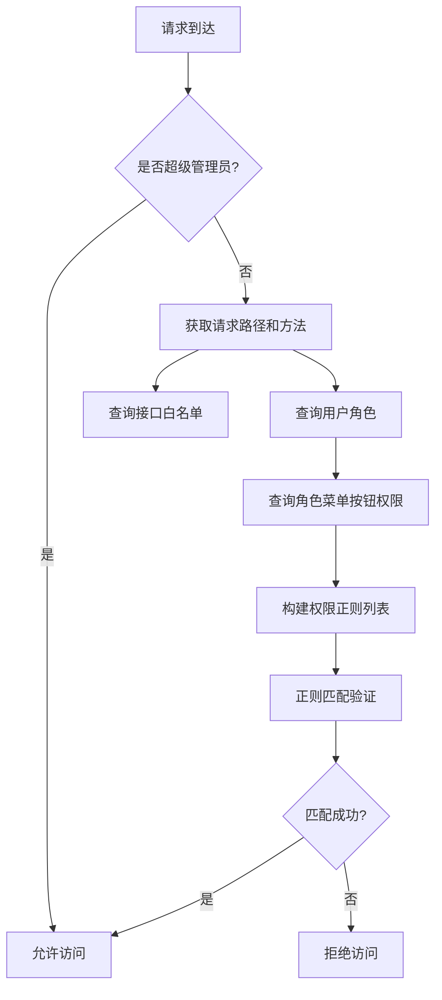
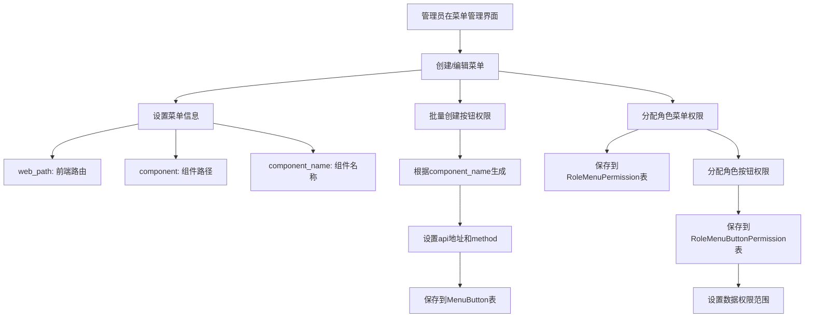
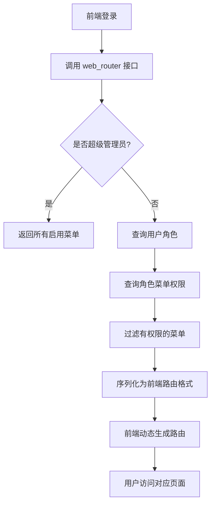
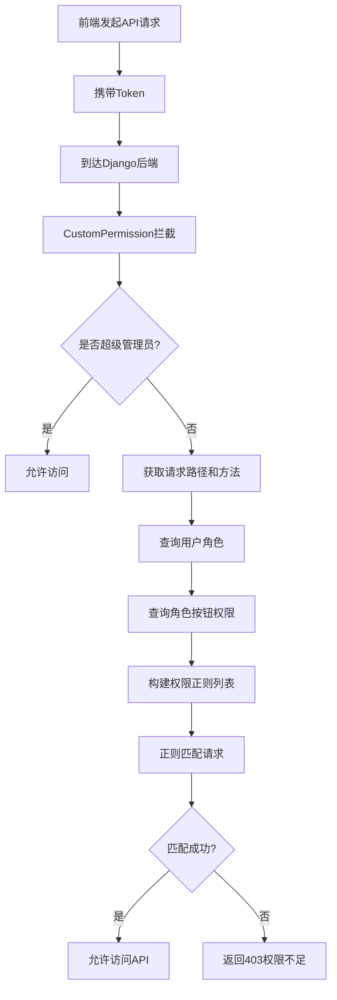

# Django Vue3 Admin - 后端路由与菜单管理机制分析

## 一、核心概念概述

本项目采用**数据库驱动的菜单和权限管理**机制，通过菜单配置实现前端路由和后端API权限的统一管理。

## 二、核心数据模型

### 2.1 Menu（菜单表）
**文件位置**: `dvadmin/system/models.py` (第205-260行)

```python
class Menu(CoreModel):
    parent = models.ForeignKey(to="Menu", ...)          # 上级菜单，支持层级结构
    icon = models.CharField(max_length=64)             # 菜单图标
    name = models.CharField(max_length=64)             # 菜单名称
    sort = models.IntegerField(default=1)              # 显示排序
    is_link = models.BooleanField(default=False)         # 是否外链
    link_url = models.CharField(max_length=255)        # 链接地址
    is_catalog = models.BooleanField(default=False)       # 是否目录
    web_path = models.CharField(max_length=128)        # 路由地址（前端路由）
    component = models.CharField(max_length=128)        # 组件地址
    component_name = models.CharField(max_length=50)     # 组件名称（用于生成按钮权限）
    status = models.BooleanField(default=True)           # 菜单状态
    cache = models.BooleanField(default=False)            # 是否页面缓存
    visible = models.BooleanField(default=True)          # 侧边栏中是否显示
    is_iframe = models.BooleanField(default=False)       # 框架外显示
    is_affix = models.BooleanField(default=False)        # 是否固定
```

**关键字段说明**:
- `web_path`: 前端路由地址（如 `/user`, `/menu`）
- `component`: 前端组件路径（如 `system/user/index`）
- `component_name`: 组件名称，用于生成按钮权限标识（如 `user`, `role`）

### 2.2 MenuButton（菜单按钮权限表）
**文件位置**: `dvadmin/system/models.py` (第287-312行)

```python
class MenuButton(CoreModel):
    menu = models.ForeignKey(to="Menu", ...)           # 关联菜单
    name = models.CharField(max_length=64)             # 按钮名称（如 新增、删除、编辑）
    value = models.CharField(unique=True, max_length=64)  # 权限值（如 user:Create）
    api = models.CharField(max_length=200)            # 接口地址（如 /api/system/user/）
    method = models.IntegerField(default=0)            # 请求方法（0=GET, 1=POST, 2=PUT, 3=DELETE）
```

**权限值命名规则**: `{component_name}:{操作}`

示例:
- `user:Create` - 用户创建权限
- `user:Delete` - 用户删除权限
- `user:Update` - 用户更新权限
- `user:Search` - 用户查询权限

### 2.3 RoleMenuPermission（角色菜单权限表）
**文件位置**: `dvadmin/system/models.py` (第315-337行)

```python
class RoleMenuPermission(CoreModel):
    role = models.ForeignKey(to="Role", ...)          # 关联角色
    menu = models.ForeignKey(to="Menu", ...)           # 关联菜单
```

**作用**: 控制角色可以访问哪些菜单（前端路由）

### 2.4 RoleMenuButtonPermission（角色按钮权限表）
**文件位置**: `dvadmin/system/models.py` (第340-375行)

```python
class RoleMenuButtonPermission(CoreModel):
    role = models.ForeignKey(to="Role", ...)          # 关联角色
    menu_button = models.ForeignKey(to="MenuButton", ...)  # 关联菜单按钮
    data_range = models.IntegerField(default=0)        # 数据权限范围
    dept = models.ManyToManyField(to="Dept", ...)       # 数据权限-关联部门
```

**数据权限范围选项**:
- 0: 仅本人数据权限
- 1: 本部门及以下数据权限
- 2: 本部门数据权限
- 3: 全部数据权限
- 4: 自定数据权限

## 三、路由注册机制

### 3.1 URL配置层级

```
application/urls.py (主路由配置)
    └── path("api/system/", include("dvadmin.system.urls"))
            └── dvadmin/system/urls.py (system模块路由)
                    └── system_url.register(r'menu', MenuViewSet)
                            └── /api/system/menu/ (最终路由)
```

**文件位置**:
- 主路由: `application/urls.py` (第104行)
- System路由: `dvadmin/system/urls.py` (第25行)

### 3.2 DRF Router自动生成路由

使用Django REST Framework的Router自动生成CRUD路由:

```python
# dvadmin/system/urls.py
system_url = routers.SimpleRouter()
system_url.register(r'menu', MenuViewSet)
```

**自动生成的路由**:
- `GET /api/system/menu/` - 查询列表
- `POST /api/system/menu/` - 创建
- `GET /api/system/menu/{id}/` - 查询详情
- `PUT /api/system/menu/{id}/` - 更新
- `DELETE /api/system/menu/{id}/` - 删除
- `GET /api/system/menu/web_router/` - 获取前端路由（自定义action）
- `GET /api/system/menu/get_all_menu/` - 获取所有菜单（自定义action）

## 四、权限验证机制

### 4.1 CustomPermission（自定义权限类）
**文件位置**: `dvadmin/utils/permission.py` (第91-128行)

```python
class CustomPermission(BasePermission):
    def has_permission(self, request, view):
        # 1. 超级管理员直接通过
        if request.user.is_superuser:
            return True

        # 2. 获取请求信息
        api = request.path          # 当前请求接口
        method = request.method      # 当前请求方法
        method_index = methodList.index(method)  # 转换为数字

        # 3. 获取接口白名单
        api_white_list = ApiWhiteList.objects.values(...)

        # 4. 获取用户角色的所有权限
        role_id_list = request.user.role.values_list('id', flat=True)
        userApiList = RoleMenuButtonPermission.objects.filter(
            role__in=role_id_list
        ).values(
            permission__api=F('menu_button__api'),
            permission__method=F('menu_button__method')
        )

        # 5. 构建权限列表（正则表达式格式）
        ApiList = [
            str(item.get('permission__api').replace('{id}', '([a-zA-Z0-9-]+)'))
            + ":" + str(item.get('permission__method')) + "$"
            for item in userApiList
        ]

        # 6. 正则匹配验证权限
        new_api = api + ":" + str(method)
        for item in new_api_ist:
            matchObj = re.match(item, new_api, re.M | re.I)
            if matchObj:
                return True

        return False
```

**权限验证流程**:



### 4.2 权限匹配规则

**正则表达式格式**: `{api路径}:{method}$`

示例:
- `/api/system/user/([a-zA-Z0-9-]+)/:0$` - GET请求用户列表
- `/api/system/user/([a-zA-Z0-9-]+)/:1$` - POST创建用户
- `/api/system/user/([a-zA-Z0-9-]+)/:2$` - PUT更新用户
- `/api/system/user/([a-zA-Z0-9-]+)/:3$` - DELETE删除用户

**{id}占位符替换**: 使用正则 `([a-zA-Z0-9-]+)` 匹配UUID或数字ID

## 五、前端路由获取机制

### 5.1 web_router接口
**文件位置**: `dvadmin/system/views/menu.py` (第118-130行)

```python
@action(methods=['GET'], detail=False, permission_classes=[])
def web_router(self, request):
    user = request.user

    if user.is_superuser:
        # 超级管理员获取所有启用菜单
        queryset = self.queryset.filter(status=1).order_by("sort")
    else:
        # 普通用户只获取有权限的菜单
        role_list = user.role.values_list('id', flat=True)
        menu_list = RoleMenuPermission.objects.filter(
            role__in=role_list
        ).values_list('menu_id', flat=True)
        queryset = Menu.objects.filter(id__in=menu_list).order_by("sort")

    serializer = WebRouterSerializer(queryset, many=True, request=request)
    return SuccessResponse(data=serializer.data, total=len(data), msg="获取成功")
```

### 5.2 WebRouterSerializer（前端路由序列化器）
**文件位置**: `dvadmin/system/views/menu.py` (第64-76行)

```python
class WebRouterSerializer(CustomModelSerializer):
    path = serializers.CharField(source="web_path")      # 路由地址
    title = serializers.CharField(source="name")           # 菜单标题

    class Meta:
        model = Menu
        fields = (
            'id', 'parent', 'icon', 'sort', 'path', 'name', 'title',
            'is_link', 'link_url', 'is_catalog', 'web_path', 'component',
            'component_name', 'cache', 'visible', 'is_iframe', 'is_affix', 'status'
        )
```

**前端路由数据结构**:
```json
{
  "id": 1,
  "parent": null,
  "icon": "iconfont icon-xitongshezhi",
  "sort": 1,
  "path": "/system",
  "name": "系统管理",
  "title": "系统管理",
  "is_catalog": true,
  "web_path": "/system",
  "component": "",
  "component_name": "",
  "status": true,
  "visible": true
}
```

## 六、菜单初始化机制

### 6.1 初始化数据文件
**文件位置**: `dvadmin/system/fixtures/init_menu.json`

**包含内容**:
- 菜单层级结构（children嵌套）
- 每个菜单的按钮权限（menu_button数组）
- 每个菜单的字段权限（menu_field数组）

### 6.2 批量创建按钮权限
**文件位置**: `dvadmin/system/views/menu_button.py` (第88-124行)

```python
@action(methods=['post'], detail=False, permission_classes=[IsAuthenticated])
def batch_create(self, request):
    menu_id = request.data.get('menu')
    menu_obj = Menu.objects.filter(id=menu_id).first()

    # 批量生成增删改查权限
    result_list = [
        {'menu': menu_obj.id, 'name': '新增', 'value': f'{menu_obj.component_name}:Create', ...},
        {'menu': menu_obj.id, 'name': '删除', 'value': f'{menu_obj.component_name}:Delete', ...},
        {'menu': menu_obj.id, 'name': '编辑', 'value': f'{menu_obj.component_name}:Update', ...},
        {'menu': menu_obj.id, 'name': '查询', 'value': f'{menu_obj.component_name}:Search', ...},
        {'menu': menu_obj.id, 'name': '详情', 'value': f'{menu_obj.component_name}:Retrieve', ...},
        {'menu': menu_obj.id, 'name': '复制', 'value': f'{menu_obj.component_name}:Copy', ...},
        {'menu': menu_obj.id, 'name': '导入', 'value': f'{menu_obj.component_name}:Import', ...},
        {'menu': menu_obj.id, 'name': '导出', 'value': f'{menu_obj.component_name}:Export', ...},
    ]
    serializer = self.get_serializer(data=result_list, many=True)
    serializer.is_valid(raise_exception=True)
    serializer.save()
    return SuccessResponse(serializer.data, msg="批量创建成功")
```

**自动生成的API规则**:
- `value`: `{component_name}:{操作}`
- `api`: `/api/{component_name}/` 或 `/api/{component_name}/{id}/`
- `method`: 对应的HTTP方法

## 七、完整工作流程

### 7.1 菜单配置与路由映射流程



### 7.2 前端路由生成流程



### 7.3 API权限验证流程



## 八、核心设计特点

### 8.1 数据库驱动的灵活性
- 菜单结构完全由数据库控制，无需修改代码
- 支持动态添加、删除、修改菜单
- 支持菜单层级结构调整

### 8.2 细粒度的权限控制
- **菜单级权限**: 控制用户能看到哪些页面
- **按钮级权限**: 控制用户能执行哪些操作
- **数据级权限**: 控制用户能访问哪些数据范围

### 8.3 前后端分离的权限同步
- 后端通过`web_router`接口向前端提供路由数据
- 前端根据返回数据动态生成路由
- 权限验证在服务端统一处理

### 8.4 约定优于配置
- `component_name`作为权限标识的命名约定
- 按钮权限值的命名规则: `{component_name}:{操作}`
- API地址的命名规则: `/api/{component_name}/`

## 九、关键文件索引

| 功能 | 文件路径 | 说明 |
|------|-----------|------|
| 菜单模型 | `dvadmin/system/models.py:205-260` | Menu模型定义 |
| 按钮模型 | `dvadmin/system/models.py:287-312` | MenuButton模型定义 |
| 角色菜单权限 | `dvadmin/system/models.py:315-337` | RoleMenuPermission模型 |
| 角色按钮权限 | `dvadmin/system/models.py:340-375` | RoleMenuButtonPermission模型 |
| 菜单视图 | `dvadmin/system/views/menu.py` | MenuViewSet及web_router接口 |
| 按钮视图 | `dvadmin/system/views/menu_button.py` | MenuButtonViewSet及批量创建 |
| 权限验证 | `dvadmin/utils/permission.py:91-128` | CustomPermission权限类 |
| 系统路由 | `dvadmin/system/urls.py:25` | 菜单路由注册 |
| 主路由 | `application/urls.py:104` | 系统模块路由引入 |
| 初始化数据 | `dvadmin/system/fixtures/init_menu.json` | 菜单初始数据 |

## 十、使用示例

### 10.1 创建新菜单并配置权限

```python
# 1. 创建菜单
menu = Menu.objects.create(
    name="商品管理",
    web_path="/product",
    component="system/product/index",
    component_name="product",
    icon="iconfont icon-product",
    sort=1
)

# 2. 批量创建按钮权限
MenuButton.objects.create(
    menu=menu,
    name="查询",
    value="product:Search",
    api="/api/system/product/",
    method=0
)
MenuButton.objects.create(
    menu=menu,
    name="新增",
    value="product:Create",
    api="/api/system/product/",
    method=1
)
# ... 其他按钮

# 3. 分配给角色
role = Role.objects.get(key="admin")
RoleMenuPermission.objects.create(role=role, menu=menu)
RoleMenuButtonPermission.objects.create(
    role=role,
    menu_button=MenuButton.objects.get(value="product:Create"),
    data_range=3  # 全部数据权限
)
```

### 10.2 自定义ViewSet权限

```python
from dvadmin.utils.viewset import CustomModelViewSet
from dvadmin.utils.permission import CustomPermission

class ProductViewSet(CustomModelViewSet):
    queryset = Product.objects.all()
    serializer_class = ProductSerializer
    permission_classes = [CustomPermission]  # 自动应用菜单权限验证
```

## 十一、总结

Django Vue3 Admin的后端路由与菜单管理机制具有以下特点:

1. **统一的权限模型**: 通过Menu、MenuButton、RoleMenuPermission、RoleMenuButtonPermission四个表实现完整的权限体系
2. **数据库驱动**: 所有菜单和权限配置存储在数据库中，支持动态调整
3. **约定式设计**: 通过component_name的命名约定自动关联菜单和API权限
4. **正则匹配**: 使用正则表达式实现灵活的API路径匹配
5. **前后端分离**: 前端通过接口获取路由，后端统一验证权限

这种设计使得系统具有高度的灵活性和可扩展性，能够满足复杂的权限管理需求。
