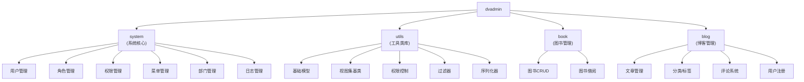

[根目录](../../CLAUDE.md) > [backend](../CLAUDE.md) > **dvadmin**

---

# Dvadmin 核心模块

> 最后更新：2026-01-24

## 变更记录 (Changelog)

| 时间 | 变更内容 | 责任人 |
|------|----------|--------|
| 2026-02-01 | 添加 blog 博客模块 | Claude AI |
| 2026-01-24 | 初始化 dvadmin 模块索引文档 | Claude AI |

---

## 模块职责

Dvadmin 是 DVAdmin 项目的核心业务模块目录，包含系统管理和工具类两大核心部分。

---

## 子模块索引

| 模块路径 | 语言 | 职责描述 | 入口文件 |
|---------|------|----------|----------|
| [system](./system/CLAUDE.md) | Python | 系统核心模块（用户/角色/权限/菜单等） | `models.py`, `urls.py`, `views/` |
| [utils](./utils/CLAUDE.md) | Python | 工具类与基础组件 | `viewset.py`, `models.py`, `permission.py` |
| [book](./book/CLAUDE.md) | Python | 图书管理模块（示例） | `models.py`, `views.py`, `urls.py` |
| [blog](./blog/CLAUDE.md) | Python | 博客管理模块（文章/分类/标签/评论） | `models.py`, `views.py`, `urls.py` |

---

## 架构图



---

## 相关文件清单

### 核心文件

| 文件 | 说明 |
|------|------|
| `__init__.py` | 包初始化文件 |
| `system/` | 系统核心模块目录 |
| `utils/` | 工具类目录 |
| `book/` | 图书管理模块目录 |
| `blog/` | 博客管理模块目录 |

---

## 依赖关系

### system 模块依赖

- Django Core
- dvadmin.utils（基础模型和工具类）
- application（Django 应用配置）

### utils 模块依赖

- Django Core
- Django REST Framework
- djangorestframework_simplejwt
- drf-yasg
- channels（WebSocket 支持）

---

## 常见问题 (FAQ)

### 1. 如何添加新的业务模块？

在 `backend/dvadmin/` 下创建新的应用目录，参考 `system` 模块的结构。

### 2. dvadmin 与 Django App 的关系？

`dvadmin` 是一个 Python 包，包含多个 Django App（如 `system`）。每个子目录可以是一个独立的 Django App。

### 3. 如何复用 utils 模块？

```python
from dvadmin.utils.viewset import CustomModelViewSet
from dvadmin.utils.models import CoreModel
```

---

## 相关资源

- [DVAdmin 官方文档](https://django-vue-admin.com)
- [Django REST Framework 文档](https://www.django-rest-framework.org/)
