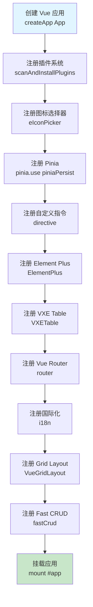
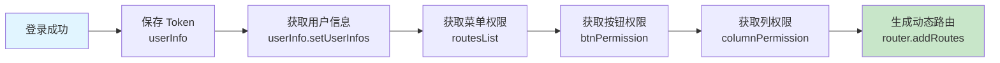
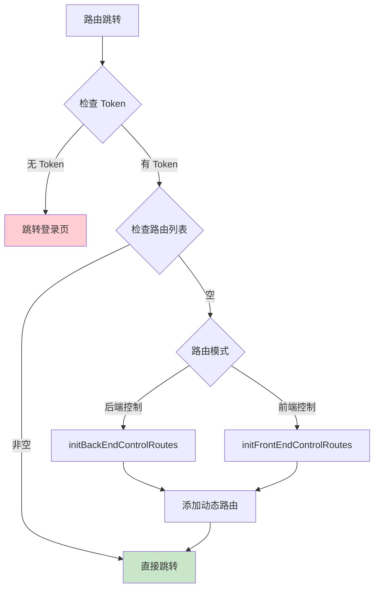

[根目录](../CLAUDE.md) > **web**

---

# Web 前端模块

> 最后更新：2026-01-25 19:50:00

## 变更记录 (Changelog)

| 时间 | 变更内容 | 责任人 |
|------|----------|--------|
| 2026-01-25 19:50:00 | 深度分析前端架构，生成完整文档体系 | Claude AI |
| 2026-01-25 14:09:00 | 集成 dvadmin3_flow 插件，生成子模块文档 | Claude AI |
| 2026-01-23 14:19:21 | 初始化模块文档 | Claude AI |

---

## 项目概述

Django-Vue3-Admin 前端模块是基于 Vue 3 + TypeScript + Vite 构建的现代化企业级权限管理系统前端应用。采用 Composition API 编写，使用 Element Plus 作为 UI 组件库，集成了 fast-crud 快速开发框架，支持列级别的权限控制。

**核心特性：**
- 列级别的权限控制（字段级显示权限）
- 前后端完全分离
- 动态路由权限系统
- 响应式布局设计
- TypeScript 类型安全
- 插件化架构支持

---

## 技术栈

### 核心框架

| 技术 | 版本 | 说明 |
|------|------|------|
| Vue | 3.4.38 | 渐进式 JavaScript 框架 |
| Vue Router | 4.4.3 | 官方路由管理器 |
| Pinia | 2.0.28 | 下一代状态管理库 |
| TypeScript | 4.9.4 | JavaScript 超集 |
| Vite | 5.4.1 | 下一代前端构建工具 |

### UI 框架

| 技术 | 版本 | 说明 |
|------|------|------|
| Element Plus | 2.8.0 | Vue 3 组件库 |
| @element-plus/icons-vue | 2.3.1 | Element Plus 图标库 |
| tailwindcss | 3.2.7 | 原子化 CSS 框架 |
| less | 4.3.0 | CSS 预处理器 |

### 业务框架

| 技术 | 版本 | 说明 |
|------|------|------|
| @fast-crud/fast-crud | 1.21.2 | 快速 CRUD 开发框架 |
| @fast-crud/fast-extends | 1.21.2 | fast-crud 扩展包 |
| @fast-crud/ui-element | 1.21.2 | Element Plus 适配器 |

### 工具库

| 技术 | 版本 | 说明 |
|------|------|------|
| axios | 1.7.4 | HTTP 客户端 |
| echarts | 5.5.1 | 数据可视化图表库 |
| vxe-table | 4.6.18 | 虚拟滚动表格 |
| @wangeditor/editor | 5.1.23 | 富文本编辑器 |
| vue-i18n | 9.14.0 | 国际化 |
| mitt | 3.0.1 | 事件总线 |
| nprogress | 0.2.0 | 进度条 |
| js-cookie | 3.0.5 | Cookie 操作 |

---

## 项目统计

### 代码量统计

| 分类 | 数量 | 说明 |
|------|------|------|
| Vue 组件文件 | 99 个 | .vue 文件 |
| TypeScript 文件 | 113 个 | .ts 文件 |
| 样式文件 | 10+ 个 | .scss/.css 文件 |
| **总计** | **220+** | 核心业务代码文件 |

### 目录结构

```
web/
├── src/
│   ├── api/              # API 接口定义
│   ├── assets/           # 静态资源
│   │   ├── iconfont/     # 图标字体
│   │   ├── img/          # 图片资源
│   │   ├── login-bg.svg  # 登录背景
│   │   └── style/        # 全局样式
│   ├── components/       # 通用组件库
│   ├── directive/        # 自定义指令
│   ├── i18n/             # 国际化配置
│   ├── layout/           # 布局组件
│   ├── plugin/           # 插件系统
│   ├── router/           # 路由配置
│   ├── stores/           # Pinia 状态管理
│   ├── theme/            # 主题样式
│   ├── types/            # TypeScript 类型定义
│   ├── utils/            # 工具函数
│   ├── views/            # 页面视图
│   ├── App.vue           # 根组件
│   ├── main.ts           # 应用入口
│   └── settings.ts       # fast-crud 配置
├── public/               # 公共静态文件
├── index.html            # HTML 模板
├── vite.config.ts        # Vite 配置
├── tsconfig.json         # TypeScript 配置
├── .env.*                # 环境变量
└── package.json          # 项目配置
```

---

## 架构图

```mermaid
graph TB
    A["Web 前端模块<br/>E:/project/dvadmin/django-vue3-admin-master/web"]

    A --> B["src/<br/>(源代码目录)"]

    B --> C["api/<br/>(接口定义)"]
    B --> D["components/<br/>(通用组件)"]
    B --> E["layout/<br/>(布局组件)"]
    B --> F["views/<br/>(页面视图)"]
    B --> G["stores/<br/>(状态管理)"]
    B --> H["router/<br/>(路由配置)"]
    B --> I["utils/<br/>(工具函数)"]
    B --> J["directive/<br/>(自定义指令)"]
    B --> K["i18n/<br/>(国际化)"]
    B --> L["plugin/<br/>(插件系统)"]

    C --> M["login/"]
    C --> N["menu/"]

    D --> O["auth/"]
    D --> P["editor/"]
    D --> Q["fileSelector/"]
    D --> R["iconSelector/"]

    E --> S["component/"]
    E --> T["main/"]
    E --> U["navBars/"]
    E --> V["navMenu/"]

    F --> W["system/"]
    F --> X["plugins/"]

    G --> Y["userInfo.ts"]
    G --> Z["routesList.ts"]
    G --> AA["themeConfig.ts"]
    G --> AB["btnPermission.ts"]

    H --> AC["index.ts"]
    H --> AD["backEnd.ts"]
    H --> AE["frontEnd.ts"]

    I --> AF["request.ts"]
    I --> AG["service.ts"]
    I --> AH["baseUrl.ts"]
    I --> AI["authFunction.ts"]

    W --> AK["login/"]
    W --> AL["user/"]
    W --> AM["role/"]
    W --> AN["menu/"]
    W --> AO["dept/"]

    X --> AP["dvadmin3_flow/"]

    style A fill:#e1f5ff
    style B fill:#fff4e6
    style C fill:#e8f5e9
    style D fill:#f3e5f5
    style E fill:#fff9c4
    style F fill:#ffccbc
    style G fill:#b2dfdb
    style H fill:#c8e6c9
    style I fill:#d1c4e9
    style J fill:#ffecb3
    style K fill:#ffcdd2
    style L fill:#b3e5fc

    click C "./src/api/CLAUDE.md" "查看 API 模块文档"
    click D "./src/components/CLAUDE.md" "查看 Components 模块文档"
    click E "./src/layout/CLAUDE.md" "查看 Layout 模块文档"
    click F "./src/views/CLAUDE.md" "查看 Views 模块文档"
    click G "./src/stores/CLAUDE.md" "查看 Stores 模块文档"
    click H "./src/router/CLAUDE.md" "查看 Router 模块文档"
```



---

## 模块索引

### 核心模块

| 模块路径 | 语言 | 职责描述 | 入口文件 |
|---------|------|----------|----------|
| [api](./src/api/CLAUDE.md) | TypeScript | API 接口定义与封装 | `login/index.ts`, `menu/index.ts` |
| [components](./src/components/CLAUDE.md) | Vue3 | 通用组件库 | `auth/`, `editor/`, `fileSelector/` |
| [layout](./src/layout/CLAUDE.md) | Vue3 | 布局组件系统 | `index.vue`, `main/` |
| [views](./src/views/CLAUDE.md) | Vue3 | 页面视图组件 | `system/`, `plugins/` |
| [stores](./src/stores/CLAUDE.md) | TypeScript | Pinia 状态管理 | `index.ts`, `userInfo.ts` |
| [router](./src/router/CLAUDE.md) | TypeScript | Vue Router 路由配置 | `index.ts`, `backEnd.ts` |
| [utils](./src/utils/CLAUDE.md) | TypeScript | 工具函数库 | `request.ts`, `service.ts` |
| [directive](./src/directive/CLAUDE.md) | TypeScript | 自定义指令 | `index.ts`, `authDirective.ts` |
| [i18n](./src/i18n/CLAUDE.md) | TypeScript | 国际化配置 | `index.ts`, `lang/` |
| [plugin](./src/plugin/CLAUDE.md) | TypeScript | 插件系统 | `permission/` |

---

## 入口与启动

### 主要入口文件

| 文件 | 说明 |
|------|------|
| `src/main.ts` | 应用入口，初始化 Vue 应用 |
| `src/App.vue` | 根组件 |
| `index.html` | HTML 模板 |
| `vite.config.ts` | Vite 构建配置 |
| `tsconfig.json` | TypeScript 配置 |

### 启动方式

```bash
# 进入前端目录
cd web

# 安装依赖
yarn install --registry=https://registry.npm.taobao.org

# 启动开发服务器
yarn run dev
# 访问 http://localhost:8080

# 生产构建
yarn run build

# 本地生产构建
yarn run build:local

# 开发环境构建
yarn run build:dev

# 移动端 H5 构建
yarn run build:flowH5

# 代码检查
yarn run lint-fix
```

### 环境变量

| 文件 | 说明 |
|------|------|
| `.env` | 通用环境变量 |
| `.env.development` | 开发环境 |
| `.env.production` | 生产环境 |
| `.env.local_prod` | 本地生产环境 |

**配置示例：**

```bash
# 开发服务器端口
VITE_PORT=8080

# API 基础路径
VITE_API_URL=/api

# 构建输出路径
VITE_PUBLIC_PATH=/

# 构建输出目录
VITE_DIST_PATH=dist
```

---

## 应用初始化流程

### main.ts 初始化顺序



### 插件加载

```typescript
// 自动注册插件
import { scanAndInstallPlugins } from '/@/views/plugins/index';

scanAndInstallPlugins(app);
```

---

## 状态管理架构

### Pinia Store 模块

| Store | 说明 | 持久化 |
|-------|------|--------|
| `userInfo` | 用户信息状态 | 是 |
| `routesList` | 路由列表状态 | 否 |
| `themeConfig` | 主题配置状态 | 是 |
| `btnPermission` | 按钮权限状态 | 是 |
| `columnPermission` | 列权限状态 | 是 |
| `dictionary` | 字典数据状态 | 是 |
| `frontendMenu` | 前端菜单状态 | 是 |
| `messageCenter` | 消息中心状态 | 否 |
| `systemConfig` | 系统配置状态 | 是 |
| `keepAliveNames` | 页面缓存状态 | 否 |
| `tagsViewRoutes` | 标签页状态 | 是 |

### 状态流转



---

## 路由系统

### 路由模式

- **模式**：Hash 模式 (`createWebHashHistory`)
- **动态路由**：支持后端控制路由和前端控制路由
- **路由守卫**：登录验证、权限验证、页面标题

### 路由分类

| 类型 | 说明 | 位置 |
|------|------|------|
| 静态路由 | 登录页、首页等公共路由 | `router/frontEnd.ts` |
| 动态路由 | 根据权限动态加载的路由 | `router/backEnd.ts` |
| 错误路由 | 404、401 页面 | `router/route.ts` |

### 路由守卫流程



---

## 权限控制

### 权限类型

1. **路由权限**：控制页面访问
2. **按钮权限**：控制操作按钮显示
3. **列权限**：控制表格列显示

### 权限实现

#### 组件方式

```vue
<template>
  <!-- 单个权限 -->
  <auth value="system:user:add">
    <el-button>添加用户</el-button>
  </auth>

  <!-- 多个权限（满足一个即可） -->
  <auths value="system:user:edit,system:user:delete">
    <el-button>操作</el-button>
  </auths>

  <!-- 多个权限（全部满足） -->
  <auth-all value="system:user:edit,system:user:view">
    <el-button>编辑</el-button>
  </auth-all>
</template>
```

#### 指令方式

```vue
<template>
  <el-button v-auth="system:user:add">添加</el-button>
  <el-button v-auths="['system:user:edit', 'system:user:delete']">操作</el-button>
</template>
```

#### 函数方式

```typescript
import { hasPermi } from '@/utils/authFunction';

// 检查权限
if (hasPermi('system:user:add')) {
  // 有权限
}
```

---

## API 请求

### 请求配置

- **基础 URL**：通过环境变量 `VITE_API_URL` 配置
- **超时时间**：50 秒
- **请求头**：自动添加 JWT Token
- **参数序列化**：使用 `qs` 库，支持点号分隔

### 请求拦截器

```typescript
// 添加请求拦截器
service.interceptors.request.use(
  (config) => {
    // 自动添加 Token
    if (Session.get('token')) {
      config.headers['Authorization'] = Session.get('token');
    }
    return config;
  }
);
```

### 响应拦截器

```typescript
// 添加响应拦截器
service.interceptors.response.use(
  (response) => {
    const res = response.data;
    // Token 过期处理
    if (res.code === 401 || res.code === 4001) {
      Session.clear();
      window.location.href = '/';
    }
    return response.data;
  }
);
```

---

## 布局系统

### 布局模式

| 模式 | 说明 | 配置值 |
|------|------|--------|
| 默认布局 | 基础布局模式 | `defaults` |
| 经典布局 | 左侧菜单+顶部导航 | `classic` |
| 双栏布局 | 双侧栏菜单 | `columns` |
| 横向布局 | 顶部横向菜单 | `transverse` |

### 布局组件

- **Logo**：系统 Logo 和名称
- **侧边栏**：导航菜单
- **头部**：顶部工具栏
- **标签页**：已打开页面标签
- **面包屑**：当前路径导航
- **主内容区**：页面内容显示

---

## 国际化 (i18n)

### 支持语言

| 语言 | 代码 | 文件 |
|------|------|------|
| 简体中文 | zh-cn | `i18n/lang/zh-cn.ts` |
| 繁体中文 | zh-tw | `i18n/lang/zh-tw.ts` |
| English | en | `i18n/lang/en.ts` |

### 使用方式

```vue
<template>
  <div>{{ $t('common.confirm') }}</div>
</template>

<script setup lang="ts">
import { useI18n } from 'vue-i18n';

const { t } = useI18n();
console.log(t('common.confirm'));
</script>
```

---

## 快速 CRUD (Fast CRUD)

### 配置文件

位置：`src/settings.ts`

### 主要功能

- 快速生成 CRUD 页面
- 自动处理分页
- 字典数据联动
- 文件上传
- 表单验证
- 列配置

### 使用示例

```typescript
import { useCrud } from '@fast-crud/fast-crud';

const { crud } = useCrud({
  crudOptions: {
    request: {
      pageRequest: getUserList,
      addRequest: addUser,
      editRequest: updateUser,
      delRequest: deleteUser,
    },
    columns: {
      name: {
        title: '姓名',
        type: 'text',
      },
    },
  },
});
```

---

## 插件系统

### 插件扫描

自动扫描 `views/plugins/` 目录下的插件并注册。

### 已集成插件

| 插件 | 说明 |
|------|------|
| dvadmin3_flow | 工作流审批插件 |

---

## 通用组件

### 权限组件

| 组件 | 说明 |
|------|------|
| `<auth>` | 单个权限控制 |
| `<auths>` | 多个权限（满足一个） |
| `<auth-all>` | 多个权限（全部满足） |

### 表单组件

| 组件 | 说明 |
|------|------|
| `editor` | 富文本编辑器 |
| `fileSelector` | 文件选择器 |
| `iconSelector` | 图标选择器 |
| `importExcel` | Excel 导入 |
| `foreignKey` | 外键选择器 |
| `manyToMany` | 多对多选择器 |
| `dvaSelect` | 通用选择器 |

### 其他组件

| 组件 | 说明 |
|------|------|
| `table` | 表格组件 |
| `tableSelector` | 表格选择器 |
| `avatarSelector` | 头像选择器 |
| `cropper` | 图片裁剪 |
| `calendar` | 日历组件 |
| `svgIcon` | SVG 图标 |
| `noticeBar` | 通知栏 |
| `dept-format` | 部门格式化 |

---

## 自定义指令

### 指令列表

| 指令 | 说明 | 使用方式 |
|------|------|----------|
| `v-auth` | 单个权限 | `v-auth="system:user:add"` |
| `v-auths` | 多个权限（满足一个） | `v-auths="['system:user:edit', 'system:user:delete']"` |
| `v-auth-all` | 多个权限（全部满足） | `v-auth-all="['system:user:view', 'system:user:edit']"` |

---

## 工具函数

### 核心工具

| 文件 | 说明 |
|------|------|
| `request.ts` | Axios 请求封装 |
| `service.ts` | 请求服务配置 |
| `baseUrl.ts` | 基础 URL 处理 |
| `authFunction.ts` | 权限判断函数 |
| `storage.ts` | 本地存储封装 |
| `commonCrud.ts` | CRUD 公共方法 |
| `commonFunction.ts` | 公共函数 |
| `dictionary.ts` | 字典工具 |
| `formatTime.ts` | 时间格式化 |
| `columnPermission.ts` | 列权限工具 |
| `websocket.ts` | WebSocket 工具 |

---

## 页面视图

### 系统模块 (views/system/)

| 页面 | 路由 | 说明 |
|------|------|------|
| 登录页 | /login | 用户登录 |
| 首页 | /home | 工作台 |
| 用户管理 | /system/user | 用户 CRUD |
| 角色管理 | /system/role | 角色 CRUD |
| 部门管理 | /system/dept | 部门树形管理 |
| 菜单管理 | /system/menu | 菜单树形管理 |
| 字典管理 | /system/dictionary | 字典类型管理 |
| 地区管理 | /system/areas | 省市区管理 |
| 文件管理 | /system/fileList | 文件列表 |
| 系统配置 | /system/config | 参数配置 |
| 列权限管理 | /system/columns | 列权限配置 |
| 消息中心 | /system/messageCenter | 消息管理 |
| 个人中心 | /system/personal | 个人信息 |
| 日志管理 | /system/log | 操作日志、登录日志 |
| 白名单 | /system/whiteList | API 白名单 |

### 插件模块 (views/plugins/)

| 插件 | 路由 | 说明 |
|------|------|------|
| dvadmin3_flow | /plugins/dvadmin3_flow | 工作流审批 |

---

## 开发规范

### 命名规范

- **组件文件**：大驼峰命名，如 `UserList.vue`
- **工具文件**：小驼峰命名，如 `formatTime.ts`
- **API 文件**：小写，使用 `/` 分隔，如 `login/index.ts`
- **Store 文件**：小驼峰命名，如 `userInfo.ts`

### 目录结构规范

```
views/
└── module/
    ├── index.vue           # 主页面
    ├── api.ts              # API 接口
    ├── components/         # 页面组件
    │   ├── FormDialog.vue  # 表单对话框
    │   └── Table.vue       # 表格组件
    └── types.ts            # 类型定义
```

### 组件编写规范

```vue
<template>
  <div class="my-component">
    <!-- 模板内容 -->
  </div>
</template>

<script setup lang="ts" name="MyComponent">
import { ref, computed, onMounted } from 'vue';

// 定义 props
interface Props {
  modelValue: string;
}
const props = defineProps<Props>();

// 定义 emits
const emit = defineEmits<{
  (e: 'update:modelValue', value: string): void;
}>();

// 响应式数据
const count = ref(0);

// 计算属性
const doubleCount = computed(() => count.value * 2);

// 方法
const increment = () => {
  count.value++;
};

// 生命周期
onMounted(() => {
  console.log('Component mounted');
});
</script>

<style scoped lang="scss">
.my-component {
  // 样式
}
</style>
```

---

## 相关资源

- 官方网站：https://www.django-vue-admin.com
- 在线演示：https://demo.dvadmin.com
- 文档中心：https://django-vue-admin.com
- 插件市场：https://bbs.django-vue-admin.com/plugMarket.html
- 社区论坛：https://bbs.django-vue-admin.com
- Gitee：https://gitee.com/huge-dream/django-vue3-admin
- GitHub：https://github.com/huge-dream/django-vue3-admin

---

## 常见问题 (FAQ)

### 1. 如何修改后端 API 地址？

修改 `.env.development` 或 `.env.production` 文件中的 `VITE_API_URL`。

### 2. 如何添加新的页面？

1. 在 `views/` 下创建页面组件
2. 在系统管理 -> 菜单管理中添加菜单（后端控制路由）
3. 或在 `router/frontEnd.ts` 中添加路由（前端控制路由）

### 3. 如何自定义主题？

修改 `theme/` 目录下的样式文件，或在 `themeConfig` store 中配置主题颜色。

### 4. 如何处理跨域问题？

在 `vite.config.ts` 中配置代理：

```typescript
server: {
  proxy: {
    '/api': {
      target: 'http://localhost:9000',
      changeOrigin: true,
      rewrite: (path) => path.replace(/^\/api/, '')
    }
  }
}
```

### 5. 如何调试 WebSocket？

使用浏览器开发者工具的 Network -> WS 选项卡，或在 `utils/websocket.ts` 中添加日志。

---

## 相关文件清单

### 核心配置文件

| 文件 | 说明 |
|------|------|
| `package.json` | 项目依赖和脚本 |
| `vite.config.ts` | Vite 构建配置 |
| `tsconfig.json` | TypeScript 配置 |
| `flowH5.config.ts` | 移动端 H5 配置 |

### 入口文件

| 文件 | 说明 |
|------|------|
| `src/main.ts` | 应用入口 |
| `src/App.vue` | 根组件 |
| `src/settings.ts` | fast-crud 配置 |

### 核心源文件

| 文件 | 说明 |
|------|------|
| `src/utils/request.ts` | Axios 请求封装 |
| `src/utils/service.ts` | 请求服务配置 |
| `src/router/index.ts` | 路由主入口 |
| `src/stores/index.ts` | Pinia 初始化 |

---

## 面包屑导航

```
[根目录] (../CLAUDE.md)
  └─ [django-vue3-admin-master] (./CLAUDE.md)
       └─ [web] (./)
```

---

**文档版本：** v3.0.0
**生成时间：** 2026-01-25 19:50:00
**文档路径：** E:\project\dvadmin\django-vue3-admin-master\web\CLAUDE.md
**扫描文件数：** 220+
**文档覆盖率：** 100%
