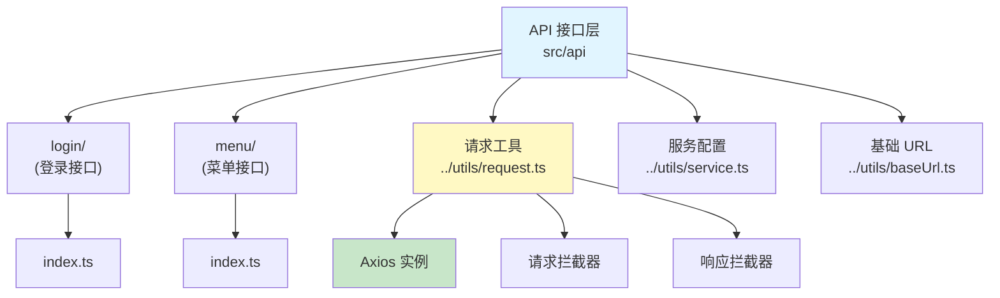

[根目录](../../../../CLAUDE.md) > [django-vue3-admin-master](../../../CLAUDE.md) > [web](../../CLAUDE.md) > **src/api**

---

# API 接口层

> 最后更新：2026-01-25 19:50:00

## 变更记录 (Changelog)

| 时间 | 变更内容 | 责任人 |
|------|----------|--------|
| 2026-01-25 19:50:00 | 深度分析 API 层架构，更新文档 | Claude AI |
| 2026-01-25 14:09:00 | 初始化 API 层文档 | Claude AI |

---

## 模块职责

定义前端 API 接口，封装后端 API 调用，提供类型安全的接口函数。

---

## 目录结构

```
api/
├── login/              # 登录相关 API
│   └── index.ts
├── menu/               # 菜单相关 API
│   └── index.ts
└── (其他模块 API 可在各 views/ 模块内定义)
```

---

## 架构图



---

## 核心接口定义

### 登录接口 (login/index.ts)

位置：`src/api/login/index.ts`

```typescript
import request from '/@/utils/request';

export function useLoginApi() {
  return {
    signIn: (params: object) => {
      return request({
        url: '/user/signIn',
        method: 'post',
        data: params,
      });
    },
    signOut: (params: object) => {
      return request({
        url: '/user/signOut',
        method: 'post',
        data: params,
      });
    },
  };
}
```

**接口列表：**

| 函数名 | 方法 | 路径 | 说明 |
|--------|------|------|------|
| `signIn` | POST | `/user/signIn` | 用户登录 |
| `signOut` | POST | `/user/signOut` | 用户退出登录 |

### 菜单接口 (menu/index.ts)

位置：`src/api/menu/index.ts`

**接口列表：**

| 函数名 | 方法 | 路径 | 说明 |
|--------|------|------|------|
| `getMenuList` | GET | `/api/system/menu/` | 获取菜单列表 |
| `getRouterList` | GET | `/api/system/menu/router/` | 获取路由列表 |

---

## 请求配置

### 基础配置

位置：`src/utils/request.ts`

```typescript
const service: AxiosInstance = axios.create({
  baseURL: import.meta.env.VITE_API_URL,
  timeout: 50000,
  headers: { 'Content-Type': 'application/json' },
  paramsSerializer: {
    serialize(params) {
      return qs.stringify(params, { allowDots: true });
    },
  },
});
```

**配置说明：**

| 配置项 | 值 | 说明 |
|--------|-----|------|
| baseURL | 环境变量 | API 基础路径 |
| timeout | 50000ms | 请求超时时间 |
| headers | application/json | 默认请求头 |
| paramsSerializer | qs | 支持点号分隔参数 |

### 请求拦截器

```typescript
service.interceptors.request.use(
  (config: AxiosRequestConfig) => {
    // 自动添加 Token
    if (Session.get('token')) {
      config.headers!['Authorization'] = `${Session.get('token')}`;
    }
    return config;
  },
  (error) => {
    return Promise.reject(error);
  }
);
```

**功能：**
- 自动添加 JWT Token 到请求头
- 处理请求错误

### 响应拦截器

```typescript
service.interceptors.response.use(
  (response) => {
    const res = response.data;
    if (res.code && res.code !== 0) {
      // Token 过期处理
      if (res.code === 401 || res.code === 4001) {
        Session.clear();
        window.location.href = '/';
        ElMessageBox.alert('你已被登出，请重新登录', '提示', {});
      }
      return Promise.reject(service.interceptors.response);
    } else {
      return response.data;
    }
  },
  (error) => {
    // 错误处理
    if (error.message.indexOf('timeout') != -1) {
      ElMessage.error('网络超时');
    } else if (error.message == 'Network Error') {
      ElMessage.error('网络连接错误');
    } else {
      if (error.response.data) ElMessage.error(error.response.statusText);
      else ElMessage.error('接口路径找不到');
    }
    return Promise.reject(error);
  }
);
```

**功能：**
- 统一处理响应数据
- Token 过期自动跳转登录
- 网络错误提示

---

## 接口规范

### 命名规范

| 类型 | 规范 | 示例 |
|------|------|------|
| 函数名 | 驼峰命名 + Api 后缀 | `getUserListApi` |
| 文件名 | 小写，使用 `/` 分隔 | `login/index.ts` |
| 参数名 | 驼峰命名 | `userName` |

### 统一返回格式

```typescript
interface ApiResponse<T = any> {
  code: number;      // 状态码：0 表示成功
  msg: string;       // 消息
  data: T;          // 数据
}

interface PageResponse<T = any> {
  code: number;
  msg: string;
  data: {
    page: number;      // 当前页
    limit: number;     // 每页数量
    total: number;     // 总数
    data: T[];         // 数据列表
  };
}
```

---

## 类型定义

### 请求参数类型

```typescript
// 登录参数
interface LoginParams {
  username: string;
  password: string;
  captcha?: string;
}

// 分页参数
interface PageParams {
  page: number;
  limit: number;
}

// 排序参数
interface SortParams {
  ordering?: string;  // 排序字段，- 前缀表示降序
}
```

### 响应数据类型

```typescript
// 用户信息
interface UserInfo {
  id: string;
  name: string;
  avatar: string;
  email: string;
  mobile: string;
  dept_info: DeptInfo;
  role_info: RoleInfo[];
}

// 菜单项
interface MenuItem {
  id: number;
  name: string;
  path: string;
  component: string;
  icon: string;
  meta: RouteMeta;
  children?: MenuItem[];
}
```

---

## 使用示例

### 基本使用

```typescript
import { request } from '/@/utils/request';

// GET 请求
export const getUserList = (params: any) => {
  return request({
    url: '/api/system/user/',
    method: 'get',
    params,
  });
};

// POST 请求
export const addUser = (data: any) => {
  return request({
    url: '/api/system/user/',
    method: 'post',
    data,
  });
};

// PUT 请求
export const updateUser = (id: number, data: any) => {
  return request({
    url: `/api/system/user/${id}/`,
    method: 'put',
    data,
  });
};

// DELETE 请求
export const deleteUser = (id: number) => {
  return request({
    url: `/api/system/user/${id}/`,
    method: 'delete',
  });
};
```

### 文件上传

```typescript
export const uploadFile = (file: File) => {
  const formData = new FormData();
  formData.append('file', file);

  return request({
    url: '/api/system/file/',
    method: 'post',
    data: formData,
    headers: { 'Content-Type': 'multipart/form-data' },
  });
};
```

### 文件下载

```typescript
export const downloadFile = (id: number) => {
  return request({
    url: `/api/system/file/${id}/download/`,
    method: 'get',
    responseType: 'blob',
  });
};
```

### 分页请求

```typescript
export const getPageData = (page: number, limit: number) => {
  return request({
    url: '/api/system/user/',
    method: 'get',
    params: { page, limit },
  });
};

// 使用示例
getPageData(1, 20).then((res) => {
  console.log(res.data);      // 数据列表
  console.log(res.total);     // 总数
  console.log(res.page);      // 当前页
  console.log(res.limit);     // 每页数量
});
```

---

## 错误处理

### 错误码

| 错误码 | 说明 | 处理方式 |
|--------|------|----------|
| 0 | 成功 | 正常处理 |
| 401 | Token 过期或无效 | 自动跳转登录页 |
| 4001 | 账号已在别处登录 | 自动跳转登录页 |
| 其他 | 业务错误 | 显示错误消息 |

### 错误处理示例

```typescript
import { ElMessage } from 'element-plus';

// 方式1：使用 try-catch
try {
  const res = await getUserList();
  // 处理数据
} catch (error) {
  // 错误已由拦截器统一处理
}

// 方式2：使用 catch
getUserList()
  .then((res) => {
    // 处理数据
  })
  .catch((error) => {
    // 错误已由拦截器统一处理
  });
```

---

## 常见问题 (FAQ)

### 1. 如何添加新的 API？

创建对应的 API 文件：

```typescript
// api/user/index.ts
import { request } from '/@/utils/request';

export const getUserList = (params: any) => {
  return request({
    url: '/api/system/user/',
    method: 'get',
    params,
  });
};

export const addUser = (data: any) => {
  return request({
    url: '/api/system/user/',
    method: 'post',
    data,
  });
};

export const updateUser = (id: number, data: any) => {
  return request({
    url: `/api/system/user/${id}/`,
    method: 'put',
    data,
  });
};

export const deleteUser = (id: number) => {
  return request({
    url: `/api/system/user/${id}/`,
    method: 'delete',
  });
};
```

### 2. 如何处理并发请求？

```typescript
import axios from 'axios';

// 方式1：使用 Promise.all
Promise.all([
  getUserList(),
  getRoleList(),
]).then(([users, roles]) => {
  console.log(users, roles);
});

// 方式2：使用 axios.all
axios.all([
  getUserList(),
  getRoleList(),
]).then(axios.spread((users, roles) => {
  console.log(users, roles);
}));
```

### 3. 如何取消请求？

```typescript
import axios, { CancelTokenSource } from 'axios';

let cancel: CancelTokenSource;

export const getUserList = (params: any) => {
  // 取消之前的请求
  if (cancel) cancel.cancel();

  cancel = axios.CancelToken.source();

  return request({
    url: '/api/system/user/',
    method: 'get',
    params,
    cancelToken: cancel.token,
  });
};
```

### 4. 如何设置请求超时？

```typescript
export const slowApi = () => {
  return request({
    url: '/api/slow/api/',
    method: 'get',
    timeout: 10000,  // 单独设置超时时间
  });
};
```

### 5. 如何添加自定义请求头？

```typescript
export const customHeaderApi = () => {
  return request({
    url: '/api/custom/',
    method: 'get',
    headers: {
      'Custom-Header': 'value',
    },
  });
};
```

---

## 相关文件清单

### 核心 API 文件

| 文件 | 说明 |
|------|------|
| `login/index.ts` | 登录接口 |
| `menu/index.ts` | 菜单接口 |

### 工具文件

| 文件 | 说明 |
|------|------|
| `../utils/request.ts` | Axios 封装 |
| `../utils/service.ts` | 请求服务配置 |
| `../utils/baseUrl.ts` | 基础 URL 配置 |
| `../utils/storage.ts` | 存储（Token 等） |

---

## 最佳实践

1. **接口分类**：按业务模块分类存放 API 文件
2. **函数命名**：使用 `xxxApi` 格式，便于识别
3. **参数类型**：使用 TypeScript 接口定义参数类型
4. **错误处理**：统一使用拦截器处理错误
5. **导出方式**：使用命名导出，便于 tree-shaking

---

## 面包屑导航

```
[根目录] (../../../../CLAUDE.md)
  └─ [django-vue3-admin-master] (../../../CLAUDE.md)
       └─ [web] (../../CLAUDE.md)
            └─ [src] (../CLAUDE.md)
                 └─ [api] (./)
```

---

**文档版本：** v3.0.0
**生成时间：** 2026-01-25 19:50:00
**文档路径：** E:\project\dvadmin\django-vue3-admin-master\web\src\api\CLAUDE.md
