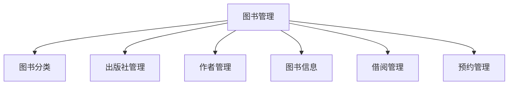

# 博客管理与图书管理 Fixtures 配置脚本计划

## 概述

为博客管理模块和图书管理模块生成 Django初始化配置脚本，放置在各自模块的 `fixtures/` 目录中，保持模块独立性。

## 目录结构

```
django-vue3-admin-master/backend/dvadmin/
├── blog/
│   └── fixtures/
│       ├── __init__.py (已存在)
│       ├── init_blog_menu.json (已存在，需要增强)
│       ├── init_blog_dictionary.json (新建)
│       └── initialize.py (已存在)
│
└── book/
    └── fixtures/ (新建目录)
        ├── __init__.py (新建)
        ├── init_book_menu.json (新建)
        ├── init_book_dictionary.json (新建)
        └── initialize.py (新建)
```

---

## 一、图书管理模块配置

### 1.1 菜单配置 (init_book_menu.json)

基于 `book/models.py` 中的模型，创建以下菜单结构：



#### 菜单详情

| 菜单名称 | 路由路径 | 组件路径 | API前缀 |
|---------|---------|---------|---------|
| 图书管理 | /book | Layout | - |
| 图书分类 | /book/category | book/category/index | /api/book/category/ |
| 出版社管理 | /book/publisher | book/publisher/index | /api/book/publisher/ |
| 作者管理 | /book/author | book/author/index | /api/book/author/ |
| 图书信息 | /book/book | book/book/index | /api/book/book/ |
| 借阅管理 | /book/borrow | book/borrow/index | /api/book/borrow/ |
| 预约管理 | /book/reservation | book/reservation/index | /api/book/reservation/ |

#### 按钮权限配置

每个子菜单包含以下标准按钮：
- 查询 (Search) - GET method: 0
- 详情 (Retrieve) - GET method: 0
- 新增 (Create) - POST method: 1
- 编辑 (Update) - PUT method: 2
- 删除 (Delete) - DELETE method: 3

#### 字段权限配置 (menu_field)

根据各模型的字段配置 menu_field：

**Book 模型字段：**
- isbn, title, subtitle, category, publisher, authors
- publish_date, edition, pages, price
- total_quantity, available_quantity, location
- status, language, summary, cover, tags

**BookCategory 模型字段：**
- name, code, sort, parent, description, status

**BookPublisher 模型字段：**
- name, code, address, contact, phone, email, website

**BookAuthor 模型字段：**
- name, pen_name, gender, country, birth_date, biography

**BookBorrow 模型字段：**
- book, user, status, borrow_date, due_date, return_date
- renew_count, fine, is_paid, remarks

**BookReservation 模型字段：**
- book, status, reservation_date, expiry_date, priority, remarks

### 1.2 字典配置 (init_book_dictionary.json)

创建以下字典数据：

#### 图书状态 (book_status)
| 标签 | 值 | 颜色 |
|-----|-----|-----|
| 上架 | 0 | success |
| 下架 | 1 | warning |
| 遗失 | 2 | danger |
| 报废 | 3 | info |

#### 借阅状态 (borrow_status)
| 标签 | 值 | 颜色 |
|-----|-----|-----|
| 借阅中 | 0 | primary |
| 已归还 | 1 | success |
| 逾期未还 | 2 | danger |
| 已续借 | 3 | warning |

#### 预约状态 (reservation_status)
| 标签 | 值 | 颜色 |
|-----|-----|-----|
| 等待中 | 0 | warning |
| 已取消 | 1 | info |
| 已完成 | 2 | success |
| 已过期 | 3 | danger |

#### 作者性别 (author_gender)
| 标签 | 值 | 颜色 |
|-----|-----|-----|
| 未知 | 0 | info |
| 男 | 1 | primary |
| 女 | 2 | danger |

---

## 二、博客管理模块配置

### 2.1 菜单配置增强 (init_blog_menu.json)

现有的菜单配置需要增强，添加 `menu_field` 字段权限配置。

#### 字段权限配置

**Category 模型字段：**
- name, description, sort_order, is_active

**Tag 模型字段：**
- name, color

**Article 模型字段：**
- title, content, summary, cover_image
- category, tags, status, views_count, likes_count, is_top

**Comment 模型字段：**
- article, content, user, parent, is_active

### 2.2 字典配置 (init_blog_dictionary.json)

创建以下字典数据：

#### 文章状态 (article_status)
| 标签 | 值 | 颜色 |
|-----|-----|-----|
| 草稿 | draft | warning |
| 已发布 | published | success |

#### 评论状态 (comment_status)
| 标签 | 值 | 颜色 |
|-----|-----|-----|
| 显示 | true | success |
| 隐藏 | false | danger |

---

## 三、实施步骤

### 步骤 1: 创建 book 模块 fixtures 目录结构
- 创建 `dvadmin/book/fixtures/` 目录
- 创建 `__init__.py` 文件

### 步骤 2: 创建图书管理菜单配置
- 文件: `dvadmin/book/fixtures/init_book_menu.json`
- 包含完整的菜单树形结构
- 包含按钮权限和字段权限

### 步骤 3: 创建图书管理字典配置
- 文件: `dvadmin/book/fixtures/init_book_dictionary.json`
- 包含图书状态、借阅状态、预约状态、作者性别等字典

### 步骤 4: 创建图书初始化脚本
- 文件: `dvadmin/book/fixtures/initialize.py`
- 实现菜单和字典的初始化逻辑

### 步骤 5: 创建博客字典配置
- 文件: `dvadmin/blog/fixtures/init_blog_dictionary.json`
- 包含文章状态、评论状态等字典

### 步骤 6: 增强博客菜单配置
- 更新 `dvadmin/blog/fixtures/init_blog_menu.json`
- 添加 menu_field 字段权限配置

---

## 四、配置文件格式规范

### 菜单配置格式

```json
[
    {
        "name": "菜单名称",
        "icon": "图标类名",
        "sort": 排序值,
        "is_link": false,
        "is_catalog": true,
        "web_path": "/路由路径",
        "component": "组件路径",
        "component_name": "组件名称",
        "status": true,
        "cache": false,
        "visible": true,
        "children": [
            {
                "name": "子菜单名称",
                "icon": "图标",
                "sort": 1,
                "is_link": false,
                "is_catalog": false,
                "web_path": "/子路由",
                "component": "组件路径",
                "component_name": "组件名",
                "status": true,
                "cache": false,
                "visible": true,
                "children": [],
                "menu_button": [
                    {
                        "name": "按钮名称",
                        "value": "权限标识",
                        "api": "/api/路径/",
                        "method": 0
                    }
                ],
                "menu_field": [
                    {
                        "field_name": "字段名",
                        "title": "字段标题",
                        "model": "模型名"
                    }
                ]
            }
        ],
        "menu_button": [],
        "menu_field": []
    }
]
```

### 字典配置格式

```json
[
    {
        "label": "字典名称",
        "value": "字典编码",
        "parent": null,
        "type": 0,
        "color": null,
        "is_value": false,
        "status": true,
        "sort": 1,
        "remark": null,
        "children": [
            {
                "label": "选项标签",
                "value": "选项值",
                "parent": 父级ID引用,
                "type": 0,
                "color": "颜色",
                "is_value": true,
                "status": true,
                "sort": 1,
                "remark": null,
                "children": []
            }
        ]
    }
]
```

---

## 五、注意事项

1. **method 值对应关系：**
   - 0: GET 请求
   - 1: POST 请求
   - 2: PUT 请求
   - 3: DELETE 请求

2. **字典 type 值对应关系：**
   - 0: 字符串类型
   - 1: 整数类型
   - 6: 布尔类型

3. **API 路径规范：**
   - 列表接口: `/api/模块/资源/`
   - 详情接口: `/api/模块/资源/{id}/`

4. **组件路径规范：**
   - 格式: `模块名/子目录/index`
   - 对应前端 `src/views/` 目录下的组件

---

## 六、验证清单

- [ ] 菜单配置 JSON 格式正确
- [ ] 字典配置 JSON 格式正确
- [ ] API 路径与 urls.py 中定义一致
- [ ] 字段名称与 models.py 中定义一致
- [ ] 按钮权限标识符合命名规范
- [ ] 字典值与模型中的 choices 定义一致
