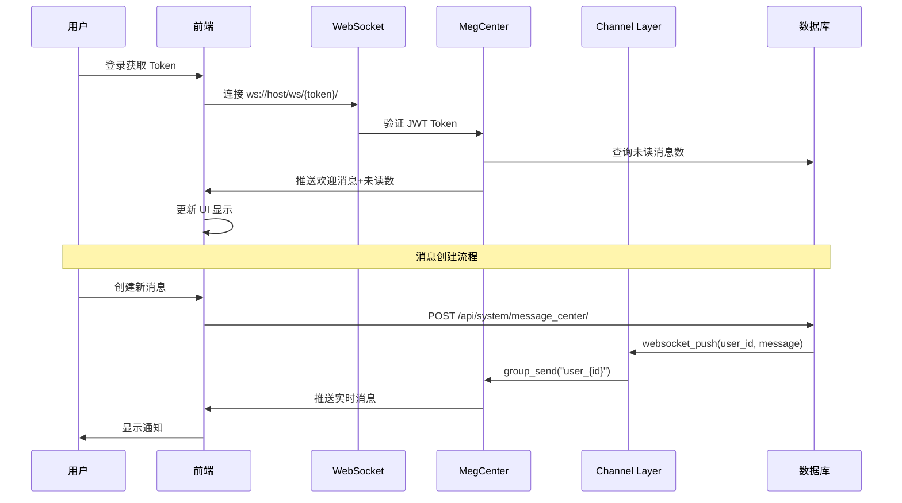
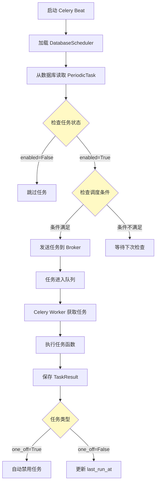

# DVAdmin 通知系统与任务调度深度研究报告

> 研究时间：2026-02-22
> 研究范围：DVAdmin 项目的通知系统（WebSocket）和任务调度系统（Celery）
> 目的：深入理解系统运作机制，识别任务调度中的潜在错误

---

## 目录

1. [通知系统架构](#1-通知系统架构)
2. [任务调度系统架构](#2-任务调度系统架构)
3. [通知系统详细分析](#3-通知系统详细分析)
4. [任务调度流程分析](#4-任务调度流程分析)
5. [发现的错误与潜在问题](#5-发现的错误与潜在问题)
6. [修复建议](#6-修复建议)
7. [最佳实践建议](#7-最佳实践建议)

---

## 1. 通知系统架构

### 1.1 系统概览

DVAdmin 的通知系统采用 **WebSocket + Channel Layers** 架构，实现实时消息推送功能。

```
┌─────────────────────────────────────────────────────────────────────────┐
│                           通知系统架构                                    │
├─────────────────────────────────────────────────────────────────────────┤
│                                                                          │
│   ┌──────────┐     WebSocket      ┌──────────────────┐                  │
│   │  前端     │ ◄───────────────► │  ASGI Server     │                  │
│   │ (Vue3)   │   ws://{token}/    │  (Uvicorn)       │                  │
│   └──────────┘                    └────────┬─────────┘                  │
│                                            │                             │
│                                            ▼                             │
│                              ┌──────────────────────┐                    │
│                              │   Channel Layers     │                    │
│                              │  (InMemory/Redis)    │                    │
│                              └────────┬─────────────┘                    │
│                                       │                                  │
│         ┌─────────────────────────────┼─────────────────────────────┐    │
│         │                             │                             │    │
│         ▼                             ▼                             ▼    │
│   ┌───────────┐              ┌───────────────┐              ┌─────────┐  │
│   │ MegCenter │              │ MessageCenter │              │  Flow   │  │
│   │ Consumer  │              │   Serializer  │              │ Record  │  │
│   └───────────┘              └───────────────┘              └─────────┘  │
│                                                                          │
└─────────────────────────────────────────────────────────────────────────┘
```

### 1.2 核心组件

| 组件 | 文件路径 | 职责 |
|------|---------|------|
| **WebSocket Consumer** | `application/websocketConfig.py` | 处理 WebSocket 连接和消息分发 |
| **Channel Layers** | `application/settings.py` | 配置消息通道层（内存/Redis） |
| **消息中心 API** | `dvadmin/system/views/message_center.py` | 消息 CRUD 和推送 |
| **消息模型** | `dvadmin/system/models.py` | MessageCenter, MessageCenterTargetUser |
| **前端 WebSocket** | `web/src/utils/websocket.ts` | 前端连接管理和重连 |

### 1.3 消息推送流程



### 1.4 消息类型与目标

**目标类型 (target_type):**
- `0`: 指定用户（target_user）
- `1`: 按角色（target_role）
- `2`: 按部门（target_dept）
- `3`: 系统通知（所有用户）

**消息结构:**
```json
{
    "sender": "system",
    "contentType": "INFO|SYSTEM|TEXT|Content",
    "content": "消息内容",
    "unread": 5,
    "notificationTitle": "通知标题",
    "notificationButton": "操作按钮",
    "path": "/跳转路径"
}
```

---

## 2. 任务调度系统架构

### 2.1 系统概览

DVAdmin 使用 **Celery + django-celery-beat** 实现异步任务和定时任务调度。

```
┌─────────────────────────────────────────────────────────────────────────┐
│                         任务调度系统架构                                   │
├─────────────────────────────────────────────────────────────────────────┤
│                                                                          │
│   ┌────────────────┐         ┌────────────────┐                         │
│   │  Celery Beat   │         │ Celery Worker  │                         │
│   │  (调度器)       │         │  (执行器)       │                         │
│   └───────┬────────┘         └───────┬────────┘                         │
│           │                          │                                   │
│           ▼                          ▼                                   │
│   ┌─────────────────────────────────────────────────┐                   │
│   │                 Redis Broker                     │                   │
│   │           (CELERY_BROKER_DB = 3)                 │                   │
│   └─────────────────────────────────────────────────┘                   │
│                              │                                           │
│                              ▼                                           │
│   ┌─────────────────────────────────────────────────────────────────┐   │
│   │                      Django Database                              │   │
│   │  ┌───────────────┐  ┌───────────────┐  ┌───────────────────┐    │   │
│   │  │ PeriodicTask  │  │ IntervalSch.  │  │   TaskResult      │    │   │
│   │  │ (定时任务)     │  │ (间隔调度)    │  │   (任务结果)      │    │   │
│   │  └───────────────┘  └───────────────┘  └───────────────────┘    │   │
│   └─────────────────────────────────────────────────────────────────┘   │
│                                                                          │
└─────────────────────────────────────────────────────────────────────────┘
```

### 2.2 核心组件

| 组件 | 文件路径 | 职责 |
|------|---------|------|
| **Celery 配置** | `application/celery.py` | Celery 应用配置和信号处理 |
| **定时任务 ViewSet** | `dvadmin/system/views/celery_task.py` | 定时任务管理 API |
| **Celery Settings** | `application/settings.py` | Celery 相关配置项 |
| **异步任务** | `dvadmin/system/tasks.py` | 异步任务实现（数据导出） |

### 2.3 Celery 配置详解

```python
# application/settings.py 中的关键配置

# Broker 配置（使用 Redis）
CELERY_BROKER_URL = f'redis://:{REDIS_PASSWORD}@{REDIS_HOST}:6379/{CELERY_BROKER_DB}'

# 结果后端（使用 Django 数据库）
CELERY_RESULT_BACKEND = 'django-db'

# Beat 调度器（使用 Django 数据库）
CELERY_BEAT_SCHEDULER = 'django_celery_beat.schedulers:DatabaseScheduler'

# 任务追踪
CELERY_TASK_TRACK_STARTED = True

# 任务时间限制
CELERY_TASK_TIME_LIMIT = 30 * 60  # 30 分钟
CELERY_TASK_SOFT_TIME_LIMIT = 25 * 60  # 25 分钟

# 结果过期时间
CELERY_RESULT_EXPIRES = 3600  # 1 小时
```

### 2.4 PeriodicTask 模型字段

| 字段 | 类型 | 说明 |
|------|------|------|
| `name` | String | 任务名称（唯一） |
| `task` | String | 任务函数路径 |
| `enabled` | Boolean | 是否启用 |
| `interval` | ForeignKey | 间隔调度 |
| `crontab` | ForeignKey | Crontab 调度 |
| `one_off` | Boolean | 是否只执行一次 |
| `start_time` | DateTime | 开始时间 |
| `expires` | DateTime | 过期时间 |
| `last_run_at` | DateTime | 上次运行时间 |
| `total_run_count` | Integer | 总运行次数 |

---

## 3. 通知系统详细分析

### 3.1 WebSocket 连接流程

**前端连接代码 (`web/src/utils/websocket.ts`):**

```typescript
// 核心连接逻辑
init: (receiveMessage: Function | null) => {
    const token = Session.get('token')
    const wsUrl = `${getWsBaseURL()}ws/${token}/`
    websocket.websocket = new WebSocket(wsUrl)

    // 连接成功处理
    websocket.websocket.onopen = function () {
        websocket.socket_open = true
        websocket.is_reonnect = true
        websocket.heartbeat()  // 开启心跳
    }

    // 连接关闭处理（自动重连）
    websocket.websocket.onclose = (e) => {
        websocket.socket_open = false
        if (websocket.is_reonnect) {
            // 5 秒后尝试重连，最多 3 次
            setTimeout(() => {
                if (websocket.reconnect_current <= websocket.reconnect_count) {
                    websocket.reconnect_current++
                    websocket.reconnect()
                }
            }, websocket.reconnect_interval)
        }
    }
}
```

**后端 Consumer (`application/websocketConfig.py`):**

```python
class DvadminWebSocket(AsyncJsonWebsocketConsumer):
    async def connect(self):
        try:
            # 1. 解析 JWT Token
            self.service_uid = self.scope["url_route"]["kwargs"]["service_uid"]
            decoded_result = jwt.decode(self.service_uid, settings.SECRET_KEY, algorithms=["HS256"])

            # 2. 获取用户 ID 并加入频道组
            self.user_id = decoded_result.get('user_id')
            self.chat_group_name = "user_" + str(self.user_id)

            # 3. 加入 Channel Layer
            await self.channel_layer.group_add(
                self.chat_group_name,
                self.channel_name
            )
            await self.accept()

            # 4. 推送未读消息数
            unread_count = await _get_message_unread(self.user_id)
            if unread_count > 0:
                await self.send_json(set_message('system', 'SYSTEM',
                    "请查看您的未读消息~", unread=unread_count))
        except InvalidSignatureError:
            await self.disconnect(None)
```

### 3.2 消息推送机制

**主动推送函数:**

```python
# application/websocketConfig.py
def websocket_push(user_id, message):
    """主动推送消息到指定用户"""
    username = "user_" + str(user_id)
    channel_layer = get_channel_layer()
    async_to_sync(channel_layer.group_send)(
        username,
        {
            "type": "push.message",  # 对应 Consumer 的 push_message 方法
            "json": message
        }
    )
```

**创建消息并推送:**

```python
def create_message_push(title: str, content: str, target_type: int = 0,
                        target_user: list = None, target_dept=None,
                        target_role=None, message: dict = None, request=Request):
    # 1. 创建 MessageCenter 记录
    data = {
        "title": title,
        "content": content,
        "target_type": target_type,
        "target_user": target_user,
        "target_dept": target_dept,
        "target_role": target_role
    }
    message_center_instance = MessageCreateSerializer(data=data, request=request)
    message_center_instance.save()

    # 2. 根据目标类型获取目标用户
    users = target_user or []
    if target_type == 1:  # 按角色
        users = Users.objects.filter(role__id__in=target_role).values_list('id', flat=True)
    if target_type == 2:  # 按部门
        users = Users.objects.filter(dept__id__in=target_dept).values_list('id', flat=True)
    if target_type == 3:  # 系统通知
        users = Users.objects.values_list('id', flat=True)

    # 3. 创建 MessageCenterTargetUser 关联
    targetuser_data = [...]
    targetuser_instance.save()

    # 4. 推送消息到每个用户
    for user in users:
        unread_count = async_to_sync(_get_message_unread)(user)
        channel_layer = get_channel_layer()
        async_to_sync(channel_layer.group_send)(
            "user_" + str(user),
            {"type": "push.message", "json": {**message, 'unread': unread_count}}
        )
```

### 3.3 审批流程通知集成

**FlowRecord 中的通知方法 (`plugins/dvadmin3_flow/models.py`):**

```python
@classmethod
def create_message_push(cls, obj, request=None):
    from application.websocketConfig import create_message_push

    # 获取待通知的用户/角色/部门
    user_id = obj.pre_user.all().values_list('id', flat=True)
    role_id = obj.pre_role.all().values_list('id', flat=True)
    dept_id = obj.pre_dept.all().values_list('id', flat=True)

    message = {
        "contentType": "Content",
        "content": "您有一个新审批，请前往查看！",
        "notificationTitle": "新审核",
        "notificationButton": "点击前往审核",
        "path": "/flowTodo"
    }

    # 分别推送给用户、角色、部门
    if user_id:
        create_message_push(title=obj.flow_data.name, content=message.get("content"),
                            target_user=list(user_id), message=message, request=request)
    if role_id:
        create_message_push(..., target_type=1, target_role=list(role_id), ...)
    if dept_id:
        create_message_push(..., target_type=2, target_dept=list(dept_id), ...)
```

---

## 4. 任务调度流程分析

### 4.1 Celery 任务执行流程



### 4.2 任务管理 API

**PeriodicTaskViewSet (`dvadmin/system/views/celery_task.py`):**

```python
class PeriodicTaskViewSet(ModelViewSet):
    """定时任务管理"""
    queryset = PeriodicTask.objects.all().order_by('-date_changed')
    serializer_class = PeriodicTaskSerializer
    filterset_fields = ['enabled', 'task']  # 可过滤字段

    @action(methods=['post'], detail=True)
    def toggle(self, request, pk=None):
        """切换任务启用/禁用状态"""
        task = self.get_object()
        task.enabled = not task.enabled
        task.save()
        return DetailResponse(data={'enabled': task.enabled})
```

### 4.3 异步任务示例

**数据导出任务 (`dvadmin/system/tasks.py`):**

```python
@app.task
def async_export_data(data: list, filename: str, dcid: int, export_field_label: dict):
    instance = DownloadCenter.objects.get(pk=dcid)
    instance.task_status = 1  # 进行中
    instance.save()

    try:
        # 生成 Excel 文件
        wb = Workbook()
        # ... 处理数据 ...

        instance.task_status = 2  # 完成
        instance.file_name = filename
        instance.url.save(filename, ContentFile(stream.read()))
    except Exception as e:
        instance.task_status = 3  # 失败
        instance.description = str(e)[:250]

    instance.save()
```

### 4.4 任务信号处理

**任务完成后的信号处理 (`application/celery.py`):**

```python
@task_postrun.connect
def add_periodic_task_name(sender, task_id, task, args, kwargs, **extras):
    """任务执行完成后更新 TaskResult"""
    periodic_task_name = kwargs.get('periodic_task_name')
    if periodic_task_name:
        from django_celery_results.models import TaskResult
        TaskResult.objects.filter(task_id=task_id).update(
            periodic_task_name=periodic_task_name
        )
```

---

## 5. 发现的错误与潜在问题

### 5.1 【严重】任务禁用后仍可能执行的问题

**问题描述：**
当用户通过 API 禁用任务（`enabled=False`）时，Celery Beat 可能已经在队列中有待处理的任务调度。由于 `DatabaseScheduler` 有缓存机制，状态更新可能不会立即生效。

**代码位置：**
- `dvadmin/system/views/celery_task.py:99-104`

```python
@action(methods=['post'], detail=True)
def toggle(self, request, pk=None):
    """切换任务启用/禁用状态"""
    task = self.get_object()
    task.enabled = not task.enabled
    task.save()  # 问题：仅保存到数据库，未通知 Beat 刷新调度器
    return DetailResponse(data={'enabled': task.enabled})
```

**根本原因：**
1. Celery Beat 使用 `DatabaseScheduler`，默认每 **5 分钟**同步一次数据库
2. 禁用任务后，Beat 可能仍使用旧的缓存数据调度任务
3. 已进入 Broker 队列的任务不会被撤销

**影响范围：**
- 禁用定时任务后，任务可能仍执行几分钟
- 修改任务调度时间后，可能仍按旧时间执行

### 5.2 【严重】one_off 任务执行后未正确清理

**问题描述：**
`one_off=True` 的任务应该只执行一次后自动禁用，但在某些情况下任务可能被多次执行。

**可能原因：**
1. 任务执行失败后重试，但 `last_run_at` 已更新
2. 多个 Worker 同时处理同一任务
3. Beat 和 Worker 之间的时间不同步

**相关配置：**
```python
# settings.py 中缺少关键配置
CELERY_WORKER_PREFETCH_MULTIPLIER = 1  # 应该设置为 1 防止预取
CELERY_TASK_ACKS_LATE = True  # 应该延迟确认
```

### 5.3 【中等】任务过期检查的竞态条件

**问题描述：**
`PeriodicTask.expires` 字段用于设置任务过期时间，但检查是在调度时进行的，而不是在执行时。

**场景：**
1. 任务被调度（此时未过期）
2. 任务在队列中等待
3. 过期时间到达
4. Worker 仍会执行该任务

**影响：**
已过期但仍在队列中的任务会被执行。

### 5.4 【中等】重复代码导致维护困难

**问题描述：**
`websocket_push` 函数在两个地方定义，功能完全相同：

1. `application/websocketConfig.py:126-135`
2. `dvadmin/system/views/message_center.py:141-153`

**风险：**
- 修改一处时可能忘记修改另一处
- 导入路径不一致可能导致使用错误的版本

### 5.5 【中等】前端 WebSocket 重连计数器未重置

**问题描述：**
前端 WebSocket 重连成功后，`reconnect_current` 计数器未重置。

**代码位置：** `web/src/utils/websocket.ts:69-76`

```typescript
websocket.websocket.onopen = function () {
    websocket.socket_open = true
    websocket.is_reonnect = true
    websocket.heartbeat()
    // 缺少：websocket.reconnect_current = 1
}
```

**影响：**
如果连接断开 3 次，重连成功后再次断开，将无法再尝试重连。

### 5.6 【低】任务结果过期清理不及时

**问题描述：**
`CELERY_RESULT_EXPIRES = 3600` 设置结果 1 小时后过期，但 `django-celery-results` 默认不会自动清理过期记录。

**影响：**
- 数据库中 `TaskResult` 表会持续增长
- 需要手动或通过 Celery Beat 定期清理

### 5.7 【低】FlowRecord.create_message_push 中的错误参数

**问题描述：**
在 `models.py:254-256` 中，部门通知使用了 `target_role` 参数而不是 `target_dept`：

```python
if dept_id:
    create_message_push(title=obj.flow_data.name, content=message.get("content"),
                        target_role=list(dept_id),  # 错误：应该是 target_dept
                        target_type=2,
                        message=message, request=request)
```

**影响：**
部门通知可能无法正确发送。

### 5.8 【低】消息重复推送风险

**问题描述：**
`create_message_push` 函数会分别按用户、角色、部门推送消息。如果一个用户同时属于指定的角色和部门，可能会收到重复通知。

**代码位置：**
`plugins/dvadmin3_flow/models.py:244-257`

---

## 6. 修复建议

### 6.1 修复任务禁用后仍执行的问题

**方案 1：强制刷新调度器缓存**

```python
# dvadmin/system/views/celery_task.py

from django_celery_beat.models import PeriodicTask

@action(methods=['post'], detail=True)
def toggle(self, request, pk=None):
    """切换任务启用/禁用状态"""
    task = self.get_object()
    task.enabled = not task.enabled
    task.save()

    # 强制 Beat 刷新调度器
    from celery import current_app
    from django_celery_beat.schedulers import DatabaseScheduler

    # 发送信号让 Beat 重新加载
    PeriodicTask.objects.filter(pk=task.pk).update(
        date_changed=timezone.now()
    )

    return DetailResponse(data={'enabled': task.enabled})
```

**方案 2：撤销已在队列中的任务**

```python
@action(methods=['post'], detail=True)
def toggle(self, request, pk=None):
    task = self.get_object()
    new_enabled = not task.enabled
    task.enabled = new_enabled
    task.save()

    if not new_enabled:
        # 撤销所有待执行的任务实例
        from celery import current_app
        current_app.control.revoke(
            task.task,
            terminate=True,
            signal='SIGKILL'
        )

    return DetailResponse(data={'enabled': task.enabled})
```

### 6.2 修复 one_off 任务重复执行

**添加 Celery 配置：**

```python
# application/settings.py

# 防止任务预取，确保任务分发正确
CELERY_WORKER_PREFETCH_MULTIPLIER = 1

# 任务执行成功后才确认，防止重复执行
CELERY_TASK_ACKS_LATE = True

# 启用任务去重
CELERY_TASK_REJECT_ON_WORKER_LOST = True
```

### 6.3 修复过期任务仍执行的问题

**在任务执行前检查过期时间：**

```python
# dvadmin/system/tasks.py

from datetime import datetime
from django.utils import timezone

@app.task(bind=True)
def async_export_data(self, data: list, filename: str, dcid: int, export_field_label: dict,
                      periodic_task_name=None):
    # 检查任务是否过期
    if periodic_task_name:
        from django_celery_beat.models import PeriodicTask
        try:
            task = PeriodicTask.objects.get(name=periodic_task_name)
            if task.expires and task.expires < timezone.now():
                logger.warning(f"任务 {periodic_task_name} 已过期，跳过执行")
                return None
        except PeriodicTask.DoesNotExist:
            pass

    # 继续执行任务...
```

### 6.4 消除重复代码

**统一使用 `application/websocketConfig.py` 中的函数：**

```python
# dvadmin/system/views/message_center.py

# 删除本地的 websocket_push 函数
# 改为导入
from application.websocketConfig import websocket_push, create_message_push
```

### 6.5 修复前端重连计数器

```typescript
// web/src/utils/websocket.ts

websocket.websocket.onopen = function () {
    console.log('[WebSocket] Connection established successfully')
    websocket.socket_open = true
    useUserInfo().setWebSocketState(websocket.socket_open);
    websocket.is_reonnect = true
    websocket.reconnect_current = 1  // 重置重连计数器
    websocket.heartbeat()
}
```

### 6.6 修复部门通知参数错误

```python
# plugins/dvadmin3_flow/models.py

if dept_id:
    create_message_push(title=obj.flow_data.name, content=message.get("content"),
                        target_dept=list(dept_id),  # 修复：使用正确的参数名
                        target_type=2,
                        message=message, request=request)
```

### 6.7 添加过期任务结果清理

**创建定时清理任务：**

```python
# dvadmin/system/tasks.py

from django.utils import timezone
from datetime import timedelta
from django_celery_results.models import TaskResult

@app.task
def cleanup_expired_task_results():
    """清理过期的任务结果"""
    expiration_time = timezone.now() - timedelta(hours=1)
    deleted, _ = TaskResult.objects.filter(
        date_done__lt=expiration_time
    ).delete()
    return f"已清理 {deleted} 条过期任务记录"
```

**注册为定时任务：**

```python
# 在管理界面创建 PeriodicTask
# task: dvadmin.system.tasks.cleanup_expired_task_results
# interval: 每 6 小时执行一次
```

---

## 7. 最佳实践建议

### 7.1 任务调度最佳实践

1. **始终使用 UTC 时间**：避免时区问题导致的任务执行异常

2. **为关键任务添加幂等性检查**：
   ```python
   @app.task(bind=True)
   def critical_task(self, task_id, *args, **kwargs):
       # 检查任务是否已执行
       if TaskResult.objects.filter(task_id=task_id, status='SUCCESS').exists():
           return "Task already completed"
       # 继续执行...
   ```

3. **使用任务锁防止并发执行**：
   ```python
   from django.core.cache import cache

   @app.task(bind=True)
   def singleton_task(self):
       lock_key = f"lock:{self.name}"
       if cache.get(lock_key):
           return "Task is already running"

       cache.set(lock_key, True, timeout=3600)
       try:
           # 执行任务
           pass
       finally:
           cache.delete(lock_key)
   ```

4. **配置任务重试策略**：
   ```python
   @app.task(bind=True, max_retries=3, default_retry_delay=60)
   def retryable_task(self, *args, **kwargs):
       try:
           # 可能失败的操作
           pass
       except Exception as exc:
           raise self.retry(exc=exc)
   ```

### 7.2 WebSocket 通知最佳实践

1. **消息幂等性**：使用唯一消息 ID 防止重复处理

2. **连接状态监控**：记录 WebSocket 连接状态和重连次数

3. **消息队列化**：对于高频消息，使用队列合并和节流

4. **优雅降级**：WebSocket 不可用时使用 SSE 或轮询

### 7.3 监控与告警建议

1. **任务执行监控**：
   - 监控任务执行时间和成功率
   - 设置任务积压告警
   - 记录任务失败原因

2. **WebSocket 监控**：
   - 监控活跃连接数
   - 记录消息推送成功率
   - 设置连接异常告警

3. **日志记录**：
   ```python
   import logging
   logger = logging.getLogger('celery')

   @app.task(bind=True)
   def logged_task(self):
       logger.info(f"Task {self.request.id} started")
       try:
           # 任务逻辑
           logger.info(f"Task {self.request.id} completed")
       except Exception as e:
           logger.error(f"Task {self.request.id} failed: {e}")
           raise
   ```

---

## 附录

### A. 相关文件清单

| 文件 | 说明 |
|------|------|
| `application/websocketConfig.py` | WebSocket Consumer 配置 |
| `application/celery.py` | Celery 应用配置 |
| `application/settings.py` | Django 主配置（含 Celery/Channels 配置） |
| `dvadmin/system/views/message_center.py` | 消息中心 API |
| `dvadmin/system/views/celery_task.py` | 定时任务管理 API |
| `dvadmin/system/tasks.py` | 异步任务实现 |
| `dvadmin/system/models.py` | 系统模型（含消息中心模型） |
| `plugins/dvadmin3_flow/models.py` | 工作流模型（含通知集成） |
| `plugins/dvadmin3_flow/base_model.py` | 工作流基础模型 |
| `web/src/utils/websocket.ts` | 前端 WebSocket 工具 |

### B. 启动命令

```bash
# 启动后端（支持 WebSocket）
uvicorn application.asgi:application --host 0.0.0.0 --port 9000 --reload

# 启动 Celery Worker
celery -A application worker -l info

# 启动 Celery Beat
celery -A application beat -l info --scheduler django_celery_beat.schedulers:DatabaseScheduler

# 启动前端
cd web && yarn dev
```

### C. 数据库表

| 表名 | 说明 |
|------|------|
| `dvadmin_message_center` | 消息中心 |
| `dvadmin_message_center_target_user` | 消息目标用户 |
| `django_celery_beat_periodictask` | 定时任务 |
| `django_celery_beat_crontabschedule` | Crontab 调度 |
| `django_celery_beat_intervalschedule` | 间隔调度 |
| `django_celery_results_taskresult` | 任务结果 |
| `workflow_flow_data` | 流程数据 |
| `workflow_flow_record` | 流程记录 |

---

**报告完成时间：** 2026-02-22
**报告版本：** v1.0
**作者：** Claude AI
